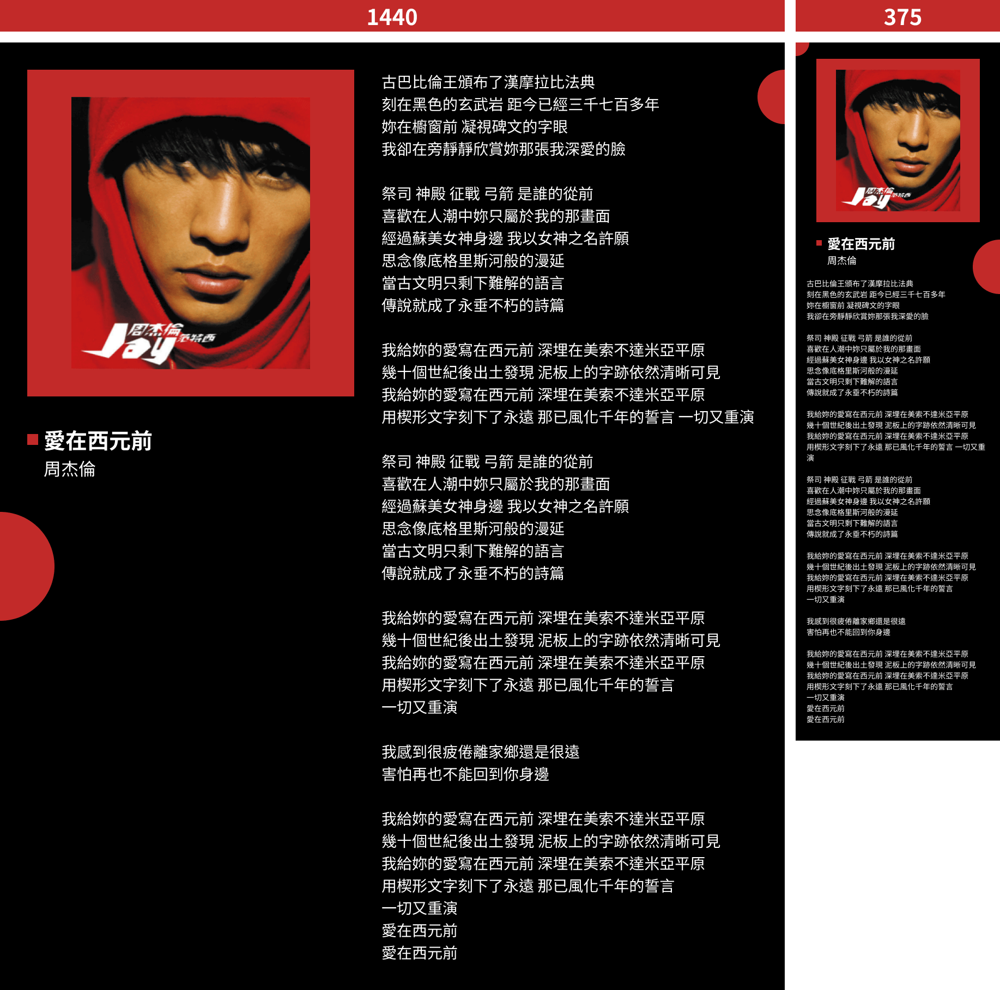
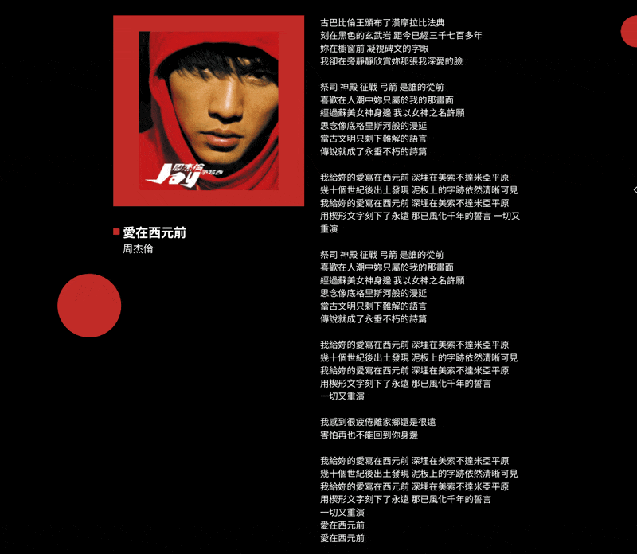

# 用等比縮放達到我心中的 pixel perfect

這是一張很常見、令人苦惱的設計稿，核心內容直接塞滿了整張設計稿，當你的視窗寬度小於 `(1440 - 50 * 2)px` 時，內容就會貼齊視窗邊緣，並且此時離手機版設計稿還有不小的差距，很難在視窗寬度 `1340px` 的時候就用 `375px` 的設計稿去切版，這時就真的挺苦惱的 :(

有聽過一些工程師會稱這張設計稿是一張**沒有安全區域**的設計稿，所謂的安全區域是指設計稿上中間放一個矩形框，當視窗寬度接近安全區域時，可能已經差不多要換成下一張設計稿來顯示了，這個區域的大小沒有一定，通常就是一個感覺，例如 `1440px` 的設計稿抓個 `1000px` 差不多，而你的主要資訊應該要放在這個安全區域中，如在視窗寬度縮小時，排版變動的機率就會比較低。

當處理這種沒有足夠安全區域的設計稿時，經常會經歷一段前端工程師與設計師的激烈溝通環節，也就是當核心內容無法完整的放進視窗中時該怎麼處理，以這張設計稿為例：究竟是要讓左右兩邊同時縮小整個放置空間呢？還是要縮小文字呢？還是要改成上下排呢？...等，拿出各種 RWD 法寶出來通靈。

通靈完後要交付時，就會遇到最煩躁的問題，**甲方或公司高層看過的設計稿是 `1440px` 與 `375px`，但他的視窗寬度肯定不是剛好這個尺寸，接著很可能就會質疑你切出來的版怎麼跟設計稿不一樣**，經常就在此時產生爭執，這就是切版日常，總之就非常麻煩。

我在剛入行時也經常在處理這種很無奈的問題，直到有一天我發現瀏覽器已經不再限制字體最小 `12px` 後，便開始了我的等比縮放摸索之旅！從此之後，我便開始有能力追求我心目中的 pixel perfect 了，~~如果不一樣，那一定是 safari 的錯~~ 😆

我認為所謂 pixel perfect 不是你的數值完全一模一樣，因為那絕對不可能，只有在視窗寬度跟設計稿寬度一樣的瞬間才有機會一模一樣，而且也沒有人真的會去比對你的網頁到底差了幾 pixel，~~如果有的話，那我一率建議快跑~~。

**我心中的 pixel perfect 是：付你錢的人所看到的設計稿跟你交付的頁面「感覺」是一樣的，那就夠了！**

我經歷了幾年的前端生涯，慢慢琢磨出了一套工作流，而我將在接下來的三十天中，儘量用淺白的文字，從 0 到 1 的分享我這幾年所使用的等比縮放設計稿實踐，並且最後會介紹一個完全沒有人知道，但是卻是支撐這套工作流的**秘密武器**，讓想嘗試的你可以很快的應用在自己的工作流程中，希望大家從那之後就不再被甲方質疑切版不準了！

## 其他小事情

- 這系列適合多少要有一點點切版基礎的人，三十天我應該沒辦法讓你變成切版高手 XD，那些基本的 css 屬性是幹嘛的，應該還是多少需要懂一點。
- 我平常中文類的文字看簡體比較多，很可能會有一些人看不習慣我的用詞，因為我已經沒辦法分辨兩岸用詞差別了，我只能先跟你說抱歉，我真的無法辨別 :(。
- 我比較少去探究某個做法的專有名詞，所以可能有些用詞不是很精確，我也先道歉，我腦中可用詞彙很少 QQ。
