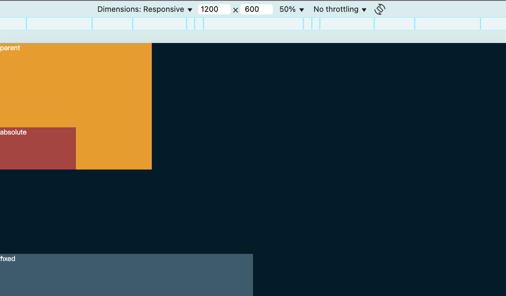
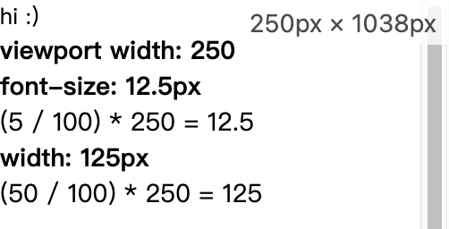
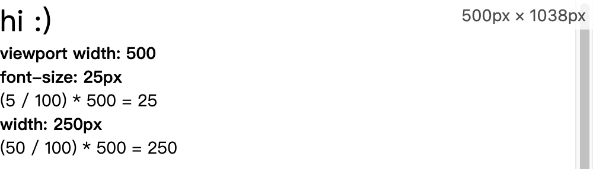
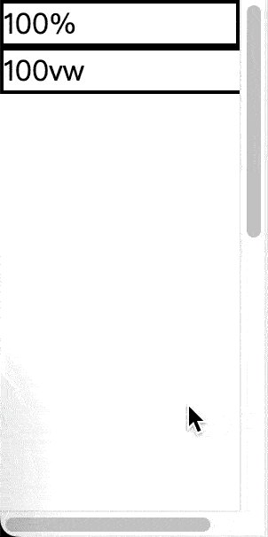

# 等比縮放的主角 - vw

通常大家剛接觸前端時，最先接觸的 css unit 都是 `px`，但 `px` 作為一個絕對單位，在不同尺寸的瀏覽器視窗上大小是固定的，也因此催生了超多響應式網站的方案與討論，而我覺得 `vw` 可能是一個被低估的解決方案，接下來歡迎跟著我一起進到 `vw` 的美好世界。

## `vw` 是什麼？

在說明 `vw` 是什麼之前，先提另一個概念。

相信大家都知道 `position: fixed`，當你為某個 DOM 設定為 `fixed` 後，該 DOM 如果使用 `%`，他的計算基準就會**基於你的視窗大小（不含佔位滾動條）**。

**程式碼**

```html
<!DOCTYPE html>
<html lang="en">
  <head>
    <meta charset="UTF-8" />
    <meta name="viewport" content="width=device-width, initial-scale=1.0" />
    <style>
      * {
        margin: 0;
        padding: 0;
      }

      body {
        background-color: #041c29;
        color: white;
      }

      .parent {
        position: relative;
        bottom: 0;
        width: 30%;
        height: 300px;
        background-color: #e79c30;
      }

      .child {
        width: 50%;
        height: 100px;
        bottom: 0;
      }

      .absolute {
        position: absolute;
        background-color: #a44542;
      }

      .fixed {
        position: fixed;
        background-color: #3e5b6d;
      }
    </style>
  </head>
  <body>
    <div class="parent">
      parent
      <div class="child absolute">absolute</div>
      <div class="child fixed">fixed</div>
    </div>
  </body>
</html>
```

**結果**



而 `vw` 其實就類似 `fixed` 時的百分比計算方式（**請注意是類似而已**），總結來說：

- `vw` 是 `Viewport Width` 的縮寫
- 它是一個相對單位，相對於視窗的寬度
- `1vw` = `viewport width` 的 1%

**程式碼**

```html
<!DOCTYPE html>
<html lang="en">
  <head>
    <meta charset="UTF-8" />
    <meta name="viewport" content="width=device-width, initial-scale=1.0" />
    <style>
      * {
        margin: 0;
        padding: 0;
      }

      body {
        height: 200dvh;
      }

      .box {
        font-size: 5vw;
        width: 50vw;
      }

      .info {
        font-size: 14px;
      }
    </style>
  </head>
  <body>
    <div class="box">hi :)</div>
    <div class="info"></div>
    <script>
      const domInfo = document.querySelector(".info");
      const domBox = document.querySelector(".box");

      const updateInfo = () => {
        const style = getComputedStyle(domBox);
        const fontSize = style.fontSize;
        const boxWidth = style.width;
        const viewportWidth = window.innerWidth;

        domInfo.innerHTML = `
        <b>viewport width: ${viewportWidth}</b>
        <p>
          <b>font-size: ${fontSize}</b><br/>
          (5 / 100) * ${viewportWidth} = ${(5 / 100) * viewportWidth}
        </p>
        <p>
          <b>width: ${boxWidth}</b><br/>
           (50 / 100) * ${viewportWidth} = ${(50 / 100) * viewportWidth}
        </p>
      `;
      };

      window.addEventListener("resize", updateInfo);
      window.addEventListener("DOMContentLoaded", updateInfo);
    </script>
  </body>
</html>
```

**結果**




從結果可以觀察到，視窗寬度變大時，那個 `hi :)` 也跟著變大了：

- 當視窗寬度為 `250px` 時：
  - `font-size: 5vw` 的結果是 `12.5px`，也就是視窗寬度的 `5%`，也就是 `250 * 5% = 12.5px`。
  - `width: 50vw` 的結果是 `125px`，也就是視窗寬度的 `50%`，也就是 `250 * 50% = 125px`。
- 當視窗寬度為 `500px` 時，`font-size` 值 ( `25px` ) 跟 `width` 值 ( `250px` ) 都直接乘以二。

這就是 `vw` 的計算過程！明天我們將利用 `vw` 這個特性，介紹這個工作流的核心公式，希望你能理解並牢牢記得這個工作流的基石！

## 補充說明

### 視窗

在技術文件中，更常見的專有名詞叫「視口」(Viewport)。

### window 滾動條問題

上面會不斷強調 `vw` 與 `fixed + %` **只是類似**是因為：CSS 的 `%` 本質上是基於可排版空間的比例，而視窗如果遇到佔位滾動條，那剩餘的可排版空間其實就沒有整個視窗那麼大，而 `vw` 本質上完全就是視窗的比例，兩者基於的數值其實不太一樣。

**測試程式碼**

```html
<!DOCTYPE html>
<html lang="en">
  <head>
    <meta charset="UTF-8" />
    <meta name="viewport" content="width=device-width, initial-scale=1.0" />
  </head>
  <body>
    <style>
      * {
        margin: 0;
        padding: 0;
        border: 0;
        box-sizing: border-box;
      }

      body {
        height: 200dvh;
      }

      .w-full {
        width: 100%;
      }

      .w-screen {
        width: 100vw;
      }

      .box {
        border: 2px solid black;
      }
    </style>
    <div class="w-full box">100%</div>
    <div class="w-screen box">100vw</div>
  </body>
</html>
```

**結果**



後面會有一系列我遇過的問題以及我的解決方案，其中一篇就是滾動條問題，所以這邊就簡單聊一下我的看法。

因為 window 系統的瀏覽器都會有**佔位**的滾動條，導致實際可排版空間沒有完整的視窗這麼大，但是可以觀察一下上面 `vw` 的範例截圖，我刻意弄出滾動條來計算字體大小，即使出現滾動條，結果依然是基於包含滾動條的整個視窗寬度所計算出來的。

所以本質上這是**排版問題**而不是計算問題，實際上對於我的工作流來說影響非常小的，我總有一天也會分享我是如何緩解這個排版問題的，敬請期待～

為了文章的流暢，我們就都先不管那個滾動條了，以後再說吧～
