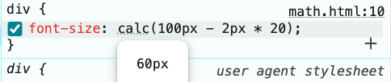
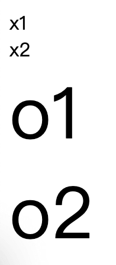
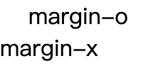
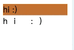
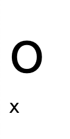

# 將咒語刻印在網頁上：CSS calc()

## calc 介紹

以前 `CSS` 要進行不同單位間的動態運算（例如 10px + 50%）非常困難，通常需要依賴 `js` 處理。

在這樣的背景下，`CSS` 的 `calc()` 就此誕生，讓開發者可以用指定的 `CSS` 屬性值來進行數學運算。

### 運算方式

`CSS` 值是一個數學表達式（`calc(expression)`），你學的數學怎麼算，他就怎麼算。

**程式碼**

```css
div {
  font-size: calc(100px - 2px * 20);
}
```

**結果**



先乘除後加減，所以是 `100px - 40px = 60px`

### 空格

`calc` 語法對於空格是有一些規定的：

1. `+` 或 `-` 的兩側一定要有空格。
2. `calc` 與 `()` 之間不能有空格。
3. `calc()` 的 `()` 裡面可以換行。

**程式碼**

```html
<!DOCTYPE html>
<html lang="en">
<head>
  <meta charset="UTF-8">
  <meta name="viewport" content="width=device-width, initial-scale=1.0">
  <style>
    /* 錯誤示範: + 或 - 兩邊沒有空格 */
    .x1 {
      font-size: calc(100px-2px*20);
    }

    /* 錯誤示範: calc 與 () 之間多了空格 */
    .x2 {
      font-size: calc (100px - 2px*20);
    }

    /* 正確示範: + or - 兩邊一定要有空格 */
    .o1 {
      font-size: calc(100px - 2px*20);
      /* 標準寫法 font-size: calc(100px - 2px * 20); */
    }

    /* 正確示範: () 裡面換行隨便你 */
    .o2 {
      font-size: calc(
        100px
        -
        2px *
        20
      );
    }
  </style>
</head>
<body>
  <div class="x1">x1</div>
  <div class="x2">x2</div>
  <div class="o1">o1</div>
  <div class="o2">o2</div>
</body>
</html>
```

**結果**



### 數據類型

#### 參與計算的數據類型

你常用的應該都支持，例如 `px`, `%` 等，這種東西就是當你有運算需求時，直接寫寫看就知道了，完全不需要特別去記。

#### 計算後的返回值

計算後的返回值必需是使用該值的 CSS 屬性支持的數值才行，例如 `margin: calc(1px + 1px)` 可以，但是 `margin: calc(1 + 1)` 不行，因為 `margin: 2` 是無效的數值。

所以除數通常不能為 `0`，因為大部分 CSS 屬性都不支持 `infinity`。

**程式碼**

```html
<!DOCTYPE html>
<html lang="en">
<head>
  <meta charset="UTF-8">
  <meta name="viewport" content="width=device-width, initial-scale=1.0">
  <style>
    * {
      margin: 0;
      padding: 0;
    }

    .margin-o {
      margin-left: calc(10px + 10px);
    }

    .margin-x {
      margin-left: calc(10 + 10);
    }
  </style>
</head>
<body>
  <div class="margin-o">margin-o</div>
  <div class="margin-x">margin-x</div>
</body>
</html>
```

**結果**



`margin-left: 20px` 是合法的數值，但是 `margin-left: 20` 不是。

#### 加減運算的數據類型需要相互兼容

不能長度單位跟時間單位相互加減運算，例如 `calc(1px + 1s)` 是不行的。

**程式碼**

```html
<!DOCTYPE html>
<html lang="en">
<head>
  <meta charset="UTF-8">
  <meta name="viewport" content="width=device-width, initial-scale=1.0">
  <style>
    @keyframes bg {
      0% {
        background-color:cadetblue;
      }
      100% {
        background-color:chocolate;
      }
    }

    .o {
      animation: bg calc(.5s * 2) infinite alternate;
      letter-spacing: calc(5px * 5vw);
    }

    .x {
      animation: bg calc(.5s + 1) infinite alternate;
      letter-spacing: calc(5px + 5vw);
    }
  </style>
</head>
<body>
  <div class="o">hi :)</div>
  <div class="x">hi :)</div>
</body>
</html>
```

**結果**



- 秒數類型跟純數字不能加減，但是可以乘除。
- `px` 跟 `vw` 都是長度單位，所以相互加減是有效果的，但是相互乘除沒有效果，原因在下面。

#### 乘跟除的其中一邊要是沒有單位的

就是...不能 `1px * 1px`。

**程式碼**

```html
<!DOCTYPE html>
<html lang="en">
<head>
  <meta charset="UTF-8">
  <meta name="viewport" content="width=device-width, initial-scale=1.0">
  <style>
    .o {
      font-size: calc(10px * 5);
    }

    .x {
      font-size: calc(10px * 5px);
    }
  </style>
</head>
<body>
  <div class="o">o</div>
  <div class="x">x</div>
</body>
</html>
```

**結果**



- `o` 只有一邊有單位，所以可以。
- `x` 兩邊都有單位，所以不行。
  - 上面那個範例中，`letter-spacing: calc(5px * 5vw);` 不合法也是這個原因。

## 預處理器的 calc

許多 CSS 預處理器（例如 sass, less, ...等）都有 `calc` 函式，但是作用不太一樣：通常預處理器會在編譯時將你的 `calc` 給執行運算一遍，如果能算出結果的就會直接算出來替換，如果遇到一些需要運行時才能獲取的值 ( 例如 `%` )，就會直接還你，讓你交給瀏覽器去處理。

CSS `calc` 雖然已經有不錯的性能，但每次計算還是會消耗額外的資源，所以建議多使用這些預處理工具來提前編譯處理，以減低運行時的負擔。

後續的文章會有更深入的 `PostCSS` 分享，這裡我們直接關注輸入的 css string 與輸出的結果即可～

**package.json**

```json
{
  "type": "module",
  "dependencies": {
    "postcss": "^8.5.6",
    "postcss-calc": "^10.1.1"
  }
}
```

通常 CSS 預處理器都會使用像 `postcss-calc` 這類的工具來處理一遍 `calc` 函式的運算。

**main.js**

```js
import postcssCalc from 'postcss-calc'
import postcss from 'postcss'

const cssString = `
  body {
    font-size: calc(1px + 1px + 50%);
  }
`

postcss()
  .use(postcssCalc())
  .process(cssString, {from: ''})
  .then((result) => {
    console.log(result.css)
  })
```

**結果**

```shell
% node ./main.js

  body {
    font-size: calc(2px + 50%);
  }
```

能運算的就都先運算並替換了 ( `1px + 1px` -> `2px` )，不能的就原封不動的留下 ( `+ 50%` )，交給瀏覽器處理。

## calc 應用

介紹 `calc` 的用法，為的就是將上一篇我們推導出來的公式給變成一個瀏覽器可用的 `vw` 數值，所以我們需要將上一篇的公式 `設計稿上的值 / 設計稿寬度 * 100vw` 改成下面這個：

> **`calc( 設計稿上的值 / 設計稿寬度 * 100vw )`**

有了這個數值後，下一篇我將分享如何將公式運用到設計稿中，敬請期待！

## 其他補充

### calc-size()

`calc` 無法對一些尺寸關鍵字進行操作，例如 `max-content`、`auto` 等，為了解決這個問題，後來又出了一個新的函式：

> `calc-size(<calc-size-basis>, <calc-sum>)`

- `<calc-size-basis>` 就是要對特定關鍵字運算的關鍵字本人。
- `<calc-sum>` 就是運算的表達式。
  - 這個表達式可以使用一個特殊關鍵字叫做 `size`，指的是第一個參數的數據。

**程式碼**

```html
<!DOCTYPE html>
<html lang="en">
<head>
  <meta charset="UTF-8">
  <meta name="viewport" content="width=device-width, initial-scale=1.0">
  <style>
    .parent1 {
      /* 合法的：獲取當前最大寬度後 + 10px */
      width: calc-size(max-content, size + 10px);
      background-color: chocolate;
    }

    .parent2 {
      /* 不合法的：calc 不支持 max-content */
      width: calc(max-content + 10px);
      background-color: chocolate;
    }

    .child {
      width: 30px;
      height: 30px;
      background-color:cadetblue;
    }
  </style>
</head>
<body>
  <div class="parent1">
    <div class="child"></div>
  </div>
  <div class="parent2">
    <div class="child"></div>
  </div>
</body>
</html>
```

**結果**


- `parent1` 先獲取 `max-content`（藍色）的數值，傳入第二個參數的 `size`，接著 `+10px` 而作為自己的寬度（藍色 + 橘色）。
- `parent2` 語法錯誤，所以退回預設的 `auto`。

注意，這個瀏覽器支援度可能不太行，就當冷知識看就好了。

## 參考連結

- [等比縮放的詠唱咒語: 設計稿上的值 / 設計稿寬度 * 100vw](../2/index.md)
- [calc](https://developer.mozilla.org/en-US/docs/Web/CSS/calc)
- [calc-size](https://developer.mozilla.org/en-US/docs/Web/CSS/calc-size)
- [postcss calc](https://www.npmjs.com/package/postcss-calc)
