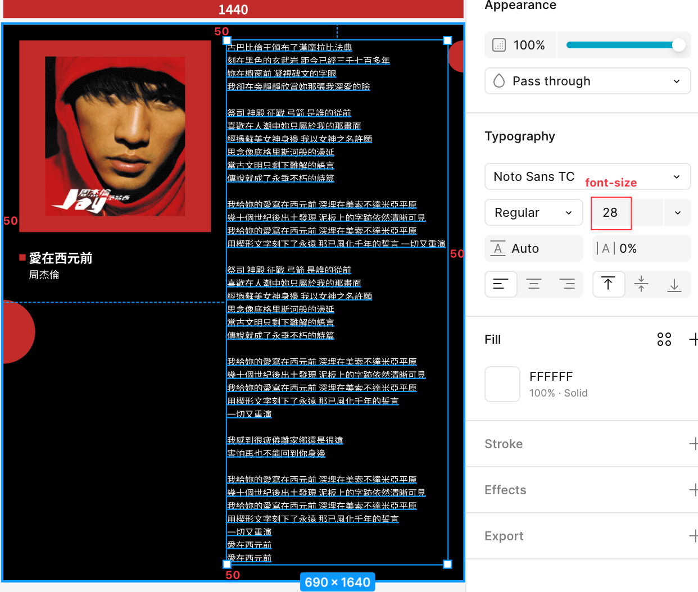
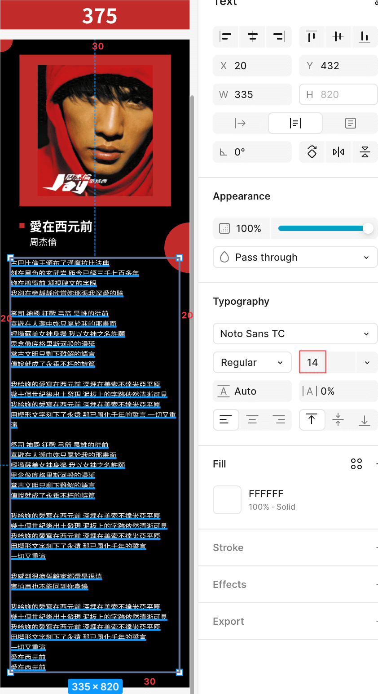
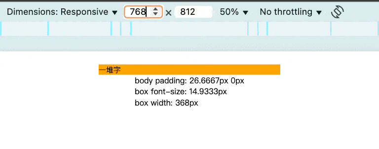

# 魔法訓練場：vw 咒文的初次施放

前面分享了一個重要的公式，相信大家應該都能理解了？不理解至少也都背起來了，我們再複習一次公式：

> `calc( 設計稿上的值 / 設計稿寬度 * 100vw )`

接下來我們要來學怎麼將設計稿上的值寫進網站中。

## 公式應用

有了這個公式之後，其實就只要把設計稿的值填入公式中，等比縮放設計稿到網頁中就實現了。

### 電腦版練習



這邊有一張 `1440px` 的設計稿，我們直接觀察歌詞的部分：

- `width: 690px` 也就是 `width: calc(690 / 1440 * 100vw);`。
- `font-size: 28px` 也就是 `font-size: calc(28 / 1440 * 100vw);`。
- 視窗上下間距為 `padding: 50px` 也就是 `padding: calc(50 / 1440 * 100vw);`。

**程式碼**

```html
<!DOCTYPE html>
<html lang="en">
<head>
  <meta charset="UTF-8">
  <meta name="viewport" content="width=device-width, initial-scale=1.0">
  <style>
    /* 簡單的 css reset */
    * {
      margin: 0;
      padding: 0;
      border: 0;
      box-sizing: border-box;
    }

    body {
      padding: calc(50 / 1440 * 100vw) 0;
    }

    .txt {
      font-size: calc(28 / 1440 * 100vw);
    }

    .box {
      width: calc(690 / 1440 * 100vw);
      margin: auto;
      background: orange; /* 為了方便觀察 */
    }

    #info {
      width: max-content;
      margin: auto;
    }
    </style>
</head>
<body>
  <div class="txt box">一堆字</div>

  <!-- 下面這些方便觀察而已 -->
  <div id="info"></div>
  <script>
    const domInfo = document.querySelector('#info')
    const domBox = document.querySelector('.box')

    const updateInfo = () => {
      const style = getComputedStyle(domBox)
      const fontSize = style.fontSize
      const boxWidth = style.width
      const bodyPadding = getComputedStyle(document.body).padding

      domInfo.innerHTML = `
        <p>body padding: ${bodyPadding}</p>
        <p>box font-size: ${fontSize}</p>
        <p>box width: ${boxWidth}</p>
      `
    }

    window.addEventListener('resize', updateInfo)
    updateInfo()
  </script>
</body>
</html>
```

**結果**


- 在視窗寬度為 `1440px` 的時候，所有數值都跟預期的相同。
- 視窗寬度放大縮小時，整體的數值也都跟著等比例放大縮小，完全達到我們要的效果了！

### 手機版練習



接著觀察這張 `375px` 的設計稿，一樣直接觀察歌詞的部分：

- `width: 335px` 也就是 `width: calc(335 / 375 * 100vw);`。
- `font-size: 14px` 也就是 `font-size: calc(14 / 375 * 100vw);`。
- 視窗上下間距為 `padding: 30px` 也就是 `padding: calc(30 / 375 * 100vw);`。

我平常習慣在視窗為 `767px` 以下的時候換設計稿，所以就有了以下的修改：

**程式碼修改**

```html
<style>
  /** 完整版在最下面 */
  @media (width < 768px) {
    body {
      padding: calc(30 / 375 * 100vw) 0;
    }

    .txt {
      font-size: calc(14 / 375 * 100vw);
    }

    .box {
      width: calc(335 / 375 * 100vw);
    }
  }
</style>
```

**結果**



- 視窗寬度為 `767px` 以下之後，數值就變成手機版的設定了。
- 所有數值都跟著視窗寬度等比例的縮放。
- 視窗寬度為 `375px` 的時候，所有數值也跟我們預期的一模一樣。

以上就是如何將公式運用到設計稿中，希望大家真的能理解～我真心覺得這個做法讓切版變得很簡單😃。

明天我們將迎來這個系列第一次的實戰：將第一天的設計稿完整的實踐一遍～敬請期待！

## 參考連結

- [等比縮放的詠唱咒語: 設計稿上的值 / 設計稿寬度 * 100vw](../2/index.md)
- [CSS calc() 將咒語刻印在網頁上](../3/index.md)

## 最終程式碼

```html
<!DOCTYPE html>
<html lang="en">
<head>
  <meta charset="UTF-8">
  <meta name="viewport" content="width=device-width, initial-scale=1.0">
  <style>
    * {
      margin: 0;
      padding: 0;
      border: 0;
      box-sizing: border-box;
    }

    body {
      padding: calc(50 / 1440 * 100vw) 0;
    }

    .txt {
      font-size: calc(28 / 1440 * 100vw);
    }

    .box {
      width: calc(690 / 1440 * 100vw);
      margin: auto;
      background: orange;
    }

    #info {
      width: max-content;
      margin: auto;
    }

    @media (width < 768px) {
      body {
        padding: calc(30 / 375 * 100vw) 0;
      }

      .txt {
        font-size: calc(14 / 375 * 100vw);
      }

      .box {
        width: calc(335 / 375 * 100vw);
      }
    }
    </style>
</head>
<body>
  <div class="txt box">一堆字</div>

  <div id="info"></div>
  <script>
    const domInfo = document.querySelector('#info')
    const domBox = document.querySelector('.box')

    const updateInfo = () => {
      const style = getComputedStyle(domBox)
      const fontSize = style.fontSize
      const boxWidth = style.width
      const bodyPadding = getComputedStyle(document.body).padding

      domInfo.innerHTML = `
        <p>body padding: ${bodyPadding}</p>
        <p>box font-size: ${fontSize}</p>
        <p>box width: ${boxWidth}</p>
      `
    }

    window.addEventListener('resize', updateInfo)
    updateInfo()
  </script>
</body>
</html>
```
