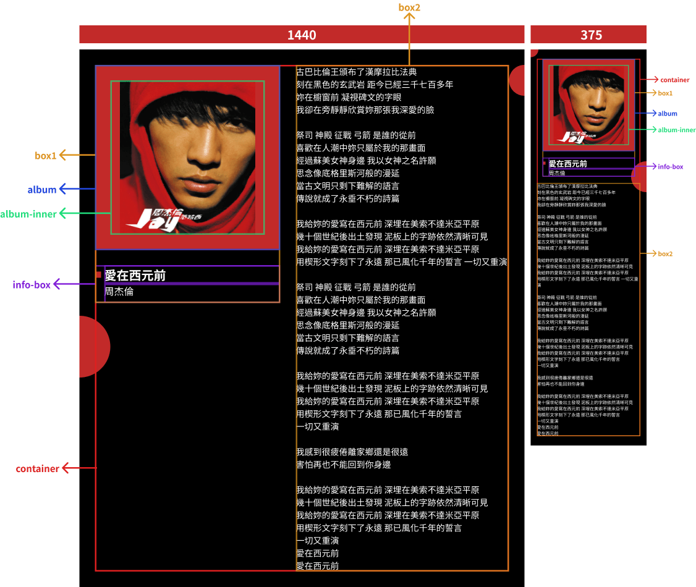
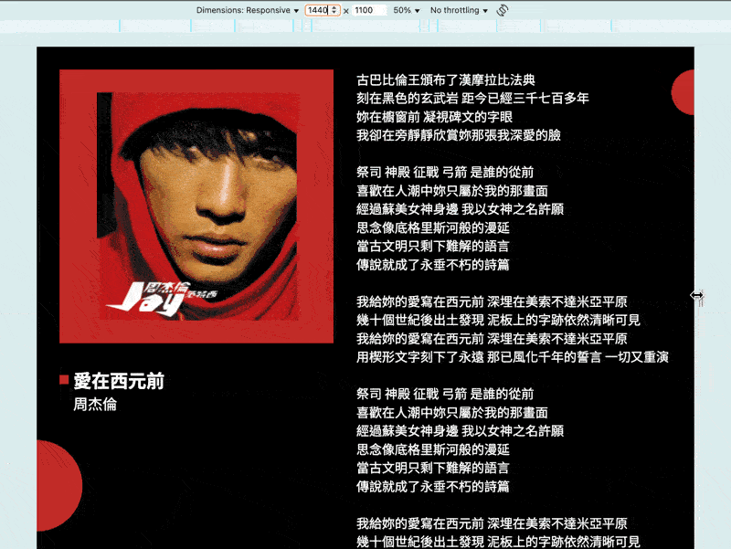

# 實戰1：設計稿華麗轉生為等比縮放網站

在開始前，我想先說一些話：如果你是剛接觸前端的新手，那我真的很抱歉，我真的無法在短短的幾天讓你變成切版高手，還是需要你去稍微認識一下常用的 CSS 屬性效果是什麼 😦。

那我們開始吧～



我在第一天的設計稿上做了一些結構標記，我們從大到小來看：

**container 與 box**

- 我將整個內容看成一個整體（紅框），將它命名為 `container`。
- `container` 裡面有兩個大區塊（橘框）：
  - `box1`：非歌詞區。
  - `box2`：歌詞區。
- `container` 跟 `box` 的排版關係：
  - 電腦版：左右盒子，中間有個間隙（`flex-direction: row`）。
  - 手機版：上下盒子，中間也有間隙（`flex-direction: column`）。
- `box1` 可以分成上下兩個部分：
  - `album`：專輯圖片。
  - `info-box`：專輯資訊。

**album**

- 我將專輯圖片拆成裝圖片的盒子 ( `album`，藍框 ) 跟圖片本身 ( `album-inner`，綠框 )
- `album`：專注於處理對內對外的樣式關係。
- `album-inner`：專注於處理圖片的顯示。
  - 專輯圖片應該要用 `object-fit: contain;`，因為專輯是一個不適合裁切或拉伸的圖片。

**info-box**

- 專輯資訊（紫框）內裝著兩種不同的東西：歌名（ `song` ）與歌手名 ( `singer` )。
- `singer` 前面有個裝飾用的矩形 ( `square` )。
- 為了讓 `song` 跟 `singer` 文字對齊，`square` 採用 `absolute` 是比較方便的選擇。

**circle**

- 有兩顆裝飾用的圓圈，獨立於 `container` 之外，直接 `absolute` 定位到對應的位置即可。

我盡可能地將每個結構的排版關係都解釋一遍，不過切版方式百百種，我再寫一次可能又不一樣，所以這只是一個參考，總之能把設計稿完美實現就是好切版。

而我們主要應該關注的是**每一個**數值是否依照公式書寫：

> `calc( 設計稿上的值 / 設計稿寬度 * 100vw )`

當你將設計稿上的**每一個**數值都按照這個公式來寫，等比縮放設計稿到網站中就能實現了，而以下是我所實現的程式碼參考：

**index.html**

```html
<!DOCTYPE html>
<html lang="en">
<head>
  <meta charset="UTF-8">
  <meta name="viewport" content="width=device-width, initial-scale=1.0">
  <link rel="preconnect" href="https://fonts.googleapis.com">
  <link rel="preconnect" href="https://fonts.gstatic.com" crossorigin>
  <link href="https://fonts.googleapis.com/css2?family=Noto+Sans+TC:wght@100..900&display=swap" rel="stylesheet">
  <link rel="stylesheet" href="./css/reset.css">
  <link rel="stylesheet" href="./css/normal.css">
</head>
<body>
  <div id="app">
    <div class="container">
      <div class="box1">
        <div class="album">
          <div class="album-inner">
            
          </div>
        </div>
        <div class="info-box">
          <div class="song">
            <div class="square"></div>
            愛在西元前
          </div>
          <div class="singer">
            周杰倫
          </div>
        </div>
      </div>
      <div class="box2 lyrics">
        古巴比倫王頒布了漢摩拉比法典<br/>
        刻在黑色的玄武岩 距今已經三千七百多年<br/>
        妳在櫥窗前 凝視碑文的字眼<br/>
        我卻在旁靜靜欣賞妳那張我深愛的臉<br/>
        <br/>
        祭司 神殿 征戰 弓箭 是誰的從前<br/>
        喜歡在人潮中妳只屬於我的那畫面<br/>
        經過蘇美女神身邊 我以女神之名許願<br/>
        思念像底格里斯河般的漫延<br/>
        當古文明只剩下難解的語言<br/>
        傳說就成了永垂不朽的詩篇<br/>
        <br/>
        我給妳的愛寫在西元前 深埋在美索不達米亞平原<br/>
        幾十個世紀後出土發現 泥板上的字跡依然清晰可見<br/>
        我給妳的愛寫在西元前 深埋在美索不達米亞平原<br/>
        用楔形文字刻下了永遠 那已風化千年的誓言 一切又重演<br/>
        <br/>
        祭司 神殿 征戰 弓箭 是誰的從前<br/>
        喜歡在人潮中妳只屬於我的那畫面<br/>
        經過蘇美女神身邊 我以女神之名許願<br/>
        思念像底格里斯河般的漫延<br/>
        當古文明只剩下難解的語言<br/>
        傳說就成了永垂不朽的詩篇<br/>
        <br/>
        我給妳的愛寫在西元前 深埋在美索不達米亞平原<br/>
        幾十個世紀後出土發現 泥板上的字跡依然清晰可見<br/>
        我給妳的愛寫在西元前 深埋在美索不達米亞平原<br/>
        用楔形文字刻下了永遠 那已風化千年的誓言<br/>
        一切又重演<br/>
        <br/>
        我感到很疲倦離家鄉還是很遠<br/>
        害怕再也不能回到你身邊<br/>
        <br/>
        我給妳的愛寫在西元前 深埋在美索不達米亞平原<br/>
        幾十個世紀後出土發現 泥板上的字跡依然清晰可見<br/>
        我給妳的愛寫在西元前 深埋在美索不達米亞平原<br/>
        用楔形文字刻下了永遠 那已風化千年的誓言<br/>
        一切又重演<br/>
        愛在西元前<br/>
        愛在西元前
      </div>
    </div>
    <div class="circle1"></div>
    <div class="circle2"></div>
  </div>
</body>
</html>
```

**css/normal.css**

特別注意我每個數值都是 `calc(xx / 1440 * 100vw)` 或 `calc(xx / 375 * 100vw)`。

```css
:root {
  --color-red: #C22A29;
}

html, body {
  overflow-x: hidden;
}

body {
  background-color: black;
  min-height: 100vh;
  min-height: 100dvh;

  color: white;
  font-family: "Noto Sans TC", sans-serif;
}

/* layout */
#app {
  position: relative;
  left: 50%;
  transform: translateX(-50%);

  width: 100vw;
  overflow: hidden;
  padding: calc(50 / 1440 * 100vw) 0;
}

.container {
  width: calc(1340 / 1440 * 100vw);
  margin: auto;
  display: flex;
}

.box1 {
  margin-right: calc(50 / 1440 * 100vw);
}

.box2 {
  flex: 1;
}

@media (width < 768px) {
  #app {
    padding: calc(30 / 375 * 100vw) 0;
  }

  .container {
    width: calc(335 / 375 * 100vw);
    flex-direction: column;
    align-items: center;
  }

  .box1 {
    margin-right: 0;
    margin-bottom: calc(20 / 375 * 100vw);
  }
}

/* album */
.album {
  width: max-content;
  background: var(--color-red);
  padding: calc(50 / 1440 * 100vw);
  margin-bottom: calc(50 / 1440 * 100vw);
}

.album-inner {
  position: relative;
  width: calc(500 / 1440 * 100vw);
}

.album-inner::after {
  content: '';
  display: block;
  padding-top: 100%;
}

.album img {
  position: absolute;
  top: 0;
  left: 0;
  width: 100%;
  height: 100%;
  object-fit: contain;
}

@media (width < 768px) {
  .album {
    padding: calc(20 / 375 * 100vw);
    margin-bottom: calc(20 / 375 * 100vw);
  }

  .album-inner {
    width: calc(260 / 375 * 100vw);
  }
}

/* info */
.info-box {
  padding-left: calc(30 / 1440 * 100vw);
}

.square {
  position: absolute;
  top: 50%;
  left: calc(-10 / 1440 * 100vw);
  transform: translate3d(-100%,-50%,0);

  width: calc(20 / 1440 * 100vw);
  height: calc(20 / 1440 * 100vw);
  background-color: var(--color-red);
}

.song {
  position: relative;

  font-size: calc(40 / 1440 * 100vw);
  font-weight: 700;
}

.singer {
  font-size: calc(32 / 1440 * 100vw);
}

@media (width < 768px) {
  .info-box {
    padding-left: calc(20 / 375 * 100vw);
  }

  .square {
    left: calc(-10 / 375 * 100vw);
    width: calc(10 / 375 * 100vw);
    height: calc(10 / 375 * 100vw);
  }

  .song {
    font-size: calc(25 / 375 * 100vw);
  }

  .singer {
    font-size: calc(18 / 375 * 100vw);
  }
}

/* lyrics */
.lyrics {
  font-size: calc(28 / 1440 * 100vw);
}

@media (width < 768px) {
  .lyrics {
    font-size: calc(14 / 375 * 100vw);
  }
}

/* circle */
.circle1 {
  position: absolute;
  top: calc(862 / 1440 * 100vw);
  left: calc(-100 / 1440 * 100vw);

  width: calc(200 / 1440 * 100vw);
  height: calc(200 / 1440 * 100vw);
  border-radius: 50%;
  background-color: var(--color-red);
}

.circle2 {
  position: absolute;
  top: calc(50 / 1440 * 100vw);
  right: calc(-50 / 1440 * 100vw);

  width: calc(100 / 1440 * 100vw);
  height: calc(100 / 1440 * 100vw);
  background: var(--color-red);
  border-radius: 50%;
}

@media (width < 768px) {
  .circle1 {
    top: calc(-25 / 375 * 100vw);
    left: calc(-25 / 375 * 100vw);
    width: calc(50 / 375 * 100vw);
    height: calc(50 / 375 * 100vw);
  }

  .circle2 {
    top: calc(362 / 375 * 100vw);
    right: calc(-50 / 375 * 100vw);
    width: calc(100 / 375 * 100vw);
    height: calc(100 / 375 * 100vw);
  }
}
```

- 其他樣式說明：
  - `html, body` 至少要有一個 `overflow-x: hidden;`，否則 `circle` 定位超出視窗時會出現滾動條。
    - 不將這個設定寫進 `reset.css` 是因為我認為這個設定本質上還是可能依據網站性質而變動，既使 99% 都會寫這個設定，我認為放進 `normal.css` 還是最合適的。
  - `body { min-height: 100dvh; }`：
    - `dvh` 或是 `vh` 會在後面某篇介紹，但這裡用到了我只好稍微說一下，簡單理解就是視窗高度的 100%。
    - 因為我習慣把整體的背景色放在 `body`，預設 `body` 高度是頁面內容的高度，當內容高度比視窗高度小時，會導致背景色沒有完整覆蓋整個視窗，底下會有一塊白色底色。
    - `min-height: 100dvh` 能讓 `body` 最小高度為視窗高度的 100%，這樣背景色就一定能完全覆蓋整個視窗。
  - `#app` 是我習慣用來放整個網站的盒子。
- media queries 組織方式：
  - 有些人會習慣將 `@media (width < ...) {...}` 整個寫在一起，但我個人覺得為每個結構各別寫 `@media` 會是更好維護的選擇。

**css/reset.css**

為了確保所有瀏覽器樣式一致，我們需要引入一個 `reset.css`。

```css
*,
::before,
::after,
::backdrop,
::file-selector-button {
  margin: 0;
  padding: 0;
  border: 0;
  box-sizing: border-box;

  font: inherit;
  color: inherit;
  vertical-align: baseline;
}

:root {
  font-family: system-ui, sans-serif;

  -webkit-font-smoothing: auto;
  -moz-osx-font-smoothing: auto;
  font-optical-sizing: auto;
  word-break: break-word;
  -webkit-text-size-adjust: none;
  -ms-text-size-adjust: none;
  -moz-text-size-adjust: none;
  -o-text-size-adjust: none;
  text-size-adjust: none;

  touch-action: manipulation;
  font-feature-settings: normal;
  font-variation-settings: normal;
}

/* media */
picture,
img,
svg,
video,
canvas,
iframe,
embed,
object {
  display: block;
  max-width: 100%;
  height: auto;
  image-rendering: auto;
}

source {
  display: block;
}

svg {
  fill: currentColor;
}

/* list */
ul,
ol,
li,
menu {
  list-style: none;
}

/* link */
a {
  cursor: pointer;
  text-decoration: none;
}

/* table */
table {
  border-collapse: collapse;
  border-spacing: 0;
}

label {
  display: block;
}

input,
button,
textarea,
select {
  display: block;
  background: none;
  outline: none;
  border: none;
  line-height: inherit;
}

textarea {
  resize: none;
}

/* button */

button,
[type="button"],
[type="reset"],
[type="submit"],
[role="button"] {
  cursor: pointer;
  appearance: none;
}

:disabled {
  cursor: not-allowed;
}

/* dialog */
dialog {
  width: auto;
  height: auto;
  background: none;
}

/* text */
p,
blockquote,
dd {
  text-indent: 0;
}

abbr {
  text-decoration: none;
}
```

**結果**



我們成功把設計稿搬到網頁上了，整個流程就只是數學公式套到底，很簡單吧。

下一篇，我想回頭來聊聊這個被我跳過的 `reset.css`，以完成所謂實戰的「完整」分享。

## 連結參考

- [魔法訓練場：vw 咒文的初次施放](../4/index.md)
