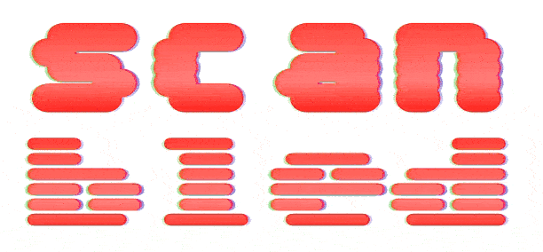

# 實戰番外篇：無垢領域 - reset.css

各個瀏覽器對於標籤的預設 `CSS` 屬性都有所不同，前端工程師為了儘量確保自己的作品在所有瀏覽器中顯示一致，都會把這些標籤屬性儘量重置，但每個人習慣的做法不同，這篇我會分享我平常使用的 `reset.css`，以及稍微介紹一些相對冷門的屬性與解釋我寫這些重置樣式的想法。

我知道網路上有超多 `reset.css` 可以抄，例如 `Normalize.css`，不過我一直沒看到自己喜歡的，所以最終我還是自己維護了一套。

```css
*,
::before,
::after,
::backdrop,
::file-selector-button {
  margin: 0;
  padding: 0;
  border: 0;
  box-sizing: border-box;

  font: inherit;
  color: inherit;
  vertical-align: baseline;
}

:root {
  font-family: system-ui, sans-serif;

  -webkit-font-smoothing: auto;
  -moz-osx-font-smoothing: auto;
  font-optical-sizing: auto;
  word-break: break-word;
  -webkit-text-size-adjust: none;
  -ms-text-size-adjust: none;
  -moz-text-size-adjust: none;
  -o-text-size-adjust: none;
  text-size-adjust: none;

  touch-action: manipulation;
  font-feature-settings: normal;
  font-variation-settings: normal;
}

/* media */
picture,
img,
svg,
video,
canvas,
iframe,
embed,
object {
  display: block;
  max-width: 100%;
  height: auto;
  image-rendering: auto;
}

source {
  display: block;
}

svg {
  fill: currentColor;
}

/* list */
ul,
ol,
li,
menu {
  list-style: none;
}

/* link */
a {
  cursor: pointer;
  text-decoration: none;
}

/* table */
table {
  border-collapse: collapse;
  border-spacing: 0;
}

label {
  display: block;
}

input,
button,
textarea,
select {
  display: block;
  background: none;
  outline: none;
  border: none;
  line-height: inherit;
}

textarea {
  resize: none;
}

/* button */

button,
[type="button"],
[type="reset"],
[type="submit"],
[role="button"] {
  cursor: pointer;
  appearance: none;
}

:disabled {
  cursor: not-allowed;
}

/* dialog */
dialog {
  width: auto;
  height: auto;
  background: none;
}

/* text */
p,
blockquote,
dd {
  text-indent: 0;
}

abbr {
  text-decoration: none;
}
```

## *

由於我不想讓 `reset.css` 看起來很雜亂，所以我感覺需要寫很多次的，我全部都丟到 `*` 裡。

我知道 `*` 在性能上比起直接將常用標籤列出來各別設置低，但~~如果這年代的設備會因為這個寫法而跑不動，那這個設備應該丟進河裡。~~

### font

一堆字體屬性的縮寫，包括 `font-size`、`font-stretch`、`font-style`、`font-variant`、`font-weight`、`line-height`。

## :root

`:root` 在瀏覽器就是指 `<html/>`，會用 `:root` 而不是用 `html` 的主要原因是優先級：

- `root` 是 `(0,1,0)`。
- `html` 是 `(0,0,1)`。

```css
:root {
  background-color: chocolate;
}

html {
  background-color: cadetblue;
}
```


- `html` 沒有蓋過 `:root`，因為優先級比較低。
- 如果不想用高優先級的 `:root` 來做這些設定，可以改成 `html`。

### font-smoothing: auto

**渲染鋸齒問題**

想像你在一張方格紙上畫一個「S」，你會發現很多方格沒有塗滿。而螢幕就是一顆顆矩形的燈組成，電腦需要決定每一個燈要不要亮，不能只亮某一角，假設採用佔用面積大的格子亮就好，就會出現**明顯**的鋸齒顯示：


**解決方案**

這個問題是無法完美被解決的，這是物理限制，只能想辦法讓鋸齒**不那麼明顯**：


- 灰階抗鋸齒：
  - 根據每個燈被佔領的比例來決定亮燈顏色的深淺度。
  - 上圖中間那個 a。
- 次像素渲染：
  - 每個燈都是由 RGB 三個小燈組成，而這個方法是各別調整小燈亮度比例，調出一個過渡的顏色。
  - 上圖右邊那個 a。

`font-smoothing` 也有兩組設定：
- `auto`：
  - 瀏覽器自己決定，通常是次像素渲染。
  - 字體看起來比較粗。
- `antialiased`：
  - 灰階抗鋸齒。
  - 字體看起來比較細。

```html
<!DOCTYPE html>
<html lang="en">
<head>
  <meta charset="UTF-8">
  <meta name="viewport" content="width=device-width, initial-scale=1.0">
  <title>Document</title>
</head>
<body>
  <style>
    .antialiased {
      -webkit-font-smoothing: antialiased;
      -moz-osx-font-smoothing: grayscale;
    }

    .auto {
      -webkit-font-smoothing: auto;
      -moz-osx-font-smoothing: auto;
    }
  </style>
  <div class="antialiased">ABCDEFGHIJKLMNOPQRSTUVWXYZ - antialiased</div>
  <div class="auto">ABCDEFGHIJKLMNOPQRSTUVWXYZ - auto</div>
</body>
</html>
```


- 為了統一瀏覽器設定，我會先寫一組，如果設計師有其他想法再來覆蓋這個設定即可。
- 特別注意：Window 系統可能會忽略這個屬性，所以在 Window 上可能根本寫啥都沒效果。
  - `moz` 的前綴特別多出 `osx` 也能證實此事，指的就是 **mac** 版的 firefox，因為 Window 系統可能無法用 CSS 改此設定。

### font-feature-settings: normal

微軟和 Adobe 共同開發一款叫 `OpenType` 的字體，他有一堆排版規則，下面看範例會比較清楚，總之如果字型有支持某個排版規則，就能使用這個來**開關該功能**。

```html
<!DOCTYPE html>
<html lang="en">
<head>
  <meta charset="UTF-8">
  <meta name="viewport" content="width=device-width, initial-scale=1.0">
  <link href="https://fonts.googleapis.com/css2?family=Inter&display=swap" rel="stylesheet">
  <style>
    * {
      margin: 0;
      padding: 0;
      font-feature-settings: normal;
    }

    body {
      font-family: "Inter", serif;
      padding: 10px;
    }

    /* 等寬數字 */
    .tnum-on { font-feature-settings: "tnum" 1; }
    .tnum-off { font-feature-settings: "tnum" 0; }

    /* 分數 */
    .frac-on { font-feature-settings: "frac" 1; }
    .frac-off { font-feature-settings: "frac" 0; }
  </style>
</head>
<body>
  <div class="tnum-on">12345 - 等寬數字/開</div>
  <div class="tnum-off">12345 - 等寬數字/關</div>
  <div class="frac-on">1/2 - 分數/開</div>
  <div class="frac-off">1/2 - 分數/關</div>
</body>
</html>
```


`normal` 是使用 **「字體源」本身的預設設定**，為了避免瀏覽器給我亂改，我都會把他設成 `normal`。

### font-variation-settings: normal

`OpenType` 1.8 版本發佈了 `OpenType variable fonts ( OTVF )`，讓使用者可以在一個連續的軸線上操作字體。

```html
<!DOCTYPE html>
<html lang="en">
<head>
  <meta charset="UTF-8">
  <meta name="viewport" content="width=device-width, initial-scale=1.0">
  <link href="https://fonts.googleapis.com/css2?family=Sixtyfour+Convergence:BLED,SCAN@0..100,-53..100&display=swap" rel="stylesheet">
  <style>
    @keyframes scan {
      0% {
        font-variation-settings: "SCAN" 0;
      }
      100% {
        font-variation-settings: "SCAN" 100;
      }
    }

    @keyframes bled {
      0% {
        font-variation-settings: "BLED" 0;
      }
      100% {
        font-variation-settings: "BLED" 100;
      }
    }

    * {
      margin: 0;
      padding: 0;
    }

    body {
      font-family: "Sixtyfour Convergence", sans-serif;
      padding: 20px;
      font-size: 100px;
    }

    .scan {
      animation: scan 1s infinite alternate;
    }

    .bled {
      animation: bled 1s infinite alternate;
    }
  </style>
</head>
<body>
  <div class="scan">scan</div>
  <div class="bled">bled</div>
</body>
</html>
```



跟 `font-feature-settings` 一樣避免預設被瀏覽器改，所以我都會放著一個 `normal` 當保險。

### font-optical-sizing: auto

#### Optical Sizing ( opsz )

- 可變字體的軸體，用來優化字體在不同尺寸下的視覺效果，它的運作方式是：
  - 當字體變小，opsz 軸會增加筆畫的粗細和字體間距，讓文字在小尺寸下更清晰易讀。
  - 當字體變大，opsz 軸會減少筆畫的粗細和字體間距，讓文字看起來更精緻。
- opsz 軸有其設計範圍：
  - 如果文字大小超出字體設計師設定的範圍，opsz 的值會固定在最小值或最大值，不再自動變化。
  - 每個字體設計的 opsz 都不盡相同。

#### font-optical-sizing

- `auto`：瀏覽器會根據 font-size 的大小，自動調整 opsz 軸的值。這個設定只有當字體本身有支援 opsz 軸時才有效。
- `none`：完全關閉 opsz 的自動調整功能，字體無論大小都保持原樣。

```html
<!DOCTYPE html>
<html lang="en">
<head>
  <meta charset="UTF-8">
  <meta name="viewport" content="width=device-width, initial-scale=1.0">
  <link rel="preconnect" href="https://fonts.googleapis.com">
  <link rel="preconnect" href="https://fonts.gstatic.com" crossorigin>
  <link href="https://fonts.googleapis.com/css2?family=Piazzolla:ital,opsz,wght@0,8..30,100..900;1,8..30,100..900&display=swap" rel="stylesheet">
  <style>
    * {
      margin: 0;
      padding: 0;
      border: 0;
    }
    body {
      font-family: 'Piazzolla', sans-serif;
    }

    span {
      background-color: skyblue;
    }

    .box {
      display: flex;
      flex-direction: column;
      align-items: flex-start;
    }

    .text20 {
      font-size: 20px;
    }

    .text50 {
      font-size: 50px;
    }

    .opsz-auto {
      font-optical-sizing: auto;
    }

    .opsz-none {
      font-optical-sizing: none;
    }

    @keyframes opsz {
      0% {
        font-variation-settings: 'opsz' 8;
      }
      100% {
        font-variation-settings: 'opsz' 30;
      }
    }

    .animate-opsz {
      animation: opsz 1s linear infinite alternate;
    }
  </style>
</head>
<body>
  <div class="text20 box">
    <div><span class="animate-opsz">20px</span></div>
    <div><span class="opsz-auto">20px</span> - auto</div>
    <div><span class="opsz-none">20px</span> - none</div>
  </div>

  <div class="text50 box">
    <div><span class="animate-opsz">50px</span></div>
    <div><span class="opsz-auto">50px</span> - auto</div>
    <div><span class="opsz-none">50px</span> - none</div>
  </div>
</body>
</html>
```


- 字體在 `20px` 的時候，`auto` 明顯比 `none` 寬。
- 字體在 `50px` 的時候（超出範圍），`auto` 跟 `none` 就幾乎一樣了。

### touch-action

早期手機因為要判斷使用者有沒有要做雙擊（快速點兩次）來放大視窗，在點下去的時候不會馬上觸發 `click` 事件，而是在 `touchend` 之後等待約 300 毫秒才觸發。

`touch-action` 是用來設置使用者點下去可以幹麻的屬性：`manipulation` 指的是禁止一些非標準手勢，包括雙擊縮放！如此瀏覽器就不需因判斷而延遲這 300 毫秒了！

## media

### svg - fill: currentColor;

這個挺方便的，就是 `svg` 的 `fill` 會基於 `css` 的 `color`

```html
<!DOCTYPE html>
<html lang="en">
<head>
  <meta charset="UTF-8">
  <meta name="viewport" content="width=device-width, initial-scale=1.0">
  <style>
    svg {
      width: 100px;
      color: blue;
      fill: currentColor;
    }
  </style>
</head>
<body>
  <svg viewBox="0 0 100 50" xmlns="http://www.w3.org/2000/svg">
    <circle cx="25" cy="25" r="25" />
    <circle cx="75" cy="25" r="25" fill="red"/>
  </svg>
</body>
</html>
```


- 左邊因為沒有設置 `fill`，所以使用 `svg` 的 `fill: currentColor;`，所以是 `color: blue` 的藍色。
- 右邊有設置 `fill`，所以不被影響。

以上就是我的 `reset.css` 中一些冷門 CSS 介紹，剩下都是一些常見的設定，我就不額外解釋了。

下一篇我們將回到主線，開始解決「實戰1：設計稿華麗轉生為等比縮放網站」的一個問題：等比縮放整張設計稿到網站上時，用大螢幕上看畫面會超爆大，那怎麼辦呢？下次再說～掰噗。

## 連結參考

- [How to make blurry text sharp and decrease eye strain](https://annystudio.com/try/sharp-text/)
- [OpenType feature tags](https://learn.microsoft.com/en-ca/typography/opentype/spec/featuretags)
- [Variable Font](https://fonts.google.com/knowledge/topics/variable_fonts)
- [實戰1：設計稿華麗轉生為等比縮放網站](../5/index.md)
