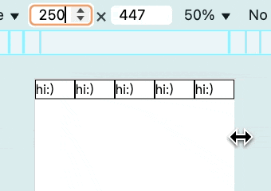

# 封印無限擴張的道具：css 比較函式

我們在「實戰1」中將設計稿等比縮放實現後，會發現網站在大螢幕看起來會超爆大。

要解決這個問題，我們需要在 `vw` 數值達到某些條件時，限制其大小，而前面介紹的 `calc()` 就只是數學運算工具而已，沒辦法做條件判斷。

CSS 以前只能透過 Media Queries 來做一些粗粒度的條件判斷，例如 (`@media (width < 768px) {}`) 判斷網站 viewport 大小，無法以單個組件的條件來判斷，例如判斷組件寬度小於某個值後就不再變小。

在這個背景下，CSS 比較函式就此誕生，例如 `min()`、`max()`、`clamp()` 等，允許開發者將判斷寫入 CSS 屬性值中。

## min() 與 max()

- `min(<calc-sum>#)` 指定數值上限。
- `max(<calc-sum>#)` 指定數值下限。

所謂 `<calc-sum>` 就是 `calc()` 運算，也就是如果想先運算再比大小，`calc()` 是可以省略的。

**程式碼**

```html
<!DOCTYPE html>
<html lang="en">
<head>
  <meta charset="UTF-8">
  <meta name="viewport" content="width=device-width, initial-scale=1.0">
  <style>
    * {
      margin: 0;
      padding: 0;
    }
    /** box1 跟 box2 是一樣的，只是想展示 calc 可以省略 */
    .box1 {
      width: min(50%, 50px + 50px);
      height: max(50%, 50px + 50px);
      background-color: cadetblue;
    }
    .box2 {
      width: min(50%, calc(50px + 50px));
      height: max(50%, calc(50px + 50px));
      background-color: chocolate;
    }
    .flex {
      display: flex;
      width: 100%;
      height: 100dvh;
    }
  </style>
</head>
<body>
  <div class="flex">
    <div class="box1"></div>
    <div class="box2"></div>
  </div>
</body>
</html>
```

**結果**


- `width: min(50%, 100px)`：
  - 假設視窗寬度為 `201px`，原本 `.box` 寬度應該是 `201px * 50% = 100.5px`。
  - 但因為 `min(50%, 100px)` 相比後，發現 `100px` 比較小，所以限制了 `width` 的數值為 `100px`。
  - 所以這個寫法有效地將 `.box` 的**最大寬度**限制在 `100px`。當視窗寬度超過 `200px` 時（`100px + 100px`），這兩個盒子就不會再變寬了。
- `height: max(50%, 100px)`：
  - 假設視窗高度為 `199px`，原本 `.box` 高度應該是 `199px * 50% = 99.5px`。
  - 但因為 `max(50%, 100px)` 相比後，發現 `100px` 比較大，所以限制了 `height` 的數值為 `100px`。
  - 所以這個寫法有效地將 `.box` 的**最小高度**限制在 `100px`。當視窗高度小於 `200px` 時，盒子的實際高度會被鎖定在 `100px`，不會再隨視窗縮小。

## clamp()

`clamp(MIN, VAL, MAX)` 的底層邏輯就是 `max(MIN, min(VAL, MAX))`，也就是將數值控制在兩個數值之間。

**程式碼**

```html
<!DOCTYPE html>
<html lang="en">
<head>
  <meta charset="UTF-8">
  <meta name="viewport" content="width=device-width, initial-scale=1.0">
  <style>
    * {
      margin: 0;
      padding: 0;
    }
    .box {
      /* 寬度要是 50%，但是不能小於 50px，也不能大於 100px */
      width: clamp(50px, 50%, 100px);
      background-color: cadetblue;
    }
  </style>
</head>
<body>
  <div class="box">hi:)</div>
</body>
</html>
```

**結果**


`.box` 的寬度為 50%，但是數值被限制在 50px 與 100px 之間：

- 當視窗小於 100px 時（`100px * 50% = 50px`），盒子就不再縮小。
- 當視窗大於 200px 時（`200px * 50% = 100px`），盒子就不再放大。

但我必須說，應該在兩三年前，我當時的同事發現有人的瀏覽器不支持 `clamp`，而他整個網站寫了一堆 `clamp`，我就看著他在那邊一個一個改成 `max(MIN, min(VAL, MAX))`，所以這東西我到現在還是不敢用，~~要是當時有 ai 可以幫他改就好了 😃。~~

## 小結

我們學會了 `min / max` 家族的比較函式用法後，下篇就可以開始解決等比縮放網站無限擴大導致畫面看起來很大的問題，那我們明天見囉～

## 補充說明

### 其他具判斷性質的函式

#### minmax

名字看起來用途跟 `clamp` 一樣，但實際上完全不同：
- `clamp` 是一個通用函式。
- `minmax(MIN,MAX)` 幾乎是為 `grid` 設計出來的函式。

**grid 常見的 RAM (repeat, auto, minmax) 寫法**

```html
<!DOCTYPE html>
<html lang="en">
<head>
  <meta charset="UTF-8">
  <meta name="viewport" content="width=device-width, initial-scale=1.0">
  <style>
    * {
      margin: 0;
      padding: 0;
      box-sizing: border-box;
    }

    div {
      border: 1px solid black;
    }

    .grid-container {
      border: 0;
      display: grid;
      grid-template-columns: repeat(auto-fit, minmax(50px, 1fr));
    }
  </style>
</head>
<body>
  <div class="grid-container">
    <div>hi:)</div>
    <div>hi:)</div>
    <div>hi:)</div>
    <div>hi:)</div>
    <div>hi:)</div>
  </div>
</body>
</html>
```

**結果**



簡單說一下 `repeat(auto-fit, minmax(50px, 1fr))`：

- `repeat`：設定為重複的欄結構。
- `minmax(50px, 1fr)`：最小值為 50px，最大值為將剩餘空間平均分配。
  - `fr` 在 `grid` 中表示按比例分配，`1fr` 就是佔一份剩餘空間。
- `auto-fit`：這個關鍵字還有個兄弟叫 `auto-fill`，總之就是當有剩餘空間時，怎麼處理：
  ```text
  假設有一個書櫃，預計為每本書留 50 的書格空間
  |50   |50   |50   |50   |50   |

  但是最終只有三本書要放，剩下的兩個空間（剩餘空間）該怎麼處理
  |50   |50   |50   |empty|empty|

  . auto-fill: 把空的書格保留。

  所以 repeat(auto-fill, minmax(50px, 1fr)) 沒有剩餘空間，因為 empty 的書格被留下，整個畫面看起來會是：
  |50   |50   |50   |

  . auto-fit：把空的書格移除。

  所以 repeat(auto-fit, minmax(50px, 1fr)) 會多出 100 的剩餘空間，
  此時 1fr 就有了作用：將剩餘的 100 平均分配給其他書格。
  畫面就會變成：
  |83.33    |83.33    |83.33    |
  ```

以上就是這段 css 的解釋，看不懂也沒關係，就是個與主線無關的補充資訊分享，總之如果你沒有用到 `grid`，那你就用不到 `minmax`。

#### if()

沒錯，後來 CSS 直接出了一個 `if` 函式 XD

**程式碼**

```css
html {
  background-color: if(
    media(width < 200px): cadetblue;
    media(width < 300px): chocolate;
    else: lightgrey;
  );
}
```

**結果**


這應該誰都看得懂吧，總之就是你想的那樣。但是支援度只能說：誰用誰勇者。

## 參考連結

- [RAM](https://web.dev/patterns/layout/repeat-auto-minmax)
- [實戰1：設計稿華麗轉生為等比縮放網站](../../1-vw/5/index.md)
- [將咒語刻印在網頁上：CSS calc()](../../1-vw/3/index.md)
