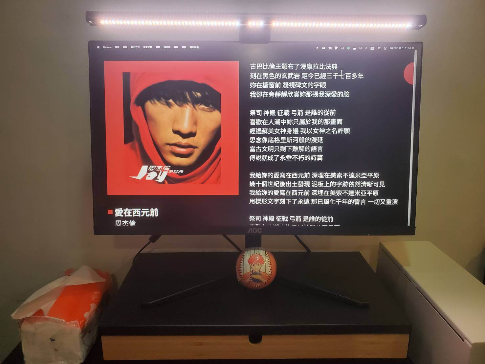
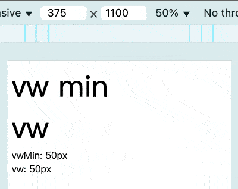
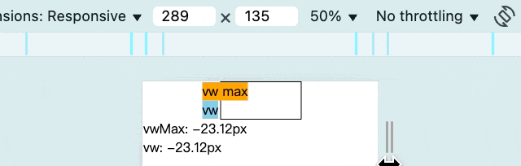

# 為縮放魔法設置疆界：有限的等比縮放

我們完成「實戰1」後會發現：在大螢幕上顯示網站會變得很大。



原因在於當視窗寬度大於設計稿寬度後，vw 數值還是會隨視窗寬度增加而持續**無限制**的往上漲，導致越大的視窗畫面，網站內容就會越大。這張設計稿只有 1440px，所以其實螢幕不用多大就能感受到了😃。

解決方法也很簡單：**讓縮放不超過某個值**就行了。所以我們在「封印無限擴張的道具」中學了 css 比較函式的使用方式，當畫面超出設計稿寬度時，我們只需利用 `min()` 跟 `max()` 來限制最終的數值大小即可。

根據 `vw` 數值的不同，使用的函式也會有所不同，那我們開始吧～

## 數值大於零

當視窗寬度變大時，這個數值就會跟著往上漲，此時我們只需拿一個固定的 `px` 數值跟這個 `vw` 數值相比取最小值（`min()`），當 `vw` 的數值超過 `px` 的數值時，`min()` 就會使用 `px` 的數值，如此就能避免 `vw` 的數值無限制的往上漲。

所以在數值大於零的時候，我們會使用下面這個公式：

> `min( 設計稿上的值px, calc( 設計稿上的值 / 設計稿寬度 * 100vw ))`
> `min( 設計稿上的值px, 設計稿上的值 / 設計稿寬度 * 100vw )`

```html
<!DOCTYPE html>
<html lang="en">
<head>
  <meta charset="UTF-8">
  <meta name="viewport" content="width=device-width, initial-scale=1.0">
  <style>
    .vwMin {
      font-size: min(50px, calc(50 / 375 * 100vw)); /* calc() 可以省略 */
    }
    .vw {
      font-size: calc(50 / 375 * 100vw);
    }
  </style>
</head>
<body>
  <div class="vwMin">
  vw min
  </div>
  <div class="vw">
  vw
  </div>

  <!-- 下面這些方便觀察而已 -->
  <div id="info"></div>
  <script>
    const domInfo = document.querySelector('#info')
    const domVwMin = document.querySelector('.vwMin')
    const domVw = document.querySelector('.vw')

    const updateInfo = () => {
      const vwMinFontSize = getComputedStyle(domVwMin).fontSize
      const vwFontSize = getComputedStyle(domVw).fontSize

      domInfo.innerHTML = `
        vwMin: ${vwMinFontSize}<br/>
        vw: ${vwFontSize}
      `
    }

    window.addEventListener('resize', updateInfo)

    updateInfo()
  </script>
</body>
</html>
```



- 當視窗寬度小於 `375px` 時，`font-size` 會跟原本一樣不停等比縮放。
- 當視窗寬度大於 `375px` 時，`font-size` 原本會超過 `50px`，但是因為使用 `min()` 讓 `vw` 數值跟 `50px` 相比取最小值，所以就會一直保持在 `50px`。

## 數值小於零

反過來說，當 `vw` 數值為負數時，視窗寬度持續變大就會造成這個數值持續變小，而我們只需拿一個固定的 `px` 數值來與這個 `vw` 數值相比取最大值（`max()`）。當 `vw` 的數值低於 `px` 的數值時，`max()` 就會使用 `px` 的數值，如此就能避免 `vw` 的數值無限制的變小。

所以在數值小於零的時候，我們會使用下面這個公式：

> `max( 設計稿上的值px, calc( 設計稿上的值 / 設計稿寬度 * 100vw ))`
> `max( 設計稿上的值px, 設計稿上的值 / 設計稿寬度 * 100vw )`

```html
<!DOCTYPE html>
<html lang="en">
<head>
  <meta charset="UTF-8">
  <meta name="viewport" content="width=device-width, initial-scale=1.0">
  <style>
    * {
      margin: 0;
      padding: 0;
      box-sizing: border-box;
    }

    .box {
      width: 100px;
      margin: auto;
      border: 1px solid black;
    }

    .vwMax {
      width: max-content;
      background-color: orange;
      margin-left: max(-30px, calc(-30 / 375 * 100vw));
    }

    .vw {
      width: max-content;
      background-color: skyblue;
      margin-left: calc(-30 / 375 * 100vw);
    }
  </style>
</head>
<body>
  <div class="box">
    <div class="vwMax">
      vw max
    </div>
    <div class="vw">
    vw
    </div>
  </div>

  <!-- 下面這些方便觀察而已 -->
  <div id="info"></div>
  <script>
    const domInfo = document.querySelector('#info')
    const domVwMax = document.querySelector('.vwMax')
    const domVw = document.querySelector('.vw')

    const updateInfo = () => {
      const vwMaxMarginLeft = getComputedStyle(domVwMax).marginLeft
      const vwMarginLeft = getComputedStyle(domVw).marginLeft

      domInfo.innerHTML = `
        vwMax: ${vwMaxMarginLeft}<br/>
        vw: ${vwMarginLeft}
      `
    }

    window.addEventListener('resize', updateInfo)

    updateInfo()
  </script>
</body>
</html>
```



- 當視窗寬度小於 `375px` 時，`margin-left` 會跟原本一樣不停等比縮放。
- 當視窗寬度大於 `375px` 時，`margin-left` 原本會小於 `-30px`，但是因為使用 `max()` 讓 `vw` 數值跟 `-30px` 相比取最大值，所以就會一直保持在 `-30px`。

## 數值等於零

這...那你就直接寫 0 就好了啊 😃

## 小結

以上就是當你想要避免網站無限制等比縮放造成畫面看起來很大時的作法。下一篇我們就要將「實戰1」給更新，解決這個超爆大的畫面增長問題。

## 參考連結

- [實戰1：設計稿華麗轉生為等比縮放網站](../../1-vw/5/index.md)
- [封印無限擴張的道具：css 比較函式](../1/index.md)
