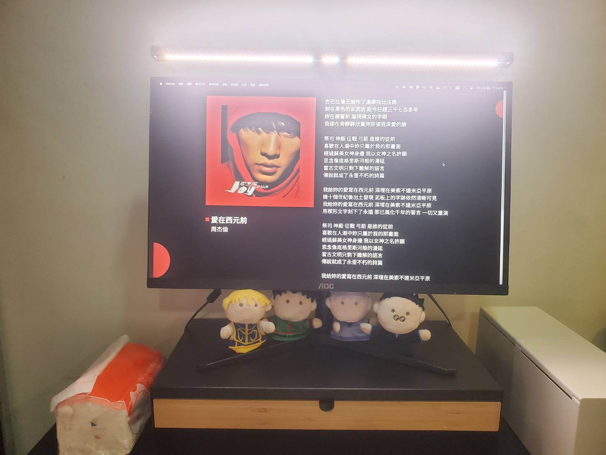
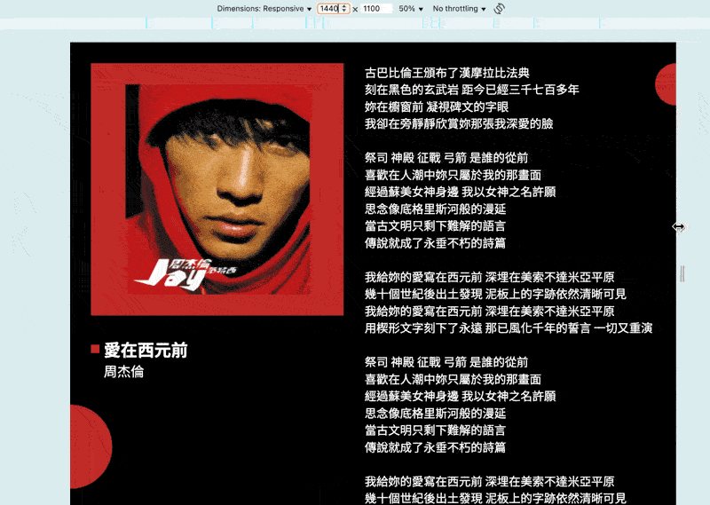

# 實戰2：為轉生後的設計稿施加封印

我們在「為縮放魔法設置疆界」中展示了等比縮放產生的畫面過大問題，並學會如何限制 `vw` 的數值成長：

如果想避免 `vw` 無限制的放大或縮小，可以使用 `max()` 與 `min()` 來限制，正數使用 `min()` 來限制放大，負數使用 `max()` 來限制縮小。因此產生兩個公式：

- 正數使用 `min( 設計稿上的值px, calc( 設計稿上的值 / 設計稿寬度 * 100vw ))` 公式。
- 負數使用 `max( 設計稿上的值px, calc( 設計稿上的值 / 設計稿寬度 * 100vw ))` 公式。

有了這兩個公式，我們就能修改「實戰1」的程式碼來解決無限制縮放畫面的問題了～

## 修改程式碼

只要把「實戰1」那一堆 `calc( 設計稿上的值 / 設計稿寬度 * 100vw )` 公式全部改成上面兩個公式即可。

**修改範例**

```shell
   .square {
-    left: calc(-10 / 375 * 100vw);
-    width: calc(10 / 375 * 100vw);
-    height: calc(10 / 375 * 100vw);
+    left: max(-10px, calc(-10 / 375 * 100vw));
+    width: min(10px, calc(10 / 375 * 100vw));
+    height: min(10px, calc(10 / 375 * 100vw));
   }
```

這邊就不全列了，可以到最下面看完整的程式碼。

**結果**


結果已經相當接近「前言篇」中我們所預期的目標展示效果了！

當視窗寬度大於設計稿寬度時，利用 `min()` 和 `max()` 讓畫面停止放大或縮小，當使用者的視窗畫面太大時，就不會感覺網站怎麼超爆大，使用體驗應該會比較舒服些。



## 延伸固定

細看第一天的展示效果可能會發現，左邊的圓圈在視窗超過 `1440px` 跟 `375px` 的時候，會直接固定在原地，但是右邊沒有，這是為了呈現兩者不同而故意設計。

- 右邊圓圈其實就是沒特別去處理的情況，也就是上面那種效果。
- 左邊圓圈的最終實現方式會在下一期跟大家分享，但其實現在也能用已知的方法來實現：
  1. 在圓圈外加一層 `absolute` 盒子。
  2. 讓盒子跟設計稿的大小相同：
     - 盒子最大寬度必須與設計稿同寬。
     - 盒子高度為 `100%`。
  3. 盒子位置 `top:0` 與置中。
  4. 讓圓圈相對於盒子。

**index.html**

圓圈外加一層盒子。

```shell
- <div class="circle1"></div>
+ <div class="lock-box">
+   <div class="circle1"></div>
+ </div>
```

**src/normal.css**

盒子最大只能與設計稿同寬，也就是 `width: min(1440px, 100vw);` 與 `width: min(375px, 100vw);`，並且依上述方式實現即可。

```css
.lock-box {
  position: absolute;
  top: 0;
  left: 50%;
  transform: translate(-50%, 0);
  width: min(1440px, 100vw);
  height: 100%;
}

@media (width < 768px) {
  .lock-box {
    width: min(375px, 100vw);
  }
}
```

**效果**



現在我們就完全實現了第一天的展示效果，注意左邊圓圈的位置，當超出 `1440px` 與 `375px` 時，左邊圓圈就定在原地，相對於右邊圓圈的處理有明顯的不同。

下篇我們將介紹另一種更簡潔的延伸固定作法～那我們下篇見囉！

## 參考連結

- [實戰1：設計稿華麗轉生為等比縮放網站](../../1-vw/5/index.md)
- [為縮放魔法設置疆界：有限的等比縮放](../2/index.md)

## 最終程式碼

- 這是沒有延伸固定的版本歐～有需要就直接照著上面寫的做法去修改即可。
- `css/reset.css` 與 `index.html` 可以去「實戰1」中複製，都沒變。

**src/normal.css**

```css
:root {
  --color-red: #C22A29;
}

html, body {
  overflow-x: hidden;
}

body {
  background-color: black;
  min-height: 100vh;
  min-height: 100dvh;

  color: white;
  font-family: "Noto Sans TC", sans-serif;
}

/* layout */
#app {
  position: relative;
  left: 50%;
  transform: translateX(-50%);

  width: 100vw;
  overflow: hidden;
  padding: min(50px, calc(50 / 1440 * 100vw)) 0;
}

.container {
  width: min(1340px, calc(1340 / 1440 * 100vw));
  margin: auto;
  display: flex;
}

.box1 {
  margin-right: min(50px, calc(50 / 1440 * 100vw));
}

.box2 {
  flex: 1;
}

@media (width < 768px) {
  #app {
    padding: min(30px, calc(30 / 375 * 100vw)) 0;
  }

  .container {
    width: min(335px, calc(335 / 375 * 100vw));
    flex-direction: column;
    align-items: center;
  }

  .box1 {
    margin-right: 0;
    margin-bottom: min(20px, calc(20 / 375 * 100vw));
  }
}

/* album */
.album {
  width: max-content;
  background: var(--color-red);
  padding: min(50px, calc(50 / 1440 * 100vw));
  margin-bottom: min(50px, calc(50 / 1440 * 100vw));
}

.album-inner {
  position: relative;
  width: min(500px, calc(500 / 1440 * 100vw));
}

.album-inner::after {
  content: '';
  display: block;
  padding-top: 100%;
}

.album img {
  position: absolute;
  top: 0;
  left: 0;
  width: 100%;
  height: 100%;
  object-fit: contain;
}

@media (width < 768px) {
  .album {
    padding: min(20px, calc(20 / 375 * 100vw));
    margin-bottom: min(20px, calc(20 / 375 * 100vw));
  }

  .album-inner {
    width: min(260px, calc(260 / 375 * 100vw));
  }
}

/* info */
.info-box {
  padding-left: min(30px, calc(30 / 1440 * 100vw));
}

.square {
  position: absolute;
  top: 50%;
  left: max(-10px, calc(-10 / 1440 * 100vw));
  transform: translate3d(-100%,-50%,0);

  width: min(20px, calc(20 / 1440 * 100vw));
  height: min(20px, calc(20 / 1440 * 100vw));
  background-color: var(--color-red);
}

.song {
  position: relative;

  font-size: min(40px, calc(40 / 1440 * 100vw));
  font-weight: 700;
}

.singer {
  font-size: min(32px, calc(32 / 1440 * 100vw));
}

@media (width < 768px) {
  .info-box {
    padding-left: min(20px, calc(20 / 375 * 100vw));
  }

  .square {
    left: max(-10px, calc(-10 / 375 * 100vw));
    width: min(10px, calc(10 / 375 * 100vw));
    height: min(10px, calc(10 / 375 * 100vw));
  }

  .song {
    font-size: min(25px, calc(25 / 375 * 100vw));
  }

  .singer {
    font-size: min(18px, calc(18 / 375 * 100vw));
  }
}

/* lyrics */
.lyrics {
  font-size: min(28px, calc(28 / 1440 * 100vw));
}

@media (width < 768px) {
  .lyrics {
    font-size: min(14px, calc(14 / 375 * 100vw));
  }
}

/* circle */
.circle1 {
  position: absolute;
  top: min(862px, calc(862 / 1440 * 100vw));
  left: max(-100px, calc(-100 / 1440 * 100vw));

  width: min(200px, calc(200 / 1440 * 100vw));
  height: min(200px, calc(200 / 1440 * 100vw));
  border-radius: 50%;
  background-color: var(--color-red);
}

.circle2 {
  position: absolute;
  top: min(50px, calc(50 / 1440 * 100vw));
  right: max(-50px, calc(-50 / 1440 * 100vw));

  width: min(100px, calc(100 / 1440 * 100vw));
  height: min(100px, calc(100 / 1440 * 100vw));
  background: var(--color-red);
  border-radius: 50%;
}

@media (width < 768px) {
  .circle1 {
    top: max(-25px, calc(-25 / 375 * 100vw));
    left: max(-25px, calc(-25 / 375 * 100vw));
    width: min(50px, calc(50 / 375 * 100vw));
    height: min(50px, calc(50 / 375 * 100vw));
  }

  .circle2 {
    top: min(362px, calc(362 / 375 * 100vw));
    right: max(-50px, calc(-50 / 375 * 100vw));
    width: min(100px, calc(100 / 375 * 100vw));
    height: min(100px, calc(100 / 375 * 100vw));
  }
}
```
