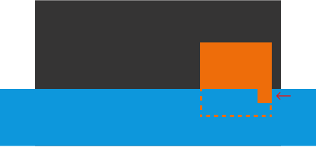

# 實戰3：無痕的延伸固定之術

如果使用有限的等比縮放來切版，當畫面超出設計稿時，通常需要思考那些依附於視窗畫面的物件應該放在哪個位置，這篇我將分享一些處理思路～那我們開始吧。


假設灰色部分是當前使用者的視窗畫面，而黑色部分是設計稿，因為有限等比縮放導致設計稿的內容不再縮放，那麼此時原本在邊邊的那些圓圈通常有兩種選擇：

- **1 號位**：固定在原地，也就是我所稱的延伸固定，以下就都稱 1 號位。
- **2 號位**：隨著視窗離去，以下就都稱 2 號位。

如果選擇 2 號位，其實就不用特別處理，他本來就會隨著視窗離去，這篇想討論的是 1 號位程式碼該怎麼處理。

## 與設計稿同寬的 absolute 盒子

這個方法在「實戰2」中已經實現過，有興趣可以回去看看！


作法就是寫一個示意圖中的 **absolute 綠框框**（不用將講解用的 `border` 寫出來），並將原本依附於視窗卻想要在 1 號位的物件，直接改成依附於綠框框即可，但是這個方法有些需要注意的地方：

### 程式碼較雜亂

首先你要為了這件事情至少多一層 DOM 就是挺煩人的一件事了。

以這個範例來說，左邊那個圓想要在 1 號位，右邊那個圓想要在 2 號位，那你的綠框框就只能包住左邊圓，但明明這兩個圓可能其實是同一個性質的物件，HTML 的結構看起來就挺不舒服的。

再想像一個情境，假設你的背景有兩層完全不同上下文的背景疊再一起，這兩層背景裡面都有想放 1 號位與 2 號位的物件，那此時要不要將兩層背景拆成四層背景，還是只寫一個綠框框塞兩層背景的 1 號位？如果只有一個綠框框，有時候遇到 `z-index` 的問題也是會有點麻煩。

在真實的切版實戰中可能有超多層背景，HTML 結構光用想像的都覺得可怕。

### 背景色延伸問題



這是設計師蠻常見的處理照片手法：假設想讓照片（橘色）前面疊一層遮擋物（藍色），被遮擋的部分想要露出某部分（箭頭指的那個小矩形），此時至少會產生三層的圖層結構。

問題來了：照片想在 1 號位，但是藍色的遮擋物延伸到兩邊 2 號位，此時怎麼辦？

- 要馬照片用兩個綠框框個別裝起來。
- 要馬將整個照片裝在綠框框中，並在兩邊補上延伸的藍色，但如果遮擋不是單純的純色矩形就會很難處理。

這還只是這種情境中最單純的示意，有此可知綠框框方案在很多時候會有些困難。

## 數學定位


以數學的角度來看，如果我想讓 2 號位移到 1 號，其實只要將視窗多出來的空間的一半加在 2 號位上（藍線），那不就搞定了嗎！而多出來的空間就是視窗寬度（ `100vw` ）減去設計稿寬度，因此我們會得出一個公式：

> `calc((100vw - 設計稿寬度) / 2 + (設計稿上的值))`

有了這個公式後，我們就可以不需要使用綠框框來將物件固定在原地，以下兩個準則可以參考：

- 當視窗畫面比設計稿寬時，使用 `calc((100vw - 設計稿寬度) / 2 + (設計稿上的值))`。
- 當視窗畫面比設計稿窄時，使用 `calc(設計稿上的值 / 設計稿寬度 * 100vw)`。
  - 因為視窗比設計稿寬度窄，所以不需使用 `min` 與 `max` 來限制，此時寫了還是會取 `vw` 的數值，所以寫了也沒用。

有了參考準則與公式，我們就能將「實戰2」的程式碼給更新了。

**normal.css 修改**

```shell
 .circle1 {
-  left: max(-100px, calc(-100 / 1440 * 100vw));
+  left: calc(-100 / 1440 * 100vw);
 }

+@media (width >= 1440px) {
+  .circle1 {
+    left: calc((100vw - 1440px) / 2 + (-100px));
+  }
+}
+

 @media (width < 768px) {
   .circle1 {
-    left: max(-25px, calc(-25 / 375 * 100vw));
+    left: calc((100vw - 375px) / 2 + (-25px));
   }
 }

+@media (width < 375px) {
+  .circle1 {
+    left: calc(-25 / 375 * 100vw);
+  }
+}
```

為了版面乾淨，這邊就不全列了，可以到最下面看完整的程式碼。

**結果**


跟綠框框效果是一樣的，但是又不用動到 `html` 結構，而缺點是需要在好幾個斷點去更新位置的公式。

## 小結

我們學會綠框框與數學定位後，分享兩個選擇方向：

- 當背景物件相當多，並且全都選擇留在 1 號位時，綠框框是個更簡單的選擇。
- 其他情況也許數學定位會是更方便的處理方式。

總算把我切版最基礎知識點全部講完了～我平常工作就是依靠這三個公式將網站等比縮放到網頁中：

- 等比縮放：`calc( 設計稿上的值 / 設計稿寬度 * 100vw )`。
- 有限等比縮放：
  - 正數：`min( 設計稿上的值px, calc( 設計稿上的值 / 設計稿寬度 * 100vw ))`。
  - 負數：`max( 設計稿上的值px, calc( 設計稿上的值 / 設計稿寬度 * 100vw ))`。
- 延伸固定：`calc((100vw - 設計稿寬度) / 2 + (設計稿上的值))`。

從第一篇看到這的你，其實已經可以跟我完成一模一樣的切版內容了，快去找設計稿試試看吧！寫著寫著可能會發現一個大問題：每個值都要寫一堆超長公式，開發體驗極低 Q_Q。

後面我將開始分享如何改善這極低的開發體驗～我們下篇見囉！

## 參考連結

- [實戰1：設計稿華麗轉生為等比縮放網站](../1-vw/5/index.md)
- [實戰2：為轉生後的設計稿施加封印](../2-minmax/3/index.md)

## 最終程式碼

`css/reset.css` 與 `index.html` 可以去「實戰1」中複製，都沒變。

**src/normal.css**

```css
:root {
  --color-red: #C22A29;
}

html, body {
  overflow-x: hidden;
}

body {
  background-color: black;
  min-height: 100vh;
  min-height: 100dvh;

  color: white;
  font-family: "Noto Sans TC", sans-serif;
}

/* layout */
#app {
  position: relative;
  left: 50%;
  transform: translateX(-50%);

  width: 100vw;
  overflow: hidden;
  padding: min(50px, calc(50 / 1440 * 100vw)) 0;
}

.container {
  width: min(1340px, calc(1340 / 1440 * 100vw));
  margin: auto;
  display: flex;
}

.box1 {
  margin-right: min(50px, calc(50 / 1440 * 100vw));
}

.box2 {
  flex: 1;
}

@media (width < 768px) {
  #app {
    padding: min(30px, calc(30 / 375 * 100vw)) 0;
  }

  .container {
    width: min(335px, calc(335 / 375 * 100vw));
    flex-direction: column;
    align-items: center;
  }

  .box1 {
    margin-right: 0;
    margin-bottom: min(20px, calc(20 / 375 * 100vw));
  }
}

/* album */
.album {
  width: max-content;
  background: var(--color-red);
  padding: min(50px, calc(50 / 1440 * 100vw));
  margin-bottom: min(50px, calc(50 / 1440 * 100vw));
}

.album-inner {
  position: relative;
  width: min(500px, calc(500 / 1440 * 100vw));
}

.album-inner::after {
  content: '';
  display: block;
  padding-top: 100%;
}

.album img {
  position: absolute;
  top: 0;
  left: 0;
  width: 100%;
  height: 100%;
  object-fit: contain;
}

@media (width < 768px) {
  .album {
    padding: min(20px, calc(20 / 375 * 100vw));
    margin-bottom: min(20px, calc(20 / 375 * 100vw));
  }

  .album-inner {
    width: min(260px, calc(260 / 375 * 100vw));
  }
}

/* info */
.info-box {
  padding-left: min(30px, calc(30 / 1440 * 100vw));
}

.square {
  position: absolute;
  top: 50%;
  left: max(-10px, calc(-10 / 1440 * 100vw));
  transform: translate3d(-100%,-50%,0);

  width: min(20px, calc(20 / 1440 * 100vw));
  height: min(20px, calc(20 / 1440 * 100vw));
  background-color: var(--color-red);
}

.song {
  position: relative;

  font-size: min(40px, calc(40 / 1440 * 100vw));
  font-weight: 700;
}

.singer {
  font-size: min(32px, calc(32 / 1440 * 100vw));
}

@media (width < 768px) {
  .info-box {
    padding-left: min(20px, calc(20 / 375 * 100vw));
  }

  .square {
    left: max(-10px, calc(-10 / 375 * 100vw));
    width: min(10px, calc(10 / 375 * 100vw));
    height: min(10px, calc(10 / 375 * 100vw));
  }

  .song {
    font-size: min(25px, calc(25 / 375 * 100vw));
  }

  .singer {
    font-size: min(18px, calc(18 / 375 * 100vw));
  }
}

/* lyrics */
.lyrics {
  font-size: min(28px, calc(28 / 1440 * 100vw));
}

@media (width < 768px) {
  .lyrics {
    font-size: min(14px, calc(14 / 375 * 100vw));
  }
}

/* circle */
.circle1 {
  position: absolute;
  top: min(862px, calc(862 / 1440 * 100vw));
  left: calc(-100 / 1440 * 100vw);

  width: min(200px, calc(200 / 1440 * 100vw));
  height: min(200px, calc(200 / 1440 * 100vw));
  border-radius: 50%;
  background-color: var(--color-red);
}

.circle2 {
  position: absolute;
  top: min(50px, calc(50 / 1440 * 100vw));
  right: max(-50px, calc(-50 / 1440 * 100vw));

  width: min(100px, calc(100 / 1440 * 100vw));
  height: min(100px, calc(100 / 1440 * 100vw));
  background: var(--color-red);
  border-radius: 50%;
}

@media (width >= 1440px) {
  .circle1 {
    left: calc((100vw - 1440px) / 2 + (-100px));
  }
}

@media (width < 768px) {
  .circle1 {
    top: max(-25px, calc(-25 / 375 * 100vw));
    left: calc((100vw - 375px) / 2 + (-25px));
    width: min(50px, calc(50 / 375 * 100vw));
    height: min(50px, calc(50 / 375 * 100vw));
  }

  .circle2 {
    top: min(362px, calc(362 / 375 * 100vw));
    right: max(-50px, calc(-50 / 375 * 100vw));
    width: min(100px, calc(100 / 375 * 100vw));
    height: min(100px, calc(100 / 375 * 100vw));
  }
}

@media (width < 375px) {
  .circle1 {
    left: calc(-25 / 375 * 100vw);
  }
}
```
