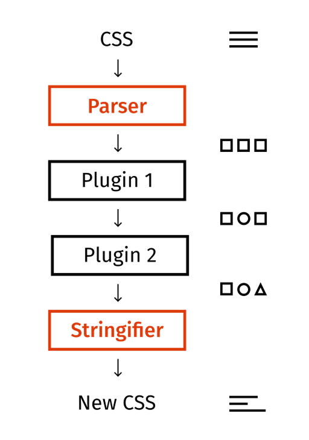

# 煉金工房的核心設施：認識魔法熔爐 PostCSS

我們在學會三大公式並開始嘗試運用到開發中之後，會發現一個大問題：以前屬性值寫 `??px` 就搞定了，現在卻要寫一堆字。所以我們需要一種與過去開發體驗類似的方法，否則你無法說服同事陪你一起等比縮放 Q_Q。

那有沒有可能我們屬性值寫一個函式呼叫，並可以將函式運算後，用結果替換掉該函式呼叫的字串呢？例如：

- `pxToVw(設計稿上的值, 設計稿寬度)`：執行 `設計稿上的值 / 設計稿寬度 * 100vw` 運算替換。
- `pxToVwClamp(設計稿上的值, 設計稿寬度)`：執行 `min(設計稿上的值px, 設計稿上的值 / 設計稿寬度 * 100vw)` 運算替換。
- `pxToVwExtend(設計稿上的值, 設計稿寬度)`：執行 `calc((100vw - 設計稿寬度) / 2 + (設計稿上的值))` 運算替換。

```css
body {
  width: pxToVw(10,100); /* calc( 設計稿上的值 / 設計稿寬度 * 100vw ) */
  height: pxToVwClamp(10,100); /* min( 設計稿上的值px, calc( 設計稿上的值 / 設計稿寬度 * 100vw )) */
  margin-left: pxToVwExtend(10,100); /* calc((100vw - 設計稿寬度) / 2 + (設計稿上的值)) */
}
```

替換成

```css
body {
  /* 10 / 100 * 100 = 10 */
  width: 10vw;
  height: min(10px, 10vw);
  margin-left: calc((100vw - 100px) * 0.5 + 10px);
}
```

要做到這件事情，我們需要具備兩個作用的工具：

1. **拿到所有 css 屬性值**來獲取我們寫的函式呼叫字串。
2. 將函式呼叫運算後**替換原本的 css**。

我目前工作上使用的是 `postcss`，`postcss` 本質上就是：

1. 將你的 `css` 字串解析成一個大 json。
2. 通過各種 hook 將這個大 json 傳給你（拿到原本的 `css`）。
3. 你對這個大 json 進行修改後。
4. 他再將最新的大 json 編譯成新的 `css` 字串（替戶原本的 `css`）。

也就是說 `postcss` 是一個提供 plugin 系統的 JS 工具，主要用來解析轉換 css，這工具完全具有我們所需的兩個條件。



## 核心邏輯

示範用 `postcss` 去修改這個 css。

**normal.css**

```css
/* hello world */
@keyframes aaa {
  0% {
    color: red;
  }
  100% {
    color: blue;
  }
}

.apple {
  color: yellow;
  font-size: 100px;
}
```

**package.json**

```json
{
  "dependencies": {
    "postcss": "^8.5.6"
  },
  "type": "module"
}
```

**main.js**

```js
import fs from 'fs'
import postcss from 'postcss'

/**
 * @type {import('postcss').PluginCreator}
 */
const plugin = function () {
  return {
    // plugin 名字，隨便取。
    postcssPlugin: ' :) ',
    Comment: (comment) => {
      console.log('[ Comment ]')
      console.log(comment.text)

      comment.text = ':)'
    },
    Declaration: (decl) => {
      console.log('[ Declaration ]')
      console.log(`${decl.prop}: ${decl.value}`)

      if (decl.prop === 'color') {
        decl.value = 'chocolate'
      }
    },
  }
}

plugin.postcss = true

fs.readFile('./normal.css', (_, data) => {

  postcss([plugin])
    .process(data, {from:'./normal.css'})
    .then((result) => {
      console.log('[ Final ]')
      console.log(result.css)
    })
})
```

`postcss` 核心流程就三個：

1. `postcss()`：安裝插件。
2. `.process()`：處理數據。
3. `.then()`：獲取處理後結果。

我做了幾件事情：

1. 建立插件
   - 監聽 `Comment`：當 postcss 解析到 CSS 註解時，會執行這個 hook，此時我將註解都改成 `:)`。
   - 監聽 `Declaration`：當 postcss 解析到每一句 CSS 設定時，會執行這個 hook，例如 `color: red;`，此時我將 `color` 都改成 `chocolate`。
   - 注意！插件一定要寫 `.postcss = true`，這是 `postcss` 規定的。
2. 讀取 `normal.css` 的內容。
3. 安裝插件 ( `postcss([plugin])` )。
4. 傳入要解析的內容 ( `.process(data, { from: "./normal.css" })` )
   - `from` 參數推薦要寫，不寫編譯器會罵你。
   - `process` 執行後：
     1. 把你傳入的內容解析成一個大 JSON。
     2. 將大 json 傳入所有安裝過的插件中。
     3. 插件監聽的 hook 就會執行，此時你就能修改內容。
     4. 如果內容有被改，就會再次拿著更新後的內容，執行一遍更新內容的 hook 們，直到大 json 沒有再被更改為止。
5. `then` 返回最終結果。
   - 裡面有個 `.css` 是經過修改後的新 css 字串。

**結果**

```shell
% node ./main.js
[ Comment ]
hello world
[ Declaration ]
color: red
[ Declaration ]
color: blue
[ Declaration ]
color: yellow
[ Declaration ]
font-size: 100px


[ Comment ]
:)
[ Declaration ]
color: chocolate
[ Declaration ]
color: chocolate
[ Declaration ]
color: chocolate


[ Final ]
/* :) */
@keyframes aaa {
  0% {
    color: chocolate;
  }
  100% {
    color: chocolate;
  }
}

.apple {
  color: chocolate;
  font-size: 100px;
}
```

- 註解變成 `:)` 而 `color` 都變成 `chocolate`。
- `Postcss` 的 hook 有個重要特性：如果大 json 的某個值被更新後，就會再次執行一輪 hook，但是只有參與更新的 Hook 與數據會被再次執行。不段重複，直到沒有數據更新為止，以此保證所有數據都可以被完整更新。
  - 輸出的結果看起來執行了兩輪。
  - 但是 `font-size` 沒有在第二輪出現，因為 `font-size` 在第一輪的 `Declaration` 沒有被更新。
  - 並且也沒有第三輪，因為第二輪就沒有東西被更新了。

以上就是 `postcss` 的運行邏輯，不過大部分的人實際上都不是這樣用 `postcss` 的，而是透過一些接口來啟動 `postcss` 開關，下篇我們要來介紹其中一個開關，那我們下篇見囉～

## 補充說明

### hook

hook 在 `postcss` 裡面叫 `visitor`，不過我還是習慣叫他 `hook`，所以後面我都會用 `hook`。

### 大 json

專有名詞叫做 `AST ( 抽象語法樹，Abstract Syntax Tree )`，這是相當龐大的主題，實在沒辦法在這展開講（而且我也不懂😆），總之就是用一個樹狀結構去解釋原始碼的每一個節點（node）的技術。

用國文課的方式分享我對 `AST` 的理解，國文課應該都會講什麼主詞、動詞、物件等，現在我們來分析這段舔狗金句：

> **我應該在車底，不應該在車裡，看到你們有多甜蜜。**

```js
const sentenceAST = {
  type: '句子',
  value: '我應該在車底，不應該在車裡，看到你們有多甜蜜。'
  nodes: [
    {
      type: '子句',
      value: '我應該在車底，'
      nodes: [
        {
          type: '主詞',
          value: '我'
        },
        {
          type: '動詞',
          value: '應該在'
        },
        {
          type: '物件',
          value: '車底'
        }
      ],
      attributes: {
        separator: '，'
      }
    },
    {
      type: '子句',
      value: '不應該在車裡，'
      nodes: [
        {
          type: '動詞',
          value: '不應該在'
        },
        {
          type: '物件',
          value: '車裡'
        }
      ],
      attributes: {
        separator: '，'
      }
    },
    {
      type: '子句',
      value: '看到你們有多甜蜜。'
      nodes: [
        {
          type: '動詞',
          value: '看到'
        },
        {
          type: '物件',
          value: '你們有多甜蜜'
        }
      ],
      attributes: {
        separator: '。'
      }
    }
  ]
};
```

這就是 `AST` 做的事情，他是一位結構拆解專家。

### Lightning.css

雖然我現在是用 `postcss`，但只要符合**獲取 css 屬性值**與**修改 css 屬性值**兩個條件的工具都可以，目前市面上最有名的替代方案應該是用 `Rust` 寫的 `Lightning.css`，他有個 `transform` 的 API 也能做到，不過目前 `postcss` 市佔還是有相當大的領先，所以後面我們會持續圍繞 `postcss`，這邊就當個額外資訊分享～

## 參考連結

- [postcss](https://postcss.org/)
- [AST explorer](https://astexplorer.net/)
- [Lightning.css](https://lightningcss.dev/transforms.html)
