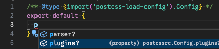

# 讓 webpack 老大哥，學會使用 postcss 魔法熔爐

上一篇我們體驗了 `postcss` 的運作過程，不過大部分使用 `postcss` 的方式都是透過打包工具，打包工具跟 `postcss` 的流程差不多：

- 提供處理函式安裝。
- 讀取檔案，將內容交給一連串處理函式。
  - 第一個處理函式拿到打包工具讀到的原始數據，處理完後，再傳給下個處理函式。
  - 最後一個處理函式，必須返回打包工具指定的格式，例如一段 `module.exports = ...` JS 模組字串。
    - 打包工具就只是個 JS 腳本，他只能識別 `js` 與 `json`。
    - 而打包工具無法識別的內容，需要透過這些處理函式，編譯成它能理解的字串。
- 打包工具將處理後的內容，拼接到最終打包文件中。
- 將打包文件交給 JS 引擎執行。

打包工具跟 `postcss` 主要差別在於應用層面：

- `postcss` 主要用於處理 `css`。
- 打包工具是個超級大平台，包含各種類似 `postcss` 的工具，例如 `babel` 等。

## loader

本篇要介紹的打包工具 `webpack` 引入了 `loader` 的概念，其他打包工具也都有類似的東西，只是名字可能叫做 `plugin`、`transformer` 等，本質上就是 JS 處理函式：

1. 接收打包工具傳入的內容。
2. 修改內容。
3. 返回結果。

`loader` 還有一些延伸概念，例如處理執行流程的 `Pitch-loader && Normal-loader`、可在模組中使用的 `inline-loader` 等，就不額外展開了。

## postcss-loader

我們用下面這個範例來嘗試理解 `postcss-loader`：

**package.json**

```json
{
  "dependencies": {
    "postcss": "^8.5.6"
  },
  "type": "module"
}
```

**normal.css**

```css
/* hello world */
.apple {
  color: yellow;
  font-size: 100px;
}
```

**main.js**

`postcss-loader` 的原始碼沒有這麼簡單，這邊為了讓大家理解而簡化了。

```js
import fs from 'fs'
import postcss from 'postcss'

// postcss plugin
/**
 * @type {import('postcss').PluginCreator}
 */
const plugin = function () {
  return {
    postcssPlugin: ' :) ',
    Comment: (comment) => {
      comment.text = ':)'
    },
    Declaration: (decl) => {
      if (decl.prop === 'color') {
        decl.value = 'chocolate'
      }
    },
  }
}

plugin.postcss = true

const RESOURCE_PATH = './normal.css'

// ---- 模擬 postcss-loader ----
function postcssLoader(source, callback) {
  postcss([plugin])
    .process(source, {from: RESOURCE_PATH})
    .then((result) => {
      callback(null, result.css)
    })
}


// ---- 模擬 webpack 與 loader 的交互行為 ----
fs.readFile(RESOURCE_PATH, (_, data) => {
  const cssString = data.toString()

  // . 把讀到的數據傳給 loader
  postcssLoader(cssString, (err, css) => {
    if (err) {throw err}

    // . 將 loader 傳出來的數據傳給下一個 loader
    // . 直到最後會拿到一個 js script 來執行
    console.log('[ Final Output ]')
    console.log(css)
  })
})
```

- `plugin`：延續「煉金工房的核心設施」的範例，將註解改成 `:)`、顏色改成 `chocolate`。
- 整個執行過程：
  1. `webpack` 讀到數據後傳入 `postcssLoader`。
  2. `postcssLoader` 將數據交給 `postcss`。
  3. `postcss` 將數據傳入各個 `plugin` 處理。
  4. `postcssLoader` 將 `postcss` 處理完的數據返回給 `webpack`。
  5. `webpack` 繼續將數據傳給下一個 `loader`，直到最後一個 `loader` 處理完為止，並期望該 `loader` 返回的內容是 js 模組字串。

**結果**

```shell
% node ./main.js
[ Final Output ]
/* :) */
.apple {
  color: chocolate;
  font-size: 100px;
}
```

`postcss-loader` 核心任務就是作為打包工具與 Postcss 之間的橋樑，此外 `postcss-loader` 還處理了 `sourceMap` 等其他附加資訊，就不額外展開了。

## 在 Webpack 中使用 postcss

打包工具在應用的層面上，其實就是一堆設定的相互配合，梳理一下流程：

1. 準備一個要被 `webpack` 作為打包入口的 JS 文件。
2. 準備一個被入口文件 import 的 css 文件，該內容會被 `postcss` 修改。
3. 準備 `webpack` 設定檔：`webpack.config.js`，並且至少裝上 `postcss-loader` 來使用 `postcss`。
4. 準備 `postcss.config.js`：`postcss-loader` 會自動查找項目根目錄的 `postcss` 設定檔。

**package.json**

```json
{
  "devDependencies": {
    "css-loader": "^7.1.2",
    "mini-css-extract-plugin": "^2.9.4",
    "postcss-load-config": "^6.0.1",
    "postcss-loader": "^8.1.1",
    "webpack": "^5.101.3",
    "webpack-cli": "^6.0.1"
  }
}
```

- `webpack`
  - `webpack`：本體。
  - `webpack-cli`：提供執行 `webpack` 指令的工具。
- `css`
  - `postcss-loader`：讓 `webpack` 使用 `postcss` 的中介層。
  - `postcss-load-config`：`postcss` 設定檔的類型提示（可選）。
  - `css-loader`：將 css 字串改成 JS 模組字串，例如：`export default ".apple { color: red; }"`。
  - `mini-css-extract-plugin`：在 `webpack` 中處理 css 有兩種常見的方法：
    - 把讀到的 `css` 塞到 `HTML` 的 `<style>`，此時我們會使用 `style-loader` 來處理。
    - 把讀到的 `css` 寫入一個檔案，就是使用 `mini-css-extract-plugin`。

**src/index.js**

打包入口的 JS 文件。

```js
import './normal.css'
```

**src/normal.css**

```css
/* hi */
body {
  color: blue;
}
```

**postcss.config.js**

詳細設定請看官方文件，最重要的是 `plugins`，用來 setup postcss plugin，也就是「煉金工房的核心設施」中，範例所寫的 `postcss([plugin])`。

```js
const myPlugin = function ({txt = ':)', color = 'orange'} = {}) {
  return {
    postcssPlugin: 'my-plugin',
    Comment: (comment) => {
      comment.text = txt
    },
    Declaration: (decl) => {
      if (decl.prop === 'color') {
        decl.value = color
      }
    },
  }
}

myPlugin.postcss = true

/** @type {import('postcss-load-config').Config} */
export default {
  plugins: [
    myPlugin({color: 'chocolate'}),
  ],
}
```

延續「煉金工房的核心設施」的範例，將 `comment` 改成 `:)`、`color` 改成 `chocolate`。

**webpack.config.js**

```js
import MiniCssExtractPlugin from 'mini-css-extract-plugin'
import {join} from 'path'

export default {
  entry: join(import.meta.dirname, './src/index.js'),
  mode: 'production',
  module: {
    rules: [
      {
        test: /\.css$/,
        use: [MiniCssExtractPlugin.loader, 'css-loader', 'postcss-loader'],
      },
    ],
  },
  plugins: [new MiniCssExtractPlugin()],
}
```

- `entry`：指定打包入口。
- `mode`：`webpack` 啟用模式。
  - 為了觀察乾淨的編譯結果，選擇 `production`。
  - 另一種模式叫 `development`，編譯結果會有一堆有的沒的標記。
- `module.rules`
  - 這是一套 loader 載入規則：當文件名符合 `test` 正規表示式時，就會將內容傳給 `use` 裡的 `loader` 處理。
  - `webpack loader` 預設是從後往前執行的，所以是：
    1. 執行 `postcss-loader`，將 `css` 交給 `postcss` 編譯成我想要的樣子。
    2. 執行 `css-loader`，將 `css` 編譯成 `js` 模組字串。
    3. 執行 `MiniCssExtractPlugin.loader`，將 `js` 模組字串攔截，後續讓插件處理。
  - `loader` 有個 `enforce` 可以主動控制執行順序，就不展開說明了。
- `plugins` 在 `webpack` 中比較像是擴展 `webpack` 整體功能。
  - `new MiniCssExtractPlugin` 會將 `MiniCssExtractPlugin.loader` 攔截的內容寫入獨立的 css 檔案中。

**結果**

```shell
% npx webpack && cat ./dist/main.css
# ...省略

/* :) */
body {
  color: chocolate;
}
```

- `webpack` 預設會打包到 `dist/`。
- `MiniCssExtractPlugin` 預設會寫入 `main.css`。
- 註解變成 `:)`、`color` 變成 `chocolate` 了

## 小結

以上就是如何在 `webpack` 中使用 `postcss` 的過程，不過近年除了 `webpack` 外，`vite` 是另一個常見的打包工具，下篇我們將介紹 `postcss` 在 `vite` 中的使用，我們下篇見囉～

## 補充說明

### postcss-loader 維護團隊

`postcss-loader` 的維護團隊是 `Webpack` 官方維護團隊（`webpack-contrib`）。

### postcss-load-config 的效果



有提示就是讚。

### HtmlWebpackPlugin

在 `webpack` 中，經常會使用 `html-webpack-plugin` 插件來生成 `html` 文件，他的作用是：

1. 獲取 HTML 模板。
2. 觀察 webpack 最終打包的檔案有哪些。
3. 在 HTML 中注入 `<script/>` 或 `<link/>` 來引入這些打包後的資源。

延續上面的範例：

**下載**

```shell
npm i html-webpack-plugin -D
```

**webpack.config.js**

```js
import MiniCssExtractPlugin from 'mini-css-extract-plugin'
import {join} from 'path'
import HtmlWebpackPlugin from 'html-webpack-plugin'

export default {
  entry: join(import.meta.dirname, './src/index.js'),
  mode: 'production',
  module: {
    rules: [
      {
        test: /\.css$/,
        use: [MiniCssExtractPlugin.loader, 'css-loader', 'postcss-loader'],
      },
    ],
  },
  plugins: [new HtmlWebpackPlugin({template: join(import.meta.dirname, './index.html')}), new MiniCssExtractPlugin()],
}
```

**index.html**

```html
<!DOCTYPE html>
<html lang="en">
<head>
</head>
<body>
  hi :)
</body>
</html>
```

其他都沒變

**結果**

```shell
% npx webpack && ls -l dist && cat ./dist/index.html

-rw-r--r--@ 1 jz  staff  153 Sep 27 17:57 index.html
-rw-r--r--@ 1 jz  staff   39 Sep 27 17:57 main.css
-rw-r--r--@ 1 jz  staff    0 Sep 27 17:57 main.js

<!doctype html><html lang="en"><head><script defer="defer" src="main.js"></script><link href="main.css" rel="stylesheet"></head><body>hi :)</body></html>
```

生成的 html 注入了其他打包資源的標籤，這就是 webpack 最基礎的完整使用流程，為了 webpack 篇的完整性，額外分享這個常用插件給你～

## 參考連結

- [webpack](https://webpack.js.org/)
- [postcss-loader](https://www.npmjs.com/package/postcss-loader)
- [css-loader](https://www.npmjs.com/package/css-loader)
- [style-loader](https://www.npmjs.com/package/style-loader)
- [postcss-load-config](https://github.com/postcss/postcss-load-config)
- [mini-css-extract-plugin](https://www.npmjs.com/package/mini-css-extract-plugin)
- [煉金工房的核心設施：認識魔法熔爐 PostCSS](../1/index.md)
