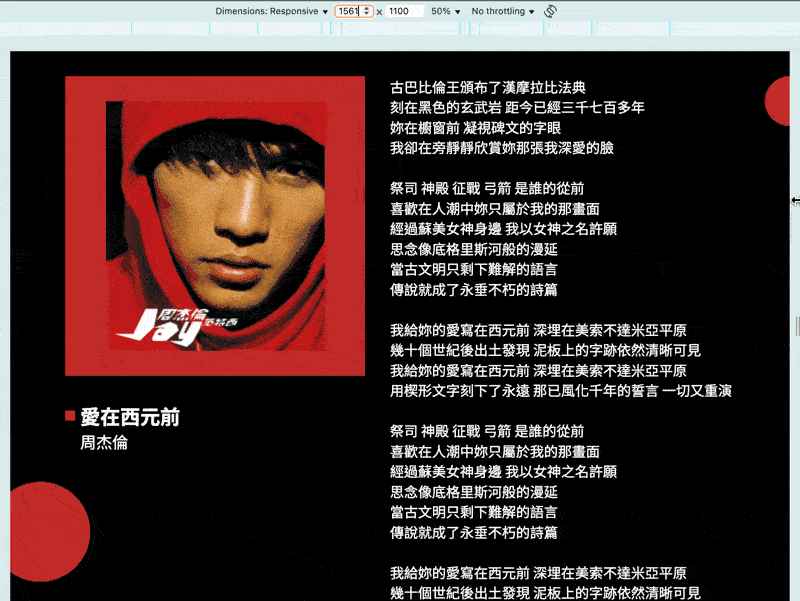

# 實戰4：揮舞魔法奇物，重鑄 CSS 咒文

我們已經將「用等比縮放達到我心中的 pixel perfect」的設計稿實現了三遍，第一遍是等比縮放，第二遍是有限的等比縮放，第三遍是延伸固定。

這三遍都存在數值書寫太長的問題，而這次我們要用 `postcss` 篇所學，將冗長的公式替換成函式呼叫，透過 `postcss-functions` 將函式呼叫執行後的結果替換函式呼叫字串，如此既能維持等比縮放的效果又能有相對簡潔的開發體驗！

## 函式改寫

在「現成的魔法奇物」中，我們將「函式呼叫替換所有基礎篇的公式」給實現了，但那些函式有個問題：設計稿寬度應該是固定的，而函式卻設計需要傳兩個參數：**設計稿寬度**與**設計稿上的值**，導致使用時會一直重複寫設計稿寬度的值。

為解決這件事情，我們應該要做一個開工前準備：**為每一個設計稿寬度，都建立一套專屬的函式**，具體來說就是**在每個函式後面寫個數字來代表某個設計稿寬度**，如此就能將設計稿寬度寫死在各別函式中，例如我們的範例設計稿有兩張（1440px 與 375px）：

- `375px` 用 1 來代表：
  - `pxToVw1(設計稿上的值)`。
  - `pxToVwClamp1(設計稿上的值)`。
  - `pxToVwExtend1(設計稿上的值)`。
- `1440px` 用 2 來代表：
  - `pxToVw2(設計稿上的值)`。
  - `pxToVwClamp2(設計稿上的值)`。
  - `pxToVwExtend2(設計稿上的值)`。

此時在 css 寫函式呼叫時，就不用寫設計稿寬度了！現在我們就能開始更新「實戰3」的程式碼：

**package.json**

```json
{
  "type": "module",
  "devDependencies": {
    "postcss-functions": "^4.0.2",
    "postcss-load-config": "^6.0.1",
    "vite": "^7.1.4"
  }
}
```

將 `vite`、`postcss-functions`、`postcss-load-config` 載下來。

**postcss.config.js**

```js
import postcssFunctions from 'postcss-functions'

// [ 等比縮放 ]
const pxToVw = (value, designDraft) => {
  value = parseFloat(value)
  designDraft = parseFloat(designDraft)
  return `${value / designDraft * 100}vw`
}

// [有限的等比縮放]
const pxToVwClamp = (value, designDraft) => {
  value = parseFloat(value)
  designDraft = parseFloat(designDraft)

  if (value === 0) {
    return 0
  }

  return value > 0 ? `min(${value}px, ${pxToVw(value, designDraft)})` : `max(${value}px, ${pxToVw(value, designDraft)})`
}

// [延伸固定]
const pxToVwExtend = (value, designDraft) => {
  value = parseFloat(value)
  designDraft = parseFloat(designDraft)

  return `calc((100vw - ${designDraft}px) / 2 + (${value}px))`
}

const DESIGN_DRAFT1 = 375
const DESIGN_DRAFT2 = 1440

/** @type {import('postcss-load-config').Config} */
export default {
  plugins: [
    postcssFunctions({
      functions: {
        pxToVw1: (value) => pxToVw(value, DESIGN_DRAFT1),
        pxToVwClamp1: (value) => pxToVwClamp(value, DESIGN_DRAFT1),
        pxToVwExtend1: (value) => pxToVwExtend(value, DESIGN_DRAFT1),
        pxToVw2: (value) => pxToVw(value, DESIGN_DRAFT2),
        pxToVwClamp2: (value) => pxToVwClamp(value, DESIGN_DRAFT2),
        pxToVwExtend2: (value) => pxToVwExtend(value, DESIGN_DRAFT2),
      },
    }),
  ],
}
```

實現兩張設計稿共六個函式：

1. 將「現成的魔法奇物」中的函式實現複製過來。
2. `functions` 選項的函式名依據上面說的規則修改：
   - 在函式後面寫一個數字來代表某個設計稿寬度。
   - 只接受設計稿上的值的參數。
   - 將設計稿上的值與寫死的設計稿寬度傳入已經實現的函式中。

**css/normal.css**

最後，將所有公式都替換成這些函式呼叫就完成了。

```shell
.circle1 {
   position: absolute;
-  top: min(862px, calc(862 / 1440 * 100vw));
-  left: calc(-100 / 1440 * 100vw);
+  top: pxToVwClamp2(862);
+  left: pxToVw2(-100);

-  width: min(200px, calc(200 / 1440 * 100vw));
-  height: min(200px, calc(200 / 1440 * 100vw));
+  width: pxToVwClamp2(200);
+  height: pxToVwClamp2(200);
   border-radius: 50%;
   background-color: var(--color-red);
 }

@media (width >= 1440px) {
   .circle1 {
-    left: calc((100vw - 1440px) / 2 + (-100px));
+    left: pxToVwExtend2(-100);
   }
 }

@media (width < 768px) {
   .circle1 {
-    top: max(-25px, calc(-25 / 375 * 100vw));
-    left: calc((100vw - 375px) / 2 + (-25px));
-    width: min(50px, calc(50 / 375 * 100vw));
-    height: min(50px, calc(50 / 375 * 100vw));
+    top: pxToVwClamp1(-25);
+    left: pxToVwExtend1(-25);
+    width: pxToVwClamp1(50);
+    height: pxToVwClamp1(50);
   }
 }

 @media (width < 375px) {
   .circle1 {
-    left: calc(-25 / 375 * 100vw);
+    left: pxToVw1(-25);
   }
 }
```

為了版面乾淨，這邊只列 `.circle1` 的 diff，因為他每個函式都用到了，完整版可到最下面看～總之就是：

- `calc(設計稿上的值 / 設計稿寬度 * 100vw)` 替換成 `pxToVw?(設計稿的值)`。
- `min(設計稿上的值px, calc(設計稿上的值 / 設計稿寬度 * 100vw))` 替換成 `pxToVwClamp?(設計稿上的值)`
- `max(設計稿上的值px, calc(設計稿上的值 / 設計稿寬度 * 100vw))` 替換成 `pxToVwClamp?(設計稿上的值)`。
- `calc((100vw - 設計稿寬度) / 2 + (設計稿上的值))` 替換成 `pxToVwExtend?(設計稿的值)`。

**結果**

```shell
% npx vite
```



我沒有複製同一張圖，效果真的沒變，最下面有最終原始碼，可以自己複製去執行看看！

## 小結

這一切是不是變得很簡潔了？

此時你可能會發現一個新問題：函式名那麼長誒，我怎麼記得住？這也很簡單啊，不會自己函式名取短一點歐 😃，那有沒有可能我就想取超爆長的函式名，但又想有優秀的開發體驗呢？下篇我將分享這題的解決方案，敬請期待囉～

## 連結參考

- [實戰1：設計稿華麗轉生為等比縮放網站](../../../1-基礎篇/1-vw/5/index.md)
- [實戰2：為轉生後的設計稿施加封印](../../../1-基礎篇/2-minmax/3/index.md)
- [實戰3：無痕的延伸固定之術](../../../1-基礎篇/3-extension/index.md)
- [現成的魔法奇物：postcss-functions](../postcss-functions-1/index.md)
- [用等比縮放達到我心中的 pixel perfect](../../../0-first/index.md)

## 最終程式碼

- `css/reset.css` 跟 `index.html` 可以去「實戰1」中複製，都沒變。
- `package.json` 跟 `postcss.config.js` 在上面。

**css/normal.css**

```css
:root {
  --color-red: #C22A29;
}

html, body {
  overflow-x: hidden;
}

body {
  background-color: black;
  min-height: 100vh;
  min-height: 100dvh;

  color: white;
  font-family: "Noto Sans TC", sans-serif;
}

/* layout */
#app {
  position: relative;
  left: 50%;
  transform: translateX(-50%);

  width: 100vw;
  overflow: hidden;
  padding: pxToVwClamp2(50) 0;
}

.container {
  width: pxToVwClamp2(1340);
  margin: auto;
  display: flex;
}

.box1 {
  margin-right: pxToVwClamp2(50);
}

.box2 {
  flex: 1;
}

@media (width < 768px) {
  #app {
    padding: pxToVwClamp1(30) 0;
  }

  .container {
    width: pxToVwClamp1(335);
    flex-direction: column;
    align-items: center;
  }

  .box1 {
    margin-right: 0;
    margin-bottom: pxToVwClamp1(20);
  }
}

/* album */
.album {
  width: max-content;
  background: var(--color-red);
  padding: pxToVwClamp2(50);
  margin-bottom: pxToVwClamp2(50);
}

.album-inner {
  position: relative;
  width: pxToVwClamp2(500);
}

.album-inner::after {
  content: '';
  display: block;
  padding-top: 100%;
}

.album img {
  position: absolute;
  top: 0;
  left: 0;
  width: 100%;
  height: 100%;
  object-fit: contain;
}

@media (width < 768px) {
  .album {
    padding: pxToVwClamp1(20);
    margin-bottom: pxToVwClamp1(20);
  }

  .album-inner {
    width: pxToVwClamp1(260);
  }
}

/* info */
.info-box {
  padding-left: pxToVwClamp2(30);
}

.square {
  position: absolute;
  top: 50%;
  left: pxToVwClamp2(-10);
  transform: translate3d(-100%,-50%,0);

  width: pxToVwClamp2(20);
  height: pxToVwClamp2(20);
  background-color: var(--color-red);
}

.song {
  position: relative;

  font-size: pxToVwClamp2(40);
  font-weight: 700;
}

.singer {
  font-size: pxToVwClamp2(32);
}

@media (width < 768px) {
  .info-box {
    padding-left: pxToVwClamp1(20);
  }

  .square {
    left: pxToVwClamp1(-10);
    width: pxToVwClamp1(10);
    height: pxToVwClamp1(10);
  }

  .song {
    font-size: pxToVwClamp1(25);
  }

  .singer {
    font-size: pxToVwClamp1(18);
  }
}

/* lyrics */
.lyrics {
  font-size: pxToVwClamp2(28);
}

@media (width < 768px) {
  .lyrics {
    font-size: pxToVwClamp1(14);
  }
}

/* circle */
.circle1 {
  position: absolute;
  top: pxToVwClamp2(862);
  left: pxToVw2(-100);

  width: pxToVwClamp2(200);
  height: pxToVwClamp2(200);
  border-radius: 50%;
  background-color: var(--color-red);
}

.circle2 {
  position: absolute;
  top: pxToVwClamp2(50);
  right: pxToVwClamp2(-50);

  width: pxToVwClamp2(100);
  height: pxToVwClamp2(100);
  background: var(--color-red);
  border-radius: 50%;
}

@media (width >= 1440px) {
  .circle1 {
    left: pxToVwExtend2(-100);
  }
}

@media (width < 768px) {
  .circle1 {
    top: pxToVwClamp1(-25);
    left: pxToVwExtend1(-25);
    width: pxToVwClamp1(50);
    height: pxToVwClamp1(50);
  }

  .circle2 {
    top: pxToVwClamp1(362);
    right: pxToVwClamp1(-50);
    width: pxToVwClamp1(100);
    height: pxToVwClamp1(100);
  }
}

@media (width < 375px) {
  .circle1 {
    left: pxToVw1(-25);
  }
}
```
