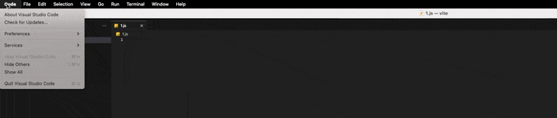
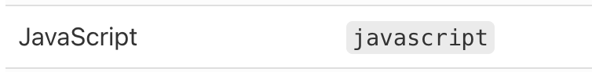
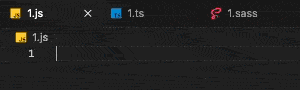
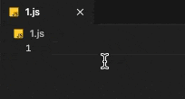
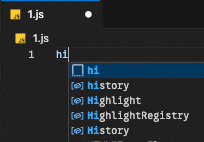
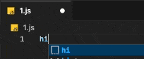
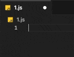
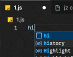
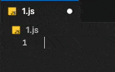
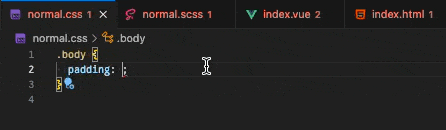

# 手工刻印的快捷符文：VSCode Snippet

在「實戰4」中，我們完成了用函式替代公式的實作，但在最後留下一個疑問：函式名太長怎辦？身為一個記性差的人，我的解法就是 `Snippet`。

## `Snippet` 是啥？

`Snippet` 是**可重複使用的短程式片段**，常見於兩種情境：

1. 文件上的範例片段：
   - 前面那一堆程式碼範例就叫 `Snippet`。
   - 讓讀者自行複製貼上用的。
2. IDE Snippet：
   - 設定縮寫與對應的模板：輸入縮寫時，會跳出提示，讓使用者決定是否用模板來替代縮寫。
   - 主流 IDE 大多都有提供此功能。

而我指的 `Snippet` 就是 IDE Snippet，以下將聚焦於我平常使用的 VSCode。

## VSCode Snippet

### 設定方法

VSCode 對於 Snippet 的設定分為 Global 與 Project：

#### Global Snippet

這個設定適用於所有專案，所以我平常較少使用，避免污染其他專案設定。

##### UI Click

依序點擊：`Code > Preferences > Configure Snippets`。



按鈕位置可能因 VSCode 版本不同而有所變動。

##### Command Palette

1. 打開命令面板 ( `Command + P` 或 `Ctrl + P` )。
2. 輸入 `> Snippet`。
3. 選擇 `Configure Snippets`。


#### Project Snippet

在專案根目錄創建 `.vscode/[language-identifier].code-snippets` 文件即可。

例如我想要 js 專用 Snippet 設定：

1. 去官方文件查 js 在 VSCode 的 id 叫啥。
   
2. 創建 `.vscode/javascript.code-snippets`。

如果文件名不想使用 `javascript.code-snippets`，可以在 `code-snippets` 設定中指定 `scoped`：

- 有 `scope` 設定，會以這個設定為主。
- 沒有 `scope` 設定，會看檔名 id。

### 設定內容

Snippet 設定是一個 `json`，我平常會用的設定就三個：`scope`、`prefix`、`body`。

#### scope

- 就是 language-identifier。
- 可以設定多種文件，用 `,` 區隔，例如 `javascript,typescript`。

```json
{
  "!!": {
    "scope": "javascript,typescript",
    "prefix": "hi",
    "body": "hi :) !!"
  }
}
```



- `scope` 寫了 `javascript,typescript`，所以 `.js` 跟 `.ts` 的文件都有跳出對應的 snippet。
- `scope` 沒有寫 `sass` 的 id，所以 `.sass` 檔就沒有跳出對應的 snippet。

#### prefix

- 要輸入的縮寫。
- 可以有多個縮寫，用 array。

```json
{
  "!!": {
    "scope": "javascript",
    "prefix": ["hi", "hello"],
    "body": "hi :) !!"
  }
}
```



`hi` 或 `hello` 都有跳出 snippet。

#### body

- 要替換的模板。
- 換行語法有兩種：
  - `\n`。
  - 使用 array，每個 index 都是獨立一行內容。
- 有很多 `$` 開頭的特殊指令可以使用。

##### 游標順序

- `$` 後面加上數字代表游標順序，案 `tab` 可以跳到下一個數字的位置。
- 順序從 `$1` 開始。
- `$0` 是最後一個，代表結束編輯。

```json
{
  "!!": {
    "scope": "javascript",
    "prefix": "hi",
    "body": ["$2", "---", "$0", "---", "$1"]
  }
}
```



順序為：`$1 -> $2 -> $0`。

##### 特殊變數

VSCode 提供很多特殊變數可用，例如當前的年月日等，以下擷取幾個官方文件的變數說明：

- `CURRENT_YEAR`: The current year
- `CURRENT_MONTH`: The month as two digits (example '02')
- `CURRENT_DATE`: The day of the month as two digits (example '08')

在 VSCode 提供的變數前面加 `$` 即可。

```json
{
  "!!": {
    "scope": "javascript",
    "prefix": "hi",
    "body": "$CURRENT_YEAR-$CURRENT_MONTH-$CURRENT_DATE"
  }
}
```



輸入 `hi` 後，按下 tab 就變成當前日期了。

##### 默認值

- 語法是 `${順序:default}`：什麼都不輸入直接按 `tab`，會使用默認值。
- 默認值可以是特殊變數。

```json
{
  "!!": {
    "scope": "javascript",
    "prefix": "hi",
    "body": ["${1:aaa}", "${2:aaa}", "${3:$CURRENT_YEAR}"]
  }
}
```



- `$1` 直接按 tab，結果是 `aaa`。
- `$2` 開始打字後，`aaa` 就被清掉了。
- `$3` 默認值可以是特殊變數（當前年份）。

##### 默認值 ENUM

- 語法是 `${順序|default1,default2,...|}`：讓你的默認值有多個選擇

```json
{
  "!!": {
    "scope": "javascript",
    "prefix": "hi",
    "body": "${1|aaa,bbb,ccc|}"
  }
}
```



##### 輸出 `$`

因為 `$` 被拿去做特殊指令的辨識符，如果想輸出 `$`，需使用 `\` 來跳脫。

```json
{
  "!!": {
    "scope": "javascript",
    "prefix": "hi",
    "body": "\\$1"
  }
}
```



- 第一個 `\` 是用來跳脫第二個 `\` 的，因為 `\` 在字串中有特殊意義，為了輸出 `\`，需要在前面多一個 `\` 來跳脫。
- 成功輸出 `\` 後，就能用 `\` 來跳脫 `$` 了。

其他太複雜的功能平常根本用不到，我其實只會用到游標順序而已 😃

### 應用

現在我們就能解決函式名太長而記不住的問題，解決辦法就是將「實戰4」的函式呼叫字串寫進 body 中，並想個縮寫設定在 `prefix` 即可，所以我們需要先規劃縮寫：

- `pxToVw` 縮寫用 `vw`。
- `pxToVwClamp` 縮寫用 `vwc`。
- `pxToVwExtend` 縮寫用 `vwe`。

延續「實戰4」的函式名定義，後面會加上數字。

**.vscode/jay.code-snippets**

```json
{
  "vw1": {
    "scope": "html,css,sass,scss,less,stylus",
    "prefix": "vw1",
    "body": "pxToVw1($1)$0"
  },
  "vwc1": {
    "scope": "html,css,sass,scss,less,stylus",
    "prefix": "vwc1",
    "body": "pxToVwClamp1($1)$0"
  },
  "vwe1": {
    "scope": "html,css,sass,scss,less,stylus",
    "prefix": "vwe1",
    "body": "pxToVwExtend1($1)$0"
  },
  "vw2": {
    "scope": "html,css,sass,scss,less,stylus",
    "prefix": "vw2",
    "body": "pxToVw2($1)$0"
  },
  "vwc2": {
    "scope": "html,css,sass,scss,less,stylus",
    "prefix": "vwc2",
    "body": "pxToVwClamp2($1)$0"
  },
  "vwe2": {
    "scope": "html,css,sass,scss,less,stylus",
    "prefix": "vwe2",
    "body": "pxToVwExtend2($1)$0"
  }
}
```



1. 在規劃時，有特別都用 `v` 開頭，這樣輸入 `v` 後，就會跳出我們設定的所有縮寫。
2. 按下 tab 後就會跳出對應的函式呼叫字串。

如此就能解決函式名太長的問題，幾乎不用記憶～

## 小結

為了提升等比縮放的開發體驗，我們做了兩件事：

- 使用 `postcss` 來實現函式呼叫替換公式。
- 使用 `Snippet` 來輸入函式呼叫。

其實整個提升開發體驗的部分到這就都分享完了，但在重新檢視整個開發過程後，會發現有個困擾：我們需「手動」維護整套函式呼叫程式碼與 Snippet，身為一個懶人開發者，有沒有可能只需準備設計稿寬度等資訊，就能自動生成這個工作流所需的所有工具呢？下篇將揭曉工作流的最後一塊拼圖～也就是在「用等比縮放達到我心中的 pixel perfect」提過的秘密武器，我們下篇見！

## 參考連結

- [VSCode Snippet](https://code.visualstudio.com/docs/editing/userdefinedsnippets)
- [VSCode Language Identifiers](https://code.visualstudio.com/docs/languages/identifiers)
- [實戰4：揮舞魔法奇物，重鑄 CSS 咒文](../../4-postcss-functions/2/index.md)
- [用等比縮放達到我心中的 pixel perfect](../../../0-first/index.md)
