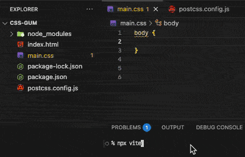

# 終極煉金術：揭曉秘密武器 css-gum

在「手工刻印的快捷符文」的最後，我們留下了一個問題：為了提升等比縮放的開發體驗，我們需「手動」維護整套函式呼叫程式碼與 Snippet，有沒有可能只需準備設計稿寬度等資訊，就能自動生成這個工作流所需的所有工具呢？

從第一篇到現在的整套工作流分享，完全是我自己這幾年開發經驗的積累所形成的，說不定這世上沒有第二個人跟我用一樣的做法在寫網站，所以要找到可以解決上述需求的工具可能有些困難，但是**我手上有一個，你要試試嗎？**

我寫了一個套件叫做 `css-gum`，目標就是解決等比縮放工作流的最後一哩路，處理各種我覺得很麻煩的事情：

- 實現所有計算函式。
- 批量處理多張設計稿的設定。
- 生成所有函式對應的 Snippet 設定。
- ...

最終的目標是希望只要寫一點點配置就可以直接開工。

**package.json**

```json
{
  "type": "module",
  "devDependencies": {
    "postcss-functions": "^4.0.2",
    "postcss-load-config": "^6.0.1",
    "vite": "^7.1.4"
  },
  "dependencies": {
    "css-gum": "^1.4.2"
  }
}
```

**index.html**

```html
<!DOCTYPE html>
<html lang="en">
<head>
  <meta charset="UTF-8">
  <meta name="viewport" content="width=device-width, initial-scale=1.0">
  <link rel="stylesheet" href="./main.css">
</head>
<body>
  hi :)
</body>
</html>
```

**postcss.config.js**

```js
import postcssFunctions from 'postcss-functions'
import {Gen, Snippet} from 'css-gum'
import {join, dirname} from 'path'
import {fileURLToPath} from 'url'

const __dirname = import.meta.dirname ?? dirname(fileURLToPath(import.meta.url)) ?? ''

const draftWidthPoints = [375, 1440]
const mediaQueryPoints = [375, 768, 1440]
const snippetOutputs = [join(__dirname, '.vscode/css-gum.code-snippets')]

const {core, VSCodeSnippet} = Gen.genFuncsDraftWidth({points: draftWidthPoints})
Snippet.writeSnippetsToFiles({
  ...VSCodeSnippet,
  ...Snippet.genVSCodeSnippetMediaQuery({points: mediaQueryPoints}),
}, snippetOutputs)

/** @type {import('postcss-load-config').Config} */
export default {
  plugins: [
    postcssFunctions({
      functions: core,
    }),
  ],
}
```

整個設定檔的核心，其實只有 `Gen.genFuncsDraftWidth` 和 `Snippet.writeSnippetsToFiles` 這兩個函式。我們所做的，就只是把專案的基礎資訊告訴 `css-gum`：

- `draftWidthPoints`：設計稿寬度。
- `mediaQueryPoints`：響應式的斷點。
- `snippetOutputs`：Snippet 的輸出路徑。

這篇我們先**感受**這些函式的作用，後面會陸續與你分享他們究竟做了些什麼～

**開發體驗**



```css
body {
  font-size: vw1(100);
}

@media (width < 768px) {
  body {
    font-size: vw0(100);
  }
}
```

**結果**


套件雖然是在鐵人賽期間爆肝寫出來的，不過這些核心邏輯在我的切版模板中已經迭代多年，我也拿它寫了幾個網站，目前應該是沒什麼太大的問題。

- 如果有什麼問題，歡迎到 `css-gum` 的 GitHub 上，幫我發個 Issue～我有時間會回覆您。
- 如果覺得很好用，歡迎到 `css-gum` 的 GitHub 上，給我一顆星星 ⭐，滿足我當工程師的虛榮心 XD。

接下來的幾篇，我將詳細介紹 `css-gum` 的用法以及我為什麼會這樣設計 API，那就聽我娓娓道來吧～下篇見！

## 參考連結

- [css-gum](https://github.com/jzovvo/css-gum)
- [手工刻印的快捷符文：VSCode Snippet](../../5-snippets/1/index.md)
