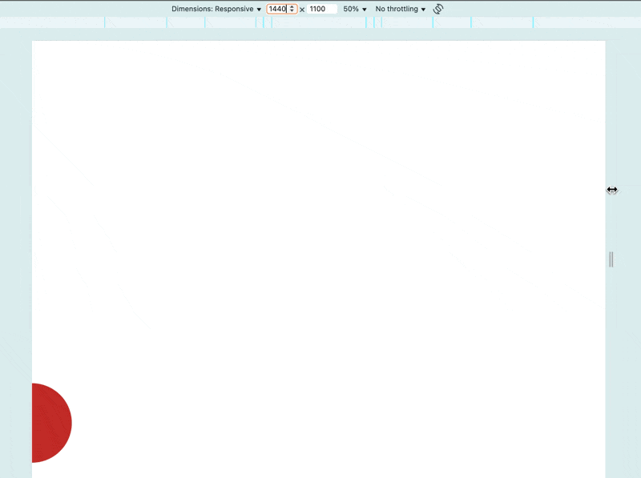

# 煉金術師的入門套組：css-gum 的 Core 模組

在看完「現成的魔法奇物」後，我們知道可以利用 `postcss-functions` 輕鬆的攔截 css 屬性值中的函式呼叫語法，並用函式呼叫後的結果替換該函式呼叫字串。所以我們需要實現這些函式來提供 `postcss-functions` 執行，而 `css-gum` 最重要的任務就是替你完成這些函式實現。

```ts
interface Core {
  vw(pixel: number, designDraft: number, space?: 0 | 1): string;
  vwc(pixel: number, designDraft: number, space?: 0 | 1): string;
  vwe(pixel: number, designDraft: number, percent?: number, space?: 0 | 1): string;
  percent(child: number, parent: number, space?: 0 | 1): string;
  em(targetValue: number, fontSize: number, space?: 0 | 1): string;
  lh(targetValue: number, fontSize: number, space?: 0 | 1): string;
}
```

## 等比縮放三兄弟

**函式說明**

在「現成的魔法奇物」篇最下面，我們將三個公式命名了對應的函式：

- 等比縮放：`pxToVw`。
- 有限的等比縮放：`pxToVwClamp`。
- 延伸固定：`pxToVwExtend`。

而 `css-gum` 導出一個了 `Core` 模組，裡面裝的就是這些函式：

- `vw` 就是 `pxToVw`。
- `vwc` 就是 `pxToVwClamp`。
- `vwe` 就是 `pxToVwExtend`。

**參數說明**

- `pixel`：設計稿上的值。
- `designDraft`：設計稿寬度。
- `space`：是否加上空格，預設是 `0`。
  - 我們先不管這個參數，下面會解釋。
- `percent`：分配剩餘空間的比例，預設是 `0.5`。
  - 延伸固定的公式為 `calc((100vw - 設計稿寬度) / 2 + (設計稿上的值))`，也就是當視窗寬度超出設計稿寬度時，將視窗寬度超出設計稿寬度的部分，分一半給設計稿上的值，以保證某個物件視覺上永遠維持在與設計稿相同的位置，不會隨著畫面的變大而改變，詳情可以去看「實戰3」。
  - 公式的`/ 2` 就等於 `* 0.5`，而這個 `percent` 就是 `*` 後面的值，這個值應該一輩子都是 `0.5`，為了彈性我把他開出來給使用者設定。

**使用測試**

```js
import {Core} from 'css-gum'

console.log(Core.vw(100, 1000))  // 10vw
console.log(Core.vwe(100, 1000)) // calc((100vw - 1000px) * 0.5 + 100px)
console.log(Core.vwe(100, 1000, 1)) // calc((100vw - 1000px) * 1 + 100px)
console.log(Core.vwc(100, 1000)) // min(100px, 10vw)
console.log(Core.vwc(-100, 1000)) // max(-100px, -10vw)
```

## 其他小工具

除了核心的等比縮放三兄弟外，還塞了一些平常切版常用的換算小工具。

**使用測試**

```js
import {Core} from 'css-gum'

console.log(Core.percent(100, 1000)) // 10%
console.log(Core.em(35, 20)) // 1.75em
console.log(Core.lh(35, 20)) // 1.75
```

## 使用範例

直接將 `Core` 傳入 `postcss-functions` 的 `functions` 選項中，就可以開工了 😃。

**package.json**

```json
{
  "type": "module",
  "devDependencies": {
    "postcss-functions": "^4.0.2",
    "vite": "^7.1.4"
  },
  "dependencies": {
    "css-gum": "^1.4.2"
  }
}
```

**postcss.config.js**

直接將 `Core` 整包丟進 `functions`。

```js
import postcssFunctions from 'postcss-functions'
import {Core} from 'css-gum'

/** @type {import('postcss-load-config').Config} */
export default {
  plugins: [
    postcssFunctions({
      functions: Core,
    }),
  ],
}
```

**index.html**

```html
<!DOCTYPE html>
<html lang="en">
<head>
  <meta charset="UTF-8">
  <meta name="viewport" content="width=device-width, initial-scale=1.0">
  <style>
  * {
    margin: 0;
    padding: 0;
    border: 0;
  }

  .circle {
    position: absolute;
    top: vwc(862, 1440);
    left: vw(-100, 1440);

    width: vwc(200, 1440);
    height: vwc(200, 1440);
    border-radius: 50%;
    background-color: #C22A29;
  }

  @media (width >= 1440px) {
    .circle {
      left: vwe(-100, 1440);
    }
  }

  @media (width < 768px) {
    .circle {
      top: vwc(-25, 375);
      left: vwe(-25, 375);
      width: vwc(50, 375);
      height: vwc(50, 375);
    }
  }

  @media (width < 375px) {
    .circle {
      left: vw(-25, 375);
    }
  }
</style>
</head>
<body>
  <div class="circle"></div>
</body>
</html>
```

如果你是從第一篇一路追過來的讀者，對於這顆紅球肯定相當熟悉，就是設計稿左邊那顆球。

**結果**

```shell
% npx vite
```



位置大小都跟實戰中一致，證明所有函式計算後的數值都正確，以上就是 `Core` 模組的使用方法。

## space 參數

在解釋 `space` 參數前，我們先看個簡單的 `tailwind` 範例，如果看不懂 `tailwind` 也沒關係，看結論的部分即可～過程其實不重要。

**package.json**

```json
{
  "type": "module",
  "devDependencies": {
    "@tailwindcss/postcss": "^4.1.13",
    "tailwindcss": "^4.1.13",
    "vite": "^7.1.4"
  }
}
```

**postcss.config.js**

```js
export default {
  plugins: {
    '@tailwindcss/postcss': {
      optimize: {minify: true},
    },
  },
}
```

- `optimize.minify`：是否幫你壓縮 css 文件。
  - 預設本來就是 `true`，我只是特別寫出來強調一下。

**normal.css**

```css
@import "tailwindcss/utilities.css";
```

- 這是 `tailwind` 基本用法，將編譯後的 css import 進來。

**index.html**

```html
<link rel="stylesheet" href="./normal.css">
<div class="p-[calc(1px+1px)_calc(1,2)]">1</div>
<div class="p-[calc(1,2)_calc(1px+1px)]">1</div>
<div class="p-[calc(1px+1px)_calc(10px+10vw)]">1</div>
<div class="p-[hi(1,2)_calc(1px+1px)]">1</div>
```

這邊寫了幾個 `padding` 設定，並且有一些 `tailwind` 認為不合法或不認識的 css 函式呼叫：

- `p-[calc(1px+1px)_calc(1,2)]`：後面 `calc(1,2)` 不合法。
- `p-[calc(1,2)_calc(1px+1px)]`：前面 `calc(1,2)` 不合法。
- `p-[calc(1px+1px)_calc(10px+10vw)]`：完全合法。
- `p-[hi(1,2)_calc(1px+1px)]`：不認識 `hi`。

**打包結果**

- 為了明確成因，我把 `vite` 的壓縮關掉，也就是編譯後的壓縮結果一定是 `tailwind` 完成的。
- 為了方便觀察，我將編譯後的 css 給 format 後貼上。

```shell
% npx vite build --minify false
```
```css
/*! tailwindcss v4.1.13 | MIT License | https://tailwindcss.com */
.p-\[calc\(1\,2\)_calc\(1px\+1px\)\] {
  padding: calc(1, 2)calc(1px + 1px)
}

.p-\[calc\(1px\+1px\)_calc\(1\,2\)\] {
  padding: calc(1px + 1px)calc(1, 2)
}

.p-\[calc\(1px\+1px\)_calc\(10px\+10vw\)\] {
  padding: 2px calc(10px + 10vw)
}

.p-\[hi\(1\,2\)_calc\(1px\+1px\)\] {
  padding: hi(1, 2)calc(1px + 1px)
}
```

從結果可以反推：當 `tailwind` 處理 `optimize.minify` 時，**會嘗試執行函式，如果無法執行，就會把函式呼叫原封不動的還你，但會把 `_` 所產生的空格移除**。我不確定其他 CSS 預處理器是否也有相同處理，但只要有一個編譯器有此情形，身為 `css-gum` 的作者就需要處理 Q_Q。

總之這會造成 **`tailwind` 不認識我們傳入 `postcss-functions` 的函式，然後就把中間的空格給刪了**，最終出現 `padding: 3vw4vw` 的窘境。

聰明的你應該知道 `space` 是幹嘛的，沒錯！既然他不給我空格，那我自己生一個：

- `1` 就是要生成。
- `0` 就是不要生成，預設是 `0`。

接下來就示範空格生成術：

**postcss.config.js**

```js
import {Core} from 'css-gum'

export default {
  plugins: {
    '@tailwindcss/postcss': {
      optimize: {minify: true},
    },
    'postcss-functions': {
      functions: Core,
    },
  },
}
```

**index.html**

```html
<link rel="stylesheet" href="./normal.css">
<!-- 沒有生成空格 -->
<div class="p-[vw(10,100)_vw(20,100)]">1</div>
<!-- 有生成空格 -->
<div class="p-[vw(10,100,1)_vw(20,100)]">1</div>
```

**結果**

```shell
% npx vite build --minify false # vite 壓縮一樣關掉。
```
```css
/*! tailwindcss v4.1.13 | MIT License | https://tailwindcss.com */
.p-\[vw\(10\,100\)_vw\(20\,100\)\] {
  padding: 10vw20vw
}

.p-\[vw\(10\,100\,1\)_vw\(20\,100\)\] {
  padding: 10vw 20vw
}
```

這結果直接就是解決前後的樣子～

## 小結

以上就是 `Core` 完整介紹，下篇我們將介紹支撐 `Core` 模組的底層工具模組，該工具模組讓你可以更自由的在其他地方使用，而不侷限於 css 屬性值的攔截，我們下篇見～

## 補充說明

### space 參數思考

為什麼 `space` 是 `0 | 1` 而不是 `boolean`？下面有兩個開發時的寫法選擇，你會選擇誰：

- `vw(10,1440,1)`。
- `vw(10,1440,true)`。

我當然選短的啊 😃

## 參考連結

- [css-gum](https://github.com/jzovvo/css-gum)
- [現成的魔法奇物：postcss-functions](../../4-postcss-functions/postcss-functions-1/index.md)
- [實戰3：無痕的延伸固定之術](../../../1-基礎篇/3-extension/1/index.md)
