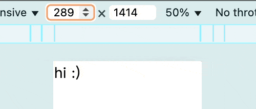

# 魔法的底層迴路：css-gum 的 Util 模組

`css-gum` 中的數值轉換模組除了 `Core` 模組外，還有一個叫做 `Util` 的模組，`Util` 實際上是 `Core` 底層所使用的運算模組，所以 `Util` 的內容跟 `Core` 其實差不多，但是預期兩者的使用場景非常不同，這篇就來介紹 `Util` 模組的使用方法與使用場景。

```ts
interface Util {
  // --- 純數值計算 ---
  percent: (denominator: number) => (numerator: number) => number;
  pxToVw: (designDraftWidth: number) => (pixel: number) => number;

  // --- CSS 字串生成 ---
  cssPercent: (parent: number) => (child: number) => string;
  cssPxToVw: (designDraftWidth: number) => (pixel: number) => string;
  cssPxToVwc: (designDraftWidth: number) => (pixel: number) => string;
  cssPxToVwe: (designDraftWidth: number) => (pixel: number, percent?: number) => string;
  cssEm: (fontSize: number, targetValue: number) => string;
  cssLh: (fontSize: number, targetValue: number) => string;
}
```

**使用測試**

```js
import {Util} from 'css-gum'

console.log(Util.percent(1000)(100))    // 10
console.log(Util.cssPercent(1000)(100)) // '10%'

console.log(Util.pxToVw(1000)(100))         // 10
console.log(Util.cssPxToVw(1000)(100))      // '10vw'
console.log(Util.cssPxToVwc(1000)(100))     // 'min(100px, 10vw)'
console.log(Util.cssPxToVwc(1000)(-100))    // 'max(-100px, -10vw)'
console.log(Util.cssPxToVwe(1000)(.5)(100)) // 'calc((100vw - 1000px) * 0.5 + 100px)'

console.log(Util.cssEm(1, 20))  // '0.05em'
console.log(Util.cssLh(30, 20)) // '1.5'
```

實際上 `Core` 模組就是湊齊 `Util` 模組中 css 開頭的函式所需的參數後傳入，所以這些 css 開頭的函式返回值與對應的 `Core` 模組函式返回值非常雷同。

## 使用範例

`Util` 模組的設計，不是拿來塞到 `postcss-functions` 中，而是直接當作工具函式使用。

**package.json**

```json
{
  "type": "module",
  "devDependencies": {
    "vite": "^7.1.4"
  },
  "dependencies": {
    "css-gum": "^1.4.2"
  }
}
```

**index.html**

```html
<script src="/main.js" type="module"></script>
<div>hi :)</div>
```

**main.js**

直接用 `Util` 計算後的值，寫入 `style` 中。

```js
import {Util} from 'css-gum'

;(() => {
  window.addEventListener('DOMContentLoaded', () => {
    document.querySelector('div').style.fontSize = Util.cssPxToVw(1000)(100)
  })
})()
```

**結果**

```shell
npx vite
```



## 與 Core 模組的不同

### 使用場景不同

兩者的使用時機點完全不同：

- `Core` 主要是想讓你在**編譯時**計算 css 屬性值的函式呼叫後替換。
- `Util` 則是想解決你在**運行時**的問題，有時候就是需要用 `js` 計算出一個數值，例如寫 style 屬性、其他 UI 庫的需要等，你可以自由的使用沒有單位的數值版本，或者帶有單位的 css 字串版本。

### 參數設計不同

因為使用場景不同而在參數設計上也不一樣。

#### Util 的 `xxx(designDraftWidth)(pixel)` 設計

如此設計的原因：因為**設計稿寬度是不會變的**，而這樣設計可以讓你重複使用同一個設計稿數值的轉換函式。

```js
import {Util} from 'css-gum'

const percent1000 = Util.percent(1000)
console.log(percent1000(10))  // 1
console.log(percent1000(100)) // 10
```

#### Core 的 `xxx(pixel,designDraft)` 設計

`Core` 沒有採用與 `Util` 相同設計的原因：因為開發體驗問題，想像一下在 css 屬性值使用 `Util` 的寫法，出現一堆括號超煩的吧！

```css
body {
  padding: vw(1000)(10) vw(1000)(20); /** 想像上都覺得煩了(?!) */
}
```

而且在 css 中也沒辦法將 `vw(designDraftWidth)` 的返回值存起來重複使用，所以跟 `Util` 寫法一樣超不合理，最終就產生了這個差異。

### 參數驗證不同

`Core` 其實是有參數驗證的，如果你傳的類型不對，是會報錯的，但是 `Util` 不會。

```js
import {Core, Util} from 'css-gum'

console.log(Core.percent('aa', 1000)) // ''
  // [css-gum error] percent(aa,1000,0)
  // child expected number, received aa (type: string)

console.log(Core.percent(1000, 'aa', 2)) // ''
  // [css-gum error] percent(1000,aa,2)
  // parent expected number, received aa (type: string)
  // [css-gum error] percent(1000,aa,2)
  // space expected 1 | 0, received 2 (type: number)

console.log(Util.percent('aa')(10)) // NaN
```

當參數有錯誤時：

- `Core` 有錯誤信息，返回值是 `''`。
- `Util` 沒有錯誤信息，並且會拿錯誤的參數去計算而產生 `NaN`。

如此設計的原因在於使用場景不同：

- `Core` 預期是使用在**編譯時**，並且是寫在 css 類型的檔案中，導致 `Core` 不太可能有 `ts` 的參數類型校驗，寫錯的當下其實很難得知，加上編譯時的處理對於性能要求沒有那麼嚴苛，所以我認為在 `Core` 中執行參數類型校驗是必要的。
- `Util` 則經常使用在**運行時**，對於性能要求較為嚴苛，加上如果你使用 `ts` 開發，那 `ts` 本身就有 `tsc` 可以處理類型校驗，因此我認為沒必要在 `Util` 中做參數類型校驗。

## 小結

以上就是 `css-gum` 兩個數值轉換模組的介紹。

說了那麼多，卻還沒看見你想看的內容嗎？當前 `Core` 實現的函式版本是「現成的魔法奇物」篇所提出的基礎版本，但是我們在「實戰4」中將設計稿寬度利用在函式名後面加上數字的方式省略了，而現在卻還需要在 css 中寫一堆設計稿寬度，`Util` 也無法優雅的解決在 css 檔案中需要重複寫設計稿寬度的問題！

別急～下篇肯定幫你解決，我們下篇見！

## 參考連結

- [css-gum](https://github.com/jzovvo/css-gum)
- [煉金術師的入門套組：css-gum Core 模組](../css-gum-2/index.md)
- [現成的魔法奇物：postcss-functions](../../4-postcss-functions/1/index.md)
- [實戰4：揮舞魔法奇物，重鑄 CSS 咒文](../../4-postcss-functions/2/index.md)
