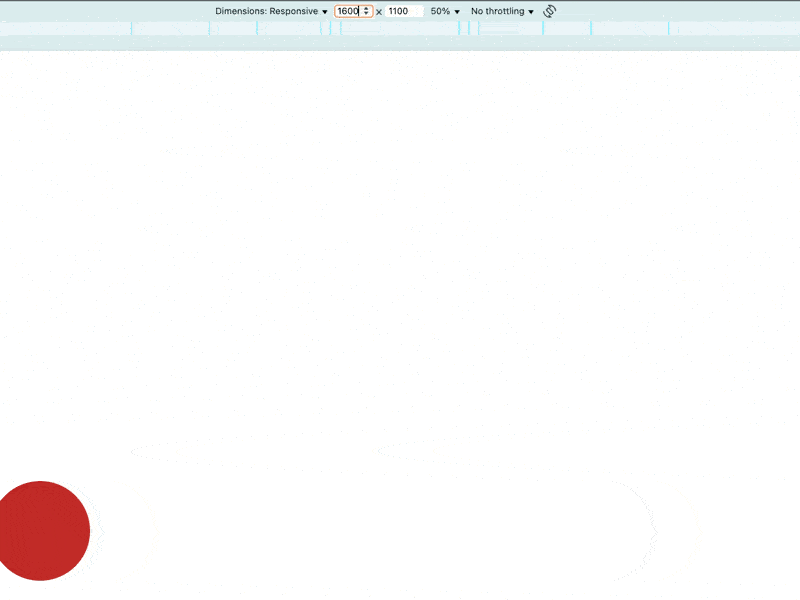

# 咒文書的自動化工廠：css-gum 的 Gen 模組

在「煉金術師的入門套組」中，我們示範了如何使用 `Core` 模組開始工作，但重複輸入設計稿寬度可能讓你不想工作了，因此 `css-gum` 準備了專門客製化生成 `Core` 模組的 `Gen` 模組，我相信它一定能解決你的問題，~~但不能解決你不想工作的問題~~。

## 重命名 Core

如果你不喜歡 `css-gum` 為 `Core` 模組設置的函式名，或者你不想整包塞到 `postcss-functions` 中，除了自己在 `postcss-functions` 的 functions 選項各別設置外，也許可以試試 `Gen.genFuncsCore`，這是一比一生成 `Core` 模組的方法，並提供 `nameXxx` 重命名參數：

- 可以自定義函式名。
- 可以設置 `''` 來刪除某個函式。

```js
import {Gen} from 'css-gum'

const {core} = Gen.genFuncsCore({
  nameVw: 'aaa',
  nameVwe: '',
})

console.log(core.vw)  // undefined
console.log(core.aaa) // [Function: aaa]
console.log(core.aaa(10, 100)) // '10vw'

console.log(core.vwe) // undefined

console.log(core.vwc) // [Function: vwc]
console.log(core.vwc(10,100)) // 'min(10px, 10vw)'
```

- 我將 `vw` 函式名改成 `aaa`，所以：
  - `core.vw` 是 `undefined`。
  - `core.aaa` 可以執行。
- 我將 `nameVwe` 設為 `''`，所以 `vwe` 函式就不存在了。
- `vwc` 沒有任何變更，所以正常使用。
- 搭配 `postcss-functions` 使用時，直接 `{ functions: core }` 即可。

## 修改預設 space

在 `Core` 模組中，所有方法的預設 `space` 都是 `0`，如果想修改預設值為 `1`，`Gen.genFuncsCore` 中有 `space` 參數可以設置：

```js
import {Gen} from 'css-gum'

const Core = Gen.genFuncsCore({
  space: 1,
}).core

console.log(Core.vw(10,100,1).length) // 5
console.log(Core.vw(10,100,0).length) // 4

console.log(Core.vw(10,100).length) // 5
```

- `Core.vw(10, 100, 1)`：有空格的返回 5 個字符。
- `Core.vw(10, 100, 0)`：沒空格的返回 4 個字符。
- `Core.vw(10, 100)`：返回 5 個字符，證明預設 `space` 改成 `1` 了。

## `Gen.genFuncsDraftWidth` 批量生成

還記得我們在「實戰4」中做了**為每一個設計稿寬度，都建立一套專屬的函式**的開工前準備嗎？當時我們**在每個函式後面寫個數字來代表某個設計稿寬度**，以解決重複輸入設計稿寬度的問題，而該篇為兩張設計稿（1440px 與 375px）實現共六個函式：

```js
const DESIGN_DRAFT1 = 375
const DESIGN_DRAFT2 = 1440

{
  functions: {
    pxToVw1: (value) => pxToVw(value, DESIGN_DRAFT1),
    pxToVwClamp1: (value) => pxToVwClamp(value, DESIGN_DRAFT1),
    pxToVwExtend1: (value) => pxToVwExtend(value, DESIGN_DRAFT1),
    pxToVw2: (value) => pxToVw(value, DESIGN_DRAFT2),
    pxToVwClamp2: (value) => pxToVwClamp(value, DESIGN_DRAFT2),
    pxToVwExtend2: (value) => pxToVwExtend(value, DESIGN_DRAFT2),
  },
}
```

`Gen` 模組中有個 `Gen.genFuncsDraftWidth` 方法，專門批量生成這些函式，並支持以下參數來實現上面這些結果：

- `nameXxx: string`：重命名。
- `space: 0 | 1`：函式預設是否生成空格。
- `points: number[]`：指定設計稿寬度。
- `order: 'asc' | 'desc'`：
  - 為 `points` 排序的排序規則。
    - `order: 'asc'`：從小到大，例如 `[375,1440]`，預設為 `asc`。
    - `order: 'desc'`：從大到小，例如 `[1440,375]`。
  - `css-gum` 會依據排序生成函式編號。
- `firstIndex: number`：
  - 每套函式生成時，都會在函式名後面加上數字，並在下一套生成時對該數字 +1，而 `firstIndex` 指的是第一個數字應為多少。
  - 預設為 `0`。

我們來試試根據「實戰4」的命名規則，將「煉金術師的入門套組」中的紅球範例改寫：

**package.json**

```json
{
  "type": "module",
  "devDependencies": {
    "postcss-functions": "^4.0.2",
    "vite": "^7.1.4"
  },
  "dependencies": {
    "css-gum": "^1.4.2"
  }
}
```

**postcss.config.js**

```js
import postcssFunctions from 'postcss-functions'
import {Gen} from 'css-gum'

/** @type {import('postcss-load-config').Config} */
export default {
  plugins: [
    postcssFunctions({
      functions: Gen.genFuncsDraftWidth({
        points: [375, 1440],
        space: 1,
        firstIndex: 1,
        nameVw: 'pxToVw',
        nameVwc: 'pxToVwClamp',
        nameVwe: 'pxToVwExtend',
      }).core,
    }),
  ],
}
```

- 「實戰4」有兩張設計稿 `375`、`1440`。
- 將函式名都改成「實戰4」的命名規則。
- 「實戰4」的數字是從 1 開始的，所以 `firstIndex` 為 1

**index.html**

```html
<!DOCTYPE html>
<html lang="en">
<head>
  <meta charset="UTF-8">
  <meta name="viewport" content="width=device-width, initial-scale=1.0">
  <style>
  * {
    margin: 0;
    padding: 0;
    border: 0;
  }

  .circle {
    position: absolute;
    top: pxToVwClamp2(862);
    left: pxToVw2(-100);

    width: pxToVwClamp2(200);
    height: pxToVwClamp2(200);
    border-radius: 50%;
    background-color: #C22A29;
  }

  @media (width >= 1440px) {
    .circle {
      left: pxToVwExtend2(-100);
    }
  }

  @media (width < 768px) {
    .circle {
      top: pxToVwClamp1(-25);
      left: pxToVwExtend1(-25);
      width: pxToVwClamp1(50);
      height: pxToVwClamp1(50);
    }
  }

  @media (width < 375px) {
    .circle {
      left: pxToVw1(-25);
    }
  }
</style>
</head>
<body>
  <div class="circle"></div>
</body>
</html>
```

將「煉金術師的入門套組」紅球範例中的函式呼叫都改成我們聲明好的函式即可：

- `vw(?, 1440)`：`pxToVw2`。
- `vw(?, 375)`：`pxToVw1`。
- `vwc(?, 1440)`：`pxToVwClamp2`。
- `vwc(?, 375)`：`pxToVwClamp1`。
- `vwe(?, 1440)`：`pxToVwExtend2`。
- `vwe(?, 375)`：`pxToVwExtend1`。

**結果**



以上就是 `Gen.genFuncsDraftWidth` 方法如何幫你實現每張設計稿的開工前準備。

你也許猜到下篇我想說什麼了，沒錯！下篇我要來分享如何自動生成提升開發幸福感的快捷符文：`Snippet`，那我們下篇見囉～

### 參考連結

- [實戰4：揮舞魔法奇物，重鑄 CSS 咒文](../../4-postcss-functions/postcss-functions-2/index.md)
- [煉金術師的入門套組：css-gum 的 Core 模組](../css-gum-2/index.md)
