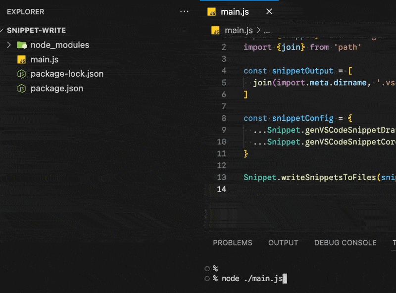
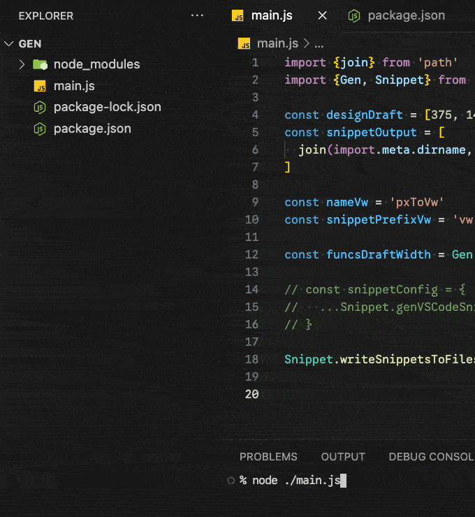

# 快捷符文生成器：css-gum 的 Snippet 模組

在 「手工刻印的快捷符文」 中，我們知道了編輯器有個很好用的功能： `Snippet`，可以輸入指定的語法來呼叫特定的模板替換功能。但是當時我們只能「手動」去寫 `Snippet` 設定，於是 `css-gum` 提供了 `Snippet` 模組，它可以「自動」幫你生成你需要的 `Snippet` 設定！

完成這件事情需要做兩個步驟：

1. 生成 `Snippet` 設定。
2. 將 `Snippet` 設定寫入文件。

## 生成 `Snippet` 設定

`Snippet` 中有兩個方法：

- `Snippet.genVSCodeSnippetCore`：生成 `Gen.genFuncsCore` 對應的 `Snippet`。
- `Snippet.genVSCodeSnippetDraftWidth`：生成 `Gen.genFuncsDraftWidth` 對應的 `Snippet`。
  - `pointsSize: number`：
    - 總共有幾張設計稿。
    - 必填。
  - `firstIndex: number`：
    - 批量生成函式的首位數字。
    - 預設值為 `0`。

通用參數：

- `scope: string[]`：
  - Snippet 設定規則上的 `scope`，例如 `{scope: ['javascript', 'typescript']}`。
  - 預設值： `['html','sass','stylus','css','scss','less']`。
- `nameXxx: string`：
  - 自定義函式名，例如 `{nameVw: 'hello'}`。
- `snippetPrefixXxx: string`：
  - Snippet 設定規則上的 `prefix`，例如 `{snippetPrefixVw: 'hi'}`。
  - 預設會使用 `nameXxx` 的值。

```js
import {Snippet} from 'css-gum'

console.log(Snippet.genVSCodeSnippetCore())
  // {
  //   em: { prefix: 'em', body: 'em($1,$2)$0', scope: 'html,sass,stylus,css,scss,less' },
  //   lh: { prefix: 'lh', body: 'lh($1,$2)$0', scope: 'html,sass,stylus,css,scss,less' },
  //   ...
  // }

console.log(Snippet.genVSCodeSnippetCore({scope: ['c', 'd'], nameEm: 'hello', snippetPrefixEm: 'hi'}))
  // {
  //   hello: { prefix: 'hi', body: 'hello($1,$2)$0', scope: 'c,d' },
  //   lh: { prefix: 'lh', body: 'lh($1,$2)$0', scope: 'c,d' },
  //   ...
  // }

console.log(Snippet.genVSCodeSnippetDraftWidth({pointsSize:3, firstIndex: 10}))
  // {
  //   vw10: { prefix: 'vw10', body: 'vw10($1)$0', scope: 'html,sass,stylus,css,scss,less' },
  //   vw11: { prefix: 'vw11', body: 'vw11($1)$0', scope: 'html,sass,stylus,css,scss,less' },
  //   vw12: { prefix: 'vw12', body: 'vw12($1)$0', scope: 'html,sass,stylus,css,scss,less' },
  //   vwc10: { prefix: 'vwc10', body: 'vwc10($1)$0', scope: 'html,sass,stylus,css,scss,less' },
  //   ...
  // }
```

這樣我們就能很輕易的生成 `Snippet` 設定，接著只需將這些設定寫入 `.vscode/???.code-snippets` 文件即可。

## 將 `Snippet` 設定寫入文件

`Snippet` 模組提供 `Snippet.writeSnippetsToFiles` 方法，用來寫入 `Snippet` 設定到指定文件中，總共有兩個參數：

1. `Snippet` 設定：就是我們剛才用生成函式所產生的那種資料結構，詳情可參考 `Snippet` 官方文件。
2. 設定檔路徑：`string[]`。
   - 接收 `string[]` 是因為有些人想用檔名而非 `scope` 設定來指定檔案類型，此時可能會需要生成多個 `code-snippets` 檔案。

**node.js**

```js
import {Snippet} from 'css-gum'
import {join} from 'path'

const snippetOutput = [
  join(import.meta.dirname, '.vscode/css-gum.code-snippets'),
]

const snippetConfig = {
  ...Snippet.genVSCodeSnippetDraftWidth({pointsSize: 2, scope: ['javascript']}),
  ...Snippet.genVSCodeSnippetCore({scope: ['javascript']}),
}

Snippet.writeSnippetsToFiles(snippetConfig, snippetOutput)
```

**結果**

```shell
% tree -I node_modules -a
.
├── main.js
├── package-lock.json
└── package.json

% node ./main.js

% tree -I node_modules -a
.
├── .vscode
│   └── css-gum.code-snippets # <-
├── main.js
├── package-lock.json
└── package.json
```



以上就是動態生成 `Snippet` 文件的基本用法。

## Gen 模組生成設定

`Gen` 模組的函式參數其實涵蓋了大部分 `Snippet` 模組生成設定函式的參數，除了 `scope`、`snippetPrefixXxx`、`pointsSize`，而 `pointsSize` 可以直接用 `points.length` 來獲取，所以其實 `Gen` 模組內部也執行了對應的 `Snippet` 生成設定函式：

- `Gen` 模組的函式可以接收 `scope`、`snippetPrefixXxx` 參數。
- 返回的內容除了 `core` 以外，還有 `VSCodeSnippet`，讓你可以拿去寫入 `snippet` 設定文件。

**程式碼**

```js
import {join} from 'path'
import {Gen, Snippet} from 'css-gum'

const designDraft = [375, 1440]
const snippetOutput = [
  join(import.meta.dirname, '.vscode/css-gum.code-snippets'),
]

const nameVw = 'pxToVw'
const snippetPrefixVw = 'vw'

const funcsDraftWidth = Gen.genFuncsDraftWidth({points: designDraft, nameVw, snippetPrefixVw, scope: ['javascript']})

// const snippetConfig = {
//   ...Snippet.genVSCodeSnippetDraftWidth({pointsSize: designDraft.length, nameVw, snippetPrefixVw, scope: ['javascript']}),
// }

Snippet.writeSnippetsToFiles(funcsDraftWidth.VSCodeSnippet, snippetOutput)
```

**結果**



所以其實 `Snippet.genVSCodeSnippetCore` 跟 `Snippet.genVSCodeSnippetDraftWidth` 平常用到的機會不多，直接用 `Gen` 模組返回的設定即可。

## 小結

以上就是 `css-gum` 如何幫助你動態的生成 `Snippet` 文件～

我們已經知道提供 `css-gum` 設計稿寬度，它就能自動生成等比縮放工作流所需的所有工具，下篇我們將利用它來更新「實戰4」，將那些手動寫的函式與 `Snippet` 設定通通移除！

當然 `css-gum` 不僅僅只提供這兩個幫助，還解決了一些開發時的小痛點～那我們下篇見囉。

## 參考連結

- [css-gum](https://github.com/jzovvo/css-gum)
- [手工刻印的快捷符文：VSCode Snippet](../../5-snippets/1/index.md)
- [咒文書的自動化工廠：css-gum 的 Gen 模組](../4/index.md)
- [VSCode Snippet](https://code.visualstudio.com/docs/editing/userdefinedsnippets)
