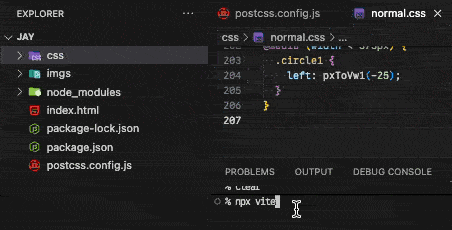
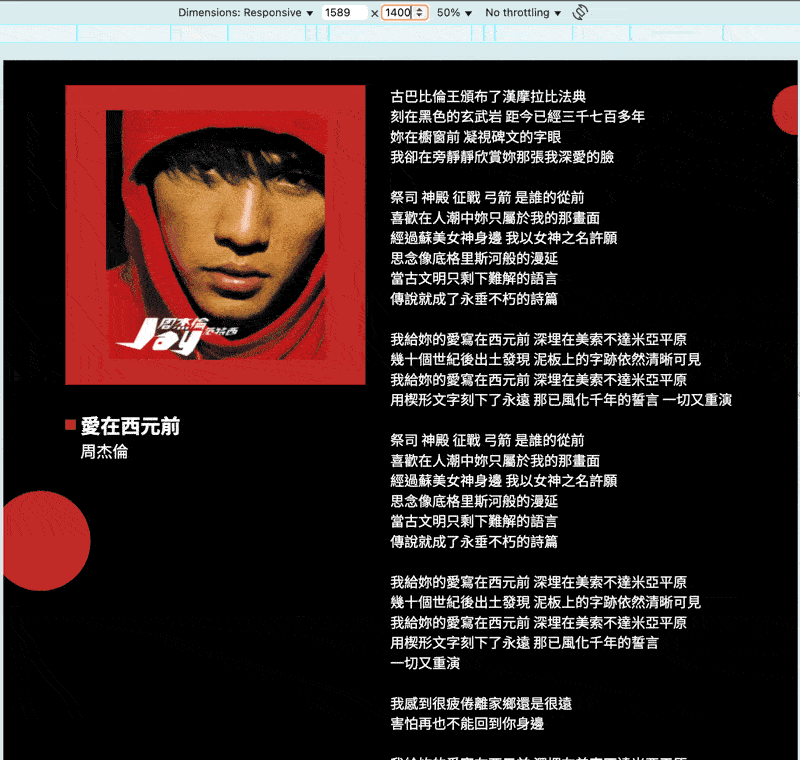
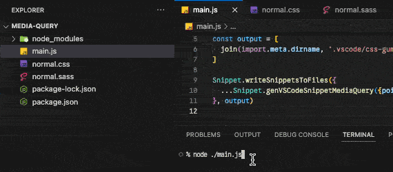
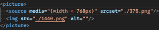
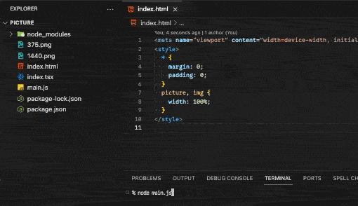
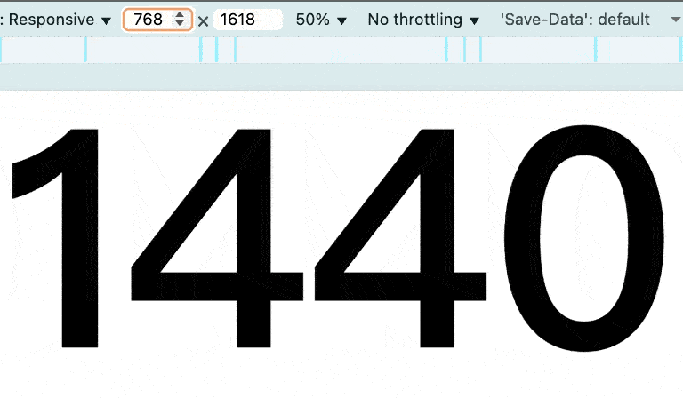

# 實戰5：煉金交響曲的華彩樂章

在「實戰4」中，我們將**冗長的公式替換成函式呼叫**完整實現，當時我們「手動」為兩張設計稿（`375`、`1440`）實現六套函式：

- `375px` 用 1 來代表：
  - `pxToVw1(設計稿上的值)`。
  - `pxToVwClamp1(設計稿上的值)`。
  - `pxToVwExtend1(設計稿上的值)`。
- `1440px` 用 2 來代表：
  - `pxToVw2(設計稿上的值)`。
  - `pxToVwClamp2(設計稿上的值)`。
  - `pxToVwExtend2(設計稿上的值)`。

接著我們在「手工刻印的快捷符文」知道了編輯器的 `Snippet` 能提供我們開發模板，而當時我們也「手動」寫了 `Snippet` 設定檔。

最後我們在「咒文書的自動化工廠」與「快捷符文生成器」兩篇中發現，`css-gum` 提供的 `Gen` 模組與 `Snippet` 模組能幫我們「自動」實現這一切！那我們開始將手動變成自動吧：

`html` 與 `css` 都不用改：

- `css/reset.css` 與 `index.html` 可以去「實戰1」複製。
- `css/normal.css` 可以去「實戰4」複製。

**package.json**

```json
{
  "type": "module",
  "devDependencies": {
    "postcss-functions": "^4.0.2",
    "postcss-load-config": "^6.0.1",
    "vite": "^7.1.4"
  },
  "dependencies": {
    "css-gum": "^1.4.2"
  }
}
```

**postcss.config.js**

```js
import postcssFunctions from 'postcss-functions'
import {Gen, Snippet} from 'css-gum'
import {dirname, join} from 'path'
import {fileURLToPath} from 'url'

const __dirname = import.meta.dirname ?? dirname(fileURLToPath(import.meta.url)) ?? ''

const DESIGN_DRAFTS = [375, 1440]
const SNIPPET_OUTPUTS = [
  join(__dirname, '.vscode/css-gum.code-snippets'),
]

const {core, VSCodeSnippet} = Gen.genFuncsDraftWidth({
  points: DESIGN_DRAFTS,
  space: 1,
  firstIndex: 1,
  nameVw: 'pxToVw',
  nameVwc: 'pxToVwClamp',
  nameVwe: 'pxToVwExtend',
})

Snippet.writeSnippetsToFiles({
  ...VSCodeSnippet,
}, SNIPPET_OUTPUTS)

/** @type {import('postcss-load-config').Config} */
export default {
  plugins: [
    postcssFunctions({
      functions: core,
    }),
  ],
}
```

**結果**




只需準備**設計稿寬度**，就能自動生所需的函式與函式相應的 `Snippet` 設定檔～是不是很簡單。

## 法寶補給

如果將這張設計稿重切一遍，在開發過程中還會遇到幾個不那麼順手的地方，而 `css-gum` 提供了幾個方便開發的法寶～

### Snippet.genVSCodeSnippetMediaQuery

```ts
interface Opt {
  points: number[];
  pointOffset?: number; // default: 0
  scope?: VSCodeLanguageIdentifier[]; // default: ['html','sass','stylus','css','scss','less']
  order?: Order; // default: 'asc'
  firstIndex?: number; // default: 0
  snippetPrefixMin?: string; // default: 'max-p'
  snippetPrefixMax?: string; // default: 'min-p'
}

interface Snippet {
  genVSCodeSnippetMediaQuery(opt: Opt): Snippets;
}
```

這是用來生成 `@media () {...}` 的 `snippet` 設定。

我記憶力不太好，切版時經常忘記 media query 的語法：到底是 `>=` 還是 `>`？數值要寫 768 還是 769？每次都要寫看看才知道。所以我就把這些語法寫進 Snippet 中一勞永逸。

參數在「快捷符文生成器」都介紹過了，除了 `pointOffset`：這個參數源於每個人寫 `@media () {...}` 的習慣不同：

```css
/* 有些人喜歡這樣 */
@media (width < 375px) {}
@media (width >= 375px) {}

/* 有些人喜歡這樣 */
@media (width <= 375px) {}
@media (width > 375px) {}
```

`Snippet.genVSCodeSnippetMediaQuery` 所生成的設定是上面那種：

- `max-p`：`<`。
- `min-p`：`>=`。

但如果有人習慣下面那種呢？那就把整個數值 +1 就行了。

```css
/* 這種 */
@media (width <= 375px) {}
@media (width > 375px) {}

/* 就相當於這種，對吧？ */
@media (width < 376px) {}
@media (width >= 376px) {}
```

而 `pointOffset` 就是用來與 `points` 的數值做運算，如果你喜歡 `<=` 跟 `>`，設置 `pointOffset: 1` 即可。

```js
import {Snippet} from 'css-gum'

console.log(Snippet.genVSCodeSnippetMediaQuery({points: [375], pointOffset: 1}))
// {
//   cssBracketMinP0: {
//     prefix: 'min-p0',
//     body: [ '@media (width >= 376px) {', '  $1', '}' ],
//     scope: 'css,scss,less'
//   },
//   cssBracketMaxP0: {
//     prefix: 'max-p0',
//     body: [ '@media (width < 376px) {', '  $1', '}' ],
//     scope: 'css,scss,less'
//   },
//   ...
// }
```

- 知道 `Snippet.genVSCodeSnippetMediaQuery` 會生成什麼內容後，我們就可以試用看看了～
- 另外提醒，這裡的 `points` 指的不是設計稿寬度，而是 `breakpoints` 歐。

**程式碼**

```js
import {Snippet} from 'css-gum'
import {dirname, join} from 'path'
import {fileURLToPath} from 'url'

const __dirname = import.meta.dirname ?? dirname(fileURLToPath(import.meta.url)) ?? ''

const BREAKPOINTS = [375, 768, 1440]
const SNIPPET_OUTPUTS = [
  join(__dirname, '.vscode/css-gum.code-snippets'),
]

Snippet.writeSnippetsToFiles(
  Snippet.genVSCodeSnippetMediaQuery({points: BREAKPOINTS}),
  SNIPPET_OUTPUTS,
)
```

**結果**



### Snippet.genVSCodeSnippetPicture

```ts
interface Opt {
  points: number[];
  pointOffset?: number; // default: 0
  scope?: VSCodeLanguageIdentifier[]; // default: ['html', 'vue', 'javascriptreact', 'typescriptreact']
  snippetPrefixPic?: string; // default: 'pic'
  order?: Order; // default: 'asc'
}

interface Snippet {
  genVSCodeSnippetPicture(opt: Opt): Snippets;
}
```

我習慣為每張設計稿都出一組圖，所以 `<picture/>` + `<source/>` 是我相當常用的標籤，但這要打超多字，所以我就把他們寫進 `Snippet` 中，有幾個需特別注意的點：

- **生成 `max-width: ??px`**：
  - 由於 `<` 與 `>` 在 `HTML` 中是特殊符號，雖然寫在屬性值內沒問題，但很多編輯器會標紅色。
    
  - 所以 `Snippet.genVSCodeSnippetPicture` 生成的 `Snippet` 是使用 `max-width: ??px`。
- **`max-width` 自帶等於效果**：
  - `(width < 768px)` 與 `(max-width: 767px)` 是相同的。
  - 所以通常會 `pointOffset: -1` 來對齊 `Snippet.genVSCodeSnippetMediaQuery`。
- 這裡的 `points` 也是指 `breakpoints`，而不是設計稿寬度。

**程式碼**

```js
import {Snippet} from 'css-gum'
import {dirname, join} from 'path'
import {fileURLToPath} from 'url'

const __dirname = import.meta.dirname ?? dirname(fileURLToPath(import.meta.url)) ?? ''

const BREAKPOINTS = [375, 768, 1440]
const SNIPPET_OUTPUTS = [
  join(__dirname, '.vscode/css-gum.code-snippets'),
]

Snippet.writeSnippetsToFiles(
  Snippet.genVSCodeSnippetPicture({
    points: BREAKPOINTS.slice(1, BREAKPOINTS.length),
    pointOffset: -1,
  }),
  SNIPPET_OUTPUTS,
)
```

由於 375 與 768 都是使用手機版設計稿的圖片，所以我只生成 768 的 breakpoint 來換圖。

**結果**





以上就是提升日常開發幸福感的兩個法寶～希望你會喜歡。

## 小結

我平常開發前會將需要的 `Snippet`、`functions` 全部生成後，就可以快樂開工了：

```js
import postcssFunctions from 'postcss-functions'
import {Gen, Snippet} from 'css-gum'
import {dirname, join} from 'path'
import {fileURLToPath} from 'url'

const __dirname = import.meta.dirname ?? dirname(fileURLToPath(import.meta.url)) ?? ''

const DESIGN_DRAFTS = [375, 1440]
const BREAKPOINTS = [375, 768, 1440]
const SNIPPET_OUTPUTS = [
  join(__dirname, '.vscode/css-gum.code-snippets'),
]

const {core, VSCodeSnippet} = Gen.genFuncsDraftWidth({
  points: DESIGN_DRAFTS,
  space: 1,
  // firstIndex: 1,
  // nameVw: 'pxToVw',
  // nameVwc: 'pxToVwClamp',
  // nameVwe: 'pxToVwExtend',
})

Snippet.writeSnippetsToFiles({
  ...VSCodeSnippet,
  ...Snippet.genVSCodeSnippetMediaQuery({points: BREAKPOINTS}),
  ...Snippet.genVSCodeSnippetPicture({
    points: BREAKPOINTS.slice(1, BREAKPOINTS.length),
    pointOffset: -1,
  }),
}, SNIPPET_OUTPUTS)

/** @type {import('postcss-load-config').Config} */
export default {
  plugins: [
    postcssFunctions({
      functions: core,
    }),
  ],
}
```

以上就是日常用 `css-gum` 常見的配置～我平常開發時會使用 `css-gum` 預設的函式名跟數字，所以這裡沒有設置 `nameXxx` 與 `firstIndex`。

近年除了正常的 css 寫法外，最流行的寫法不外乎是 `tailwind`，為了避免寫 `tailwind` 的你對於這套工作流有些困惑，下篇我們將「實戰4」用 tailwind 重寫一遍，那麼下篇見囉！

## 參考連結

- [實戰1：設計稿華麗轉生為等比縮放網站](../../../1-基礎篇/1-vw/5/index.md)
- [實戰4：揮舞魔法奇物，重鑄 CSS 咒文](../../4-postcss-functions/2/index.md)
- [手工刻印的快捷符文](../../5-snippets/1/index.md)
- [咒文書的自動化工廠：css-gum 的 Gen 模組](../4/index.md)
- [快捷符文生成器：css-gum 的 Snippet 模組](../5/index.md)
