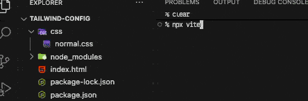
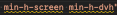

# 實戰6：Tailwind 與 css-gum 的協奏曲

前端開發中，除了原生寫法外，另一種相當不同但是常見的寫法就是 `Tailwind`。`Tailwind` 定義一套約定規則，在編譯時會在需要編譯的檔案中查找是否有匹配的規則字串，找到就會編譯出對應的 css 讓你使用。

例如 `Tailwind` 約定 `w-[??px]` 是 `width: ??px`：

**index.html**

```html
<div class="w-[30px]"></div>
```

編譯器在 `index.html` 看到了 `w-[30px]`。

**編譯結果**

```css
.w-\[30px\] {
  width: 30px;
}
```

編譯出這個 css 後，div 就有了 `width: 30px` 的效果，這就是 `Tailwind` 的運行邏輯～他讓你在切版時不用想 class name，而我覺得它最大的價值在於**增加爬蟲工具依賴固定 class name 來定位 DOM 元素的難度**。

由於篇幅的關係，我只能假定願意看這篇的你是懂 `Tailwind` 的工程師。這篇我會將「實戰4」改用 `Tailwind` 實現一遍，但在那之前，我們需要從 `css-gum` 中再掏出一個法寶。

## Config.genTailwindBreakpointConfig

```ts
interface Opt {
  points: number[];
  firstIndex?: number; // default: 0
  order?: Order; // default: 'asc'
  wrapper?: string; // default: 'theme'
  prefix?: string; // default: 'breakpoint-p'
  unit?: string; // default: 'px'
}

interface Snippet {
  genTailwindBreakpointConfig(opt: Opt): string;
  writeConfigToFiles(config: string, outputPaths: string[]);
}
```

`tailwindcss@4` 之後，設定改成寫在 css 檔案中，這導致難以共用寫在 js 的 `breakpoint` 設定。於是 `Config.genTailwindBreakpointConfig` 跟 `Config.writeConfigToFiles` 就此誕生～用法跟 `Snippet` 模組相同：生成設定後，寫入指定文件。

這些參數除了 `Tailwind` 設定所需的字符外，其他都介紹過了～所以我們就直接開始吧。

**package.json**

```json
{
  "type": "module",
  "devDependencies": {
    "@tailwindcss/postcss": "^4.1.13",
    "tailwindcss": "^4.1.13",
    "vite": "^7.1.5"
  },
  "dependencies": {
    "css-gum": "^1.4.2"
  }
}
```

**postcss.config.js**

```js
import tailwindcss from '@tailwindcss/postcss'
import {Config} from 'css-gum'
import {dirname, join} from 'path'
import {fileURLToPath} from 'url'

const __dirname = import.meta.dirname ?? dirname(fileURLToPath(import.meta.url)) ?? ''

const BREAKPOINTS = [375, 768, 1440]
const TAILWIND_CONFIG_OUTPUTS = [
  join(__dirname, 'css/_breakpoint.css'),
]

const tailwindBreakpointConfig = Config.genTailwindBreakpointConfig({points: BREAKPOINTS})
console.log(tailwindBreakpointConfig)
  // @theme {
  //   --breakpoint-p0: 375px;
  //   --breakpoint-p1: 768px;
  //   --breakpoint-p2: 1440px;
  // }

Config.writeConfigToFiles(tailwindBreakpointConfig,TAILWIND_CONFIG_OUTPUTS)

/** @type {import('postcss-load-config').Config} */
export default {
  plugins: [
    tailwindcss(),
  ],
}
```

將設置生成後，寫入 `css/_breakpoint.css` 中。

**index.html**

```html
<meta name="viewport" content="width=device-width, initial-scale=1.0">
<link rel="stylesheet" href="./css/normal.css">
<div class="bg-blue-500 max-p0:bg-red-500">hi :)</div>
```

**normal.css**

```css
@import "tailwindcss";
@import "./_breakpoint.css" layer(theme);
```

將動態生成的 `css/_breakpoint.css` import 進來。

**結果**

```shell
% npx vite
```



- 因為 `--breakpoint-p0: 375px`，所以在 374 時（`max-p0`），背景色從藍色變成紅色。

## tailwind 實戰

為了減少寫 `Tailwind` 的你對於這套工作流的使用困惑，我將「實戰4」完整的用 `Tailwind` 重新實現一遍，作法如下：

**原本 css 版本**

```css
.circle1 {
  left: vw1(-100);
}

@media (width >= 1440px) {
  .circle1 {
    left: vwe1(-100);
  }
}

@media (width < 768px) {
  .circle1 {
    left: vwe0(-25);
  }
}

@media (width < 375px) {
  .circle1 {
    left: vw0(-25);
  }
}
```

**Tailwind 版本**

```html
<div
  class="
    left-[vw1(-100)]
    min-p2:left-[vwe1(-100)]
    max-p1:left-[vwe0(-25)]
    max-p0:left-[vw0(-25)]
  "></div>
```

- 參考 `.circle1` 的 `left` 範例去改寫全部，就能將「實戰4」用 `Tailwind` 實現了～
- 為了版面乾淨，這邊就不全列了，可以到最下面看完整的程式碼。

## 小結

辛苦大家一路看到這，我已經將整套工作流的所有工作流程全部分享完畢，我們已經能透過三個步驟輕鬆的完成最初的目標「用等比縮放達到我心中的 pixel perfect」：

- 利用三大公式實現畫面等比縮放。
- 屬性值寫函式呼叫，利用編譯工具將函式呼叫運算執行後，用函式呼叫的結果替換呼叫字串。
- 利用 `css-gum` 處理所有開發所需的工具，包括函式呼叫所使用的運算函式、Snippet 設定、各種小工具。

這系列最大的主角 `vw` 實際上是一個大家族，下篇我們將介紹 `vw` 的其他兄弟姊妹。

## 參考連結

- [實戰4：揮舞魔法奇物，重鑄 CSS 咒文](../../4-postcss-functions/2/index.md)
- [實戰番外篇：無垢領域 - reset.css](../../../1-基礎篇/1-vw/6/index.md)
- [用等比縮放達到我心中的 pixel perfect](../../../0-first/index.md)

## Tailwind 實戰原始碼

```shell
% tree -I node_modules
.
├── css
│   ├── color.css
│   ├── font.css
│   ├── global.css
│   ├── normal.css
│   └── reset.css
├── imgs
│   └── jay.jpg
├── index.html
├── package-lock.json
├── package.json
└── postcss.config.js
```

- 我平常習慣將 css 檔案拆的較細，並使用統一管理檔案（`css/global.css`）。

**css/global.css**

```css
@layer theme, base, components, utilities;

@import "tailwindcss/theme.css" layer(theme);
@import "./font.css" layer(theme);
@import "./color.css" layer(theme);
@import "./_breakpoint.css" layer(theme);
@import "./reset.css" layer(base);
@import "./normal.css" layer(base);
@import "tailwindcss/utilities.css" layer(utilities);
```

- `_breakpoint.css` 會透過 `Config.genTailwindBreakpointConfig` 來動態生成。
  - 我習慣加上 `_` 來提醒自己這個檔案是動態生成的。
- `reset.css` 是一樣的，可以參考「實戰番外篇：無垢領域」。

**css/font.css**

```css
@theme {
  --font-noto-sans: "Noto Sans TC", sans-serif;
}
```

**css/color.css**

```css
@theme {
  --color-red: #C22A29;
}
```

**css/normal.css**

```css
html, body {
  overflow-x: hidden;
}

body {
  min-height: 100vh;
  min-height: 100dvh;
}

#app {
  position: relative;
  left: 50%;
  transform: translateX(-50%);
  width: 100vw;
  overflow: hidden;
}
```

- 這個檔案專放一些不是 `reset.css` 的初始化樣式。
- 為什麼不寫進 html 中？因為 VSCode Tailwind 插件在同屬性重複設置時會有警告，而寫 `normal.css` 也沒什麼不好，所以我就都寫在這裡。
  

**package.json**

```json
{
  "type": "module",
  "devDependencies": {
    "@tailwindcss/postcss": "^4.1.13",
    "postcss-functions": "^4.0.2",
    "postcss-load-config": "^6.0.1",
    "tailwindcss": "^4.1.13",
    "vite": "^7.1.4"
  },
  "dependencies": {
    "css-gum": "^1.4.2"
  }
}
```

**postcss.config.js**

```js
import postcssFunctions from 'postcss-functions'
import tailwindcss from '@tailwindcss/postcss'
import {Gen, Snippet, Config} from 'css-gum'
import {dirname, join} from 'path'
import {fileURLToPath} from 'url'

const __dirname = import.meta.dirname ?? dirname(fileURLToPath(import.meta.url)) ?? ''

const DESIGN_DRAFTS = [375, 1440]
const BREAKPOINTS = [375, 768, 1440]
const SNIPPET_OUTPUTS = [
  join(__dirname, '.vscode/css-gum.code-snippets'),
]

const TAILWIND_CONFIG_OUTPUTS = [
  join(__dirname, 'css/_breakpoint.css'),
]

const {core, VSCodeSnippet} = Gen.genFuncsDraftWidth({
  points: DESIGN_DRAFTS,
  space: 1,
})

Snippet.writeSnippetsToFiles({
  ...VSCodeSnippet,
  ...Snippet.genVSCodeSnippetMediaQuery({points: BREAKPOINTS}),
  ...Snippet.genVSCodeSnippetPicture({
    points: BREAKPOINTS.slice(1, BREAKPOINTS.length),
    pointOffset: -1,
  }),
}, SNIPPET_OUTPUTS)

Config.writeConfigToFiles(
  Config.genTailwindBreakpointConfig({points: BREAKPOINTS}),
  TAILWIND_CONFIG_OUTPUTS,
)

/** @type {import('postcss-load-config').Config} */
export default {
  plugins: [
    postcssFunctions({
      functions: {
        ...core,
      },
    }),
    tailwindcss(),
  ],
}
```

這個版本已經相當接近我平常工作的版本了～基本上就是將需要的 `Snippet`、`Config`、`functions` 全部生成，即可開工：

- 定義基礎數值：
  - `DESIGN_DRAFTS`：設計稿尺寸。
  - `BREAKPOINTS`：rwd 斷點。
- 自動生成核心函式：
  - `Gen.genFuncsDraftWidth` 幫我們生成 `vw0`、`vwc0`、`vwe0`、`vw1`...等開發時所需函式。
  - 「實戰4」是為了後續文章的推進：函式名太長怎麼辦、示範 `css-gum` 的 `nameXxx` 與 `firstIndex` 用法，才會刻意取別的名字以及從 1 開始，我平常都是使用 `css-gum` 預設值。
- 自動生成 Snippet 設定檔：
  - `Gen.genFuncsDraftWidth`、`Snippet.genVSCodeSnippetMediaQuery` 與 `Snippet.genVSCodeSnippetPicture` 生成 `Snippet` 設定，
  - `Snippet.writeSnippetsToFile` 將設定寫入指定的 `VSCode Snippet` 設定檔。
- 自動生成 Tailwind 斷點設定檔：
  - `Config.genTailwindBreakpointConfig` 生成 `Tailwind` 斷點設定。
  - `Config.writeConfigToFiles` 寫入指定的 css 文件。
- 最後用 `postcss-functions` 與 `@tailwindcss/postcss` 讓這一切可以在 `postcss` 中運作。

**index.html**

將「實戰4」的 `normal.css` 用 `Tailwind` 語法重新實現一遍。

```html
<!DOCTYPE html>
<html lang="en">
<head>
  <meta charset="UTF-8">
  <meta name="viewport" content="width=device-width, initial-scale=1.0">
  <link rel="preconnect" href="https://fonts.googleapis.com">
  <link rel="preconnect" href="https://fonts.gstatic.com" crossorigin>
  <link href="https://fonts.googleapis.com/css2?family=Noto+Sans+TC:wght@100..900&display=swap" rel="stylesheet">
  <link rel="stylesheet" href="./css/global.css">
</head>
<body
  class="bg-black text-white font-noto-sans">
  <div
    id="app"
    class="
      py-[vwc1(50)]
      max-p1:py-[vwc0(30)]
    ">
    <div
      class="
        w-[vwc1(1340)] mx-auto flex
        max-p1:w-[vwc0(335)] max-p1:flex-col max-p1:items-center
      ">
      <div
        class="
          mr-[vwc1(50)]
          max-p1:mr-0 max-p1:mb-[vwc0(20)]
        ">
        <div
          class="
            w-max bg-red p-[vwc1(50)] mb-[vwc1(50)]
            max-p1:p-[vwc0(20)] max-p1:mb-[vwc0(20)]
          ">
          <div
            class="
              relative w-[vwc1(500)]
              after:block after:pt-[100%]
              max-p1:w-[vwc0(260)]
            ">
            
          </div>
        </div>
        <div
          class="
            pl-[vwc1(30)]
            max-p1:pl-[vwc0(20)]
          ">
          <div
            class="
              relative
              text-[length:vwc1(40)] font-bold
              max-p1:text-[length:vwc0(25)]
            ">
            <div
              class="
                absolute top-1/2 left-[vwc1(-10)] -translate-x-full -translate-y-1/2
                w-[vwc1(20)] h-[vwc1(20)] bg-red
                max-p1:left-[vwc0(-10)] max-p1:w-[vwc0(10)] max-p1:h-[vwc0(10)]
              "></div>
            愛在西元前
          </div>
          <div
            class="
              text-[length:vwc1(32)]
              max-p1:text-[length:vwc0(18)]
            ">
            周杰倫
          </div>
        </div>
      </div>
      <div
        class="
          flex-1
          text-[length:vwc1(28)]
          max-p1:text-[length:vwc0(14)]
        ">
        古巴比倫王頒布了漢摩拉比法典<br/>
        刻在黑色的玄武岩 距今已經三千七百多年<br/>
        妳在櫥窗前 凝視碑文的字眼<br/>
        我卻在旁靜靜欣賞妳那張我深愛的臉<br/>
        <br/>
        祭司 神殿 征戰 弓箭 是誰的從前<br/>
        喜歡在人潮中妳只屬於我的那畫面<br/>
        經過蘇美女神身邊 我以女神之名許願<br/>
        思念像底格里斯河般的漫延<br/>
        當古文明只剩下難解的語言<br/>
        傳說就成了永垂不朽的詩篇<br/>
        <br/>
        我給妳的愛寫在西元前 深埋在美索不達米亞平原<br/>
        幾十個世紀後出土發現 泥板上的字跡依然清晰可見<br/>
        我給妳的愛寫在西元前 深埋在美索不達米亞平原<br/>
        用楔形文字刻下了永遠 那已風化千年的誓言 一切又重演<br/>
        <br/>
        祭司 神殿 征戰 弓箭 是誰的從前<br/>
        喜歡在人潮中妳只屬於我的那畫面<br/>
        經過蘇美女神身邊 我以女神之名許願<br/>
        思念像底格里斯河般的漫延<br/>
        當古文明只剩下難解的語言<br/>
        傳說就成了永垂不朽的詩篇<br/>
        <br/>
        我給妳的愛寫在西元前 深埋在美索不達米亞平原<br/>
        幾十個世紀後出土發現 泥板上的字跡依然清晰可見<br/>
        我給妳的愛寫在西元前 深埋在美索不達米亞平原<br/>
        用楔形文字刻下了永遠 那已風化千年的誓言<br/>
        一切又重演<br/>
        <br/>
        我感到很疲倦離家鄉還是很遠<br/>
        害怕再也不能回到你身邊<br/>
        <br/>
        我給妳的愛寫在西元前 深埋在美索不達米亞平原<br/>
        幾十個世紀後出土發現 泥板上的字跡依然清晰可見<br/>
        我給妳的愛寫在西元前 深埋在美索不達米亞平原<br/>
        用楔形文字刻下了永遠 那已風化千年的誓言<br/>
        一切又重演<br/>
        愛在西元前<br/>
        愛在西元前
      </div>
    </div>
    <div
      class="
        absolute top-[vwc1(862)] left-[vw1(-100)] w-[vwc1(200)] h-[vwc1(200)]
        rounded-full bg-red
        min-p2:left-[vwe1(-100)]
        max-p1:top-[vwc0(-25)] max-p1:left-[vwe0(-25)] max-p1:w-[vwc0(50)] max-p1:h-[vwc0(50)]
        max-p0:left-[vw0(-25)]
      "></div>
    <div
      class="
        absolute top-[vwc1(50)] right-[vwc1(-50)] w-[vwc1(100)] h-[vwc1(100)]
        rounded-full bg-red
        max-p1:top-[vwc0(362)] max-p1:right-[vwc0(-50)] max-p1:w-[vwc0(100)] max-p1:h-[vwc0(100)]
      "></div>
  </div>
</body>
</html>
```
