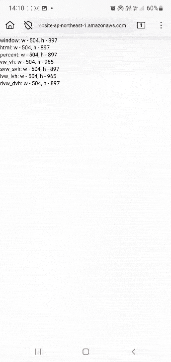

# 煉金術師的精密測繪：vw 家族的尺寸之謎

我們在「等比縮放的主角登場」中，大致瞭解了 `vw` 的使用邏輯，不過 `vw` 實際上還有三個好朋友：`dvw`、`svw`、`lvw`，另外還有一組完全對應的 `vh`，要介紹這些 css 單位前，我們必須先暸解這些英文字母代表什麼以及觀察他們的模樣：

## 英文縮寫

這些單位是由下面這些單字所組成：

- `d`: dynamic, `s`: small, `l`: large
- `v`: viewport
- `w`: width, `h`: height

## 表現模樣

```html
<!DOCTYPE html>
<html lang="en">
<head>
  <meta charset="UTF-8">
  <meta name="viewport" content="width=device-width, initial-scale=1.0">
</head>
<body>
  <style>
    * {
      margin: 0;
      padding: 0;
      border: 0;
      box-sizing: border-box;
    }

    html {
      overflow: scroll;
      scrollbar-gutter: stable;
    }

    body {
      height: 200vh; /** 產生垂直滾動條 */
    }

    div {
      position: fixed;
      top: 0;
      left: 0;
    }

    p {
      position: fixed;
      top: 0;
      left: 0;
      pointer-events: none;
    }

    input {
      position: fixed;
      top: 0;
      left: 0;
      width: 100%;
      z-index: 10;
      background-color: transparent;
    }

    .vw_vh {
      width: 100vw;
      height: 100vh;
    }

    .svw_svh {
      width: 100svw;
      height: 100svh;
    }

    .lvw_lvh {
      width: 100lvw;
      height: 100lvh;
    }

    .dvw_dvh {
      width: 100dvw;
      height: 100dvh;
    }

    .percent {
      width: 100%;
      height: 100%;
    }
  </style>
  <div class="vw_vh"></div>
  <div class="svw_svh"></div>
  <div class="lvw_lvh"></div>
  <div class="dvw_dvh"></div>
  <div class="percent"></div>
  <p></p>
  <input type="text" value="" />
  <script>
    const vw_vh = document.querySelector('.vw_vh')
    const svw_svh = document.querySelector('.svw_svh')
    const lvw_lvh = document.querySelector('.lvw_lvh')
    const dvw_dvh = document.querySelector('.dvw_dvh')
    const percent = document.querySelector('.percent')

    const p = document.querySelector('p')

    const updateInfo = () => {
      p.innerHTML = `
        window: w - ${window.innerWidth}, h - ${window.innerHeight}<br/>
        html: w - ${document.documentElement.clientWidth}, h - ${document.documentElement.clientHeight}<br/>
        percent: w - ${percent.clientWidth}, h - ${percent.clientHeight}<br/>
        vw_vh: w - ${vw_vh.clientWidth}, h - ${vw_vh.clientHeight}<br/>
        svw_svh: w - ${svw_svh.clientWidth}, h - ${svw_svh.clientHeight}<br/>
        lvw_lvh: w - ${lvw_lvh.clientWidth}, h - ${lvw_lvh.clientHeight}<br/>
        dvw_dvh: w - ${dvw_dvh.clientWidth}, h - ${dvw_dvh.clientHeight}
      `
    }

    const repeat = () => {
      updateInfo()
      requestAnimationFrame(repeat)
    }

    repeat()
  </script>
</body>
</html>
```

**桌機 - 滾動條佔位**

window 系統的瀏覽器滾動條是會佔位的。


**桌機 - 滾動條不佔位**

mac 系統的滾動條預設是不佔位的。


**android - firefox**



**android - chrome**


從結果可觀察到幾個點：

- 滾動條佔位時：
  - `html` 的寬度變小了。
  - `%` 的可排版空間也變小了。
- `vw` 系列的值跟 `window.innerWidth` 相同。
- 手機在往下滑時，網址列會隱藏，此時：
  - `window.innerHeight` 跟 `height: 100%` 就會變大。
  - `dvh` 也會變大，但在 android firefox 數值不穩定。
  - 往上滑，結果會反過來（網址列會展開，值變小）。
- 手機跳出 input 框時，預設不會影響這些數值。

由此可知，**網址列隱藏與否**與**滾動條佔位與否**會對這些數值產生影響。

## 網址列隱藏與否的影響

### vh 的困境

從 `vh` 在 mdn 的定義中可以找到一個陌生的名詞：`initial containing block`。

> Represents a percentage of the height of the viewport's initial containing block. 1vh is 1% of the viewport height.

在 css 規範中，對於 `initial containing block` 的定義為：

> The containing block of the root element. The initial containing block establishes a block formatting context, and takes the principal writing mode of the document. In continuous media, it has the dimensions of the small viewport size and is anchored at the canvas origin. In paged media.

大家應該看過這張 box model 的圖：


在 css 中，每個 DOM 都被裝在父層 DOM 的 Content 裡，但 `<html/>` 沒有父層提供 Content 來裝他，所以瀏覽器定義一個特殊的虛擬盒子來裝 `<html/>`，這個盒子就叫 `initial containing block ( ICB )`，**`ICB` 的大小在手機或電腦就是 `viewport` 的大小**。

`vh` 到了**手機**時代就有點問題：手機瀏覽器的網址列會經常切換顯示與否，造成 viewport 高度經常變動。當你數值使用 `vh` 為單位時，使用者滾上滾下就會導致內容變大變小。


為了解決這個問題，safari 跟 chrome 陸續將 `vh` 改成一個靜態數值，此時有兩個選擇：

- 網址列隱藏時的 `viewport` 數值。
- 網址列顯示時的 `viewport` 數值。

最終都選擇**網址列隱藏時的 `viewport` 數值**，這就是為什麼在網址列顯示的時，100vh 比 viewport 還大的原因。

### d、s、l 三兄弟誕生

後來 `d`、`s`、`l` 三兄弟就被寫進 css 規範了：

- `large viewport (lv*)`：
  - 定義：網址列隱藏時的 `viewport` 數值。
    - `The large viewport-percentage units (lv*) and default viewport-percentage units (v*) are defined with respect to the large viewport size: the viewport sized assuming any UA interfaces that are dynamically expanded and retracted to be retracted.`
  - 警語：數值可能會大於 `viewport`（網址列顯示時）。
    - `content might be hidden behind such interfaces when they are expanded.`
- `small viewport (sv*)`：
  - 定義：網址列顯示時的 `viewport` 數值。
    - `The small viewport-percentage units (sv*) are defined with respect to the small viewport size: the viewport sized assuming any UA interfaces that are dynamically expanded and retracted to be expanded.`
  - 警語：數值可能會小於 `viewport`（網址列隱藏時）。
    - `content might not fill the viewport when such interfaces are retracted.`
- `dynamic viewport (dv*)`：
  - 定義：完全跟著 `viewport`。
    - `The dynamic viewport-percentage units (dv*) are defined with respect to the dynamic viewport size: the viewport sized with dynamic consideration of any UA interfaces that are dynamically expanded and retracted. `
    - 不過要注意，不是每個瀏覽器都這麼完美實現，`firefox` 的數值就沒那麼穩定。
  - 警語：縮放問題跟性能問題，慎用。
    - `Using these units can cause content to resize e.g. while the user scrolls the page. Depending on usage, this can be disturbing to the user and/or costly in terms of performance.`

網址列只是比較直白的說法，規範寫 `UA interfaces` ，就是 `viewport` 以外那些有的沒的。

至於傳統的 `vw` `vh` 呢？規範寫說瀏覽器廠商自己決定。

> Whether the expansion/retraction of a particular interface (A) changes the sizes of all of the viewport-percentage lengths (and the initial containing block) simultaneously or (B) contributes to the differences between the large viewport size and small viewport size is largely UA-dependent.

從結果來看，大家都選擇了 `lvh`。

## 滾動條佔位與否的影響

W3C 規範中有一段寫著：

> In all cases, if the value of overflow or scrollbar-gutter on the root element in either axis would cause scrollbars to appear (or space to be reserved for them) unconditionally (for example, overflow: scroll, but not overflow: auto), the computed values of the viewport-percentage lengths in that axis are reduced in accordance with the initial containing block. Otherwise, and always in the case of media queries, the viewport-percentage lengths are sized assuming that scrollbars do not exist (even if this diverges from the initial containing block).
>
> Note: The value of overflow on the body element can sometimes affect the presence of scrollbars on the root element. This does not affect the size of viewport units, however.

我對這段定義的理解是，如果 `<html/>` 有設定 `overflow: scroll` 或是 `scrollbar-gutter: stable`，那 `the viewport-percentage lengths` 應該要扣掉滾動條的寬度，以實驗結果來看，滾動條佔位只影響了 `<html/>` 的寬度，進而導致可排版空間被壓縮，但對於 `vw` 家族的表現結果，顯然是沒有扣除滾動條寬度。

## 手機虛擬鍵盤的不影響

虛擬鍵盤只是預設不影響，在 `<meta>` 標籤的 `viewport` 有個 `interactive-widget` 可以設置這些交互 UI 對頁面的影響方式：

- `resizes-visual`：
  - 修改 `visual-viewport` 的值。
  - 不影響任何佈局（`vh` 家族的值不會變動）。
- `resizes-content`：
  - 修改 `viewport` 的值。
  - 會縮小整個佈局空間（`vh` 家族的值都會變小）。
- `overlays-content`：
  - 直接將交互 UI 放在畫面的上面，想像他就是一個 `position: fixed` 且 `z-index` 在最上層的物件即可。
  - 不影響任何佈局（`vh` 家族的值不會變動）。
  - 這個的作用是讓你使用 `VirtualKeyboard API` 來自行操作相關影響，不過這個 API 目前還只是實驗性質的。

`visual-viewport` 與 `viewport` 的關係是一個相當複雜的主題，後面會有一篇加以說明，這邊只需關注這些設定對於 `vh` 家族數值是否有影響即可。

**程式碼修改**

```html
-  <meta name="viewport" content="width=device-width, initial-scale=1.0">
+  <meta name="viewport" content="width=device-width, initial-scale=1.0, interactive-widget=resizes-content">
```

**結果**


當 `interactive-widget` 設置為 `resizes-content` 時，虛擬鍵盤顯示會導致 `viewport` 的空間壓縮，從而影響到所有高度相關的數值。

## css-gum 支持

`css-gum` 提供的所有工具都有這些單位的版本。

```js
import {Util, Core, Gen, Snippet} from 'css-gum'

console.log(Util.cssPxToDvw(100)(10)) // 10dvw
console.log(Util.cssPxToSvw(100)(10)) // 10svw
console.log(Util.cssPxToLvw(100)(10)) // 10lvw
console.log(Util.cssPxToVh(100)(10))  // 10vh
console.log(Util.cssPxToDvh(100)(10)) // 10dvh
// ...

console.log(Core.dvh(10,100)) // 10dvh
console.log(Core.dvw(10,100)) // 10dvw
// ...

console.log(Gen.genFuncsDraftWidth({points:[375]}).core)
  // {
  //   vw0: [Function (anonymous)],
  //   dvw0: [Function (anonymous)],
  //   lvw0: [Function (anonymous)],
  //   svw0: [Function (anonymous)],
  //   vwc0: [Function (anonymous)],
  //   dvwc0: [Function (anonymous)],
  //   lvwc0: [Function (anonymous)],
  //   svwc0: [Function (anonymous)],
  //   vwe0: [Function (anonymous)],
  //   dvwe0: [Function (anonymous)],
  //   lvwe0: [Function (anonymous)],
  //   svwe0: [Function (anonymous)]
  // }

console.log(Gen.genFuncsDraftHeight({points:[375]}).core)
  // {
  //   vh0: [Function (anonymous)],
  //   dvh0: [Function (anonymous)],
  //   lvh0: [Function (anonymous)],
  //   svh0: [Function (anonymous)],
  //   vhc0: [Function (anonymous)],
  //   dvhc0: [Function (anonymous)],
  //   lvhc0: [Function (anonymous)],
  //   svhc0: [Function (anonymous)],
  //   vhe0: [Function (anonymous)],
  //   dvhe0: [Function (anonymous)],
  //   lvhe0: [Function (anonymous)],
  //   svhe0: [Function (anonymous)]
  // }

console.log(Snippet.genVSCodeSnippetDraftWidth({pointsSize:1}))
  // {
  //   vw0: {
  //     prefix: 'vw0',
  //     body: 'vw0($1)$0',
  //     scope: 'html,sass,stylus,css,scss,less'
  //   },
  //   dvw0: {/* ... */},
  //   lvw0: {/* ... */},
  //   svw0: {/* ... */},
  //   vwc0: {/* ... */},
  //   dvwc0: {/* ... */},
  //   lvwc0: {/* ... */},
  //   svwc0: {/* ... */},
  //   vwe0: {/* ... */},
  //   dvwe0: {/* ... */},
  //   lvwe0: {/* ... */},
  //   svwe0: {/* ... */}
  // }

console.log(Snippet.genVSCodeSnippetDraftHeight({pointsSize:1}))

  // {
  //   vh0: {
  //     prefix: 'vh0',
  //     body: 'vh0($1)$0',
  //     scope: 'html,sass,stylus,css,scss,less'
  //   },
  //   dvh0: {/* ... */},
  //   lvh0: {/* ... */},
  //   svh0: {/* ... */},
  //   vhc0: {/* ... */},
  //   dvhc0: {/* ... */},
  //   lvhc0: {/* ... */},
  //   svhc0: {/* ... */},
  //   vhe0: {/* ... */},
  //   dvhe0: {/* ... */},
  //   lvhe0: {/* ... */},
  //   svhe0: {/* ... */}
  // }
```

## 小結

以上就是我所理解的 `vw` 完整系列的介紹了，抱歉這篇有很多酷炫的專有名詞，我儘量用白話解釋了，希望大家都能看懂～

最後我們來小結一下**當前瀏覽器**（不是當前規範）的表現狀況：


- `100%` 淡橘色部分：如果滾動條不佔位，會多出淡橘色部分。
- `dvh` 淡橘色部分：網址列隱藏與否會影響 `dvh` 的數值。

## 參考連結

- [mdn - length](https://developer.mozilla.org/en-US/docs/Web/CSS/length)
- [mdn - Layout and the containing block](https://developer.mozilla.org/en-US/docs/Web/CSS/CSS_display/Containing_block)
- [W3C - initial-containing-block](https://drafts.csswg.org/css-display-3/#initial-containing-block)
- [W3C - Viewport-percentage Lengths](https://www.w3.org/TR/css-values-4/#viewport-relative-lengths)
- [VirtualKeyboard API](https://developer.mozilla.org/en-US/docs/Web/API/VirtualKeyboard_API)
- [等比縮放的主角登場：解鎖 vw 的縮放魔法](../../../1-基礎篇/1-vw/1/index.md)
