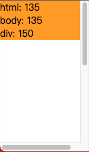
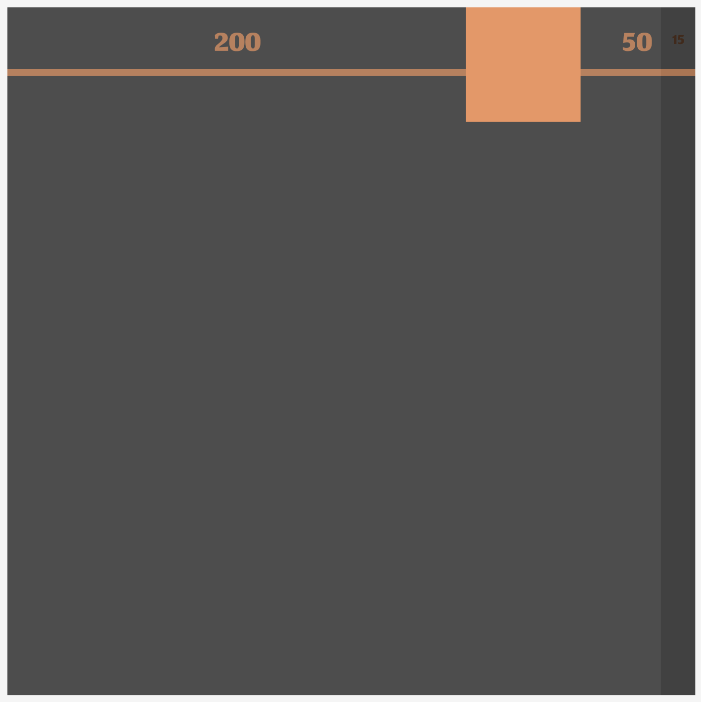
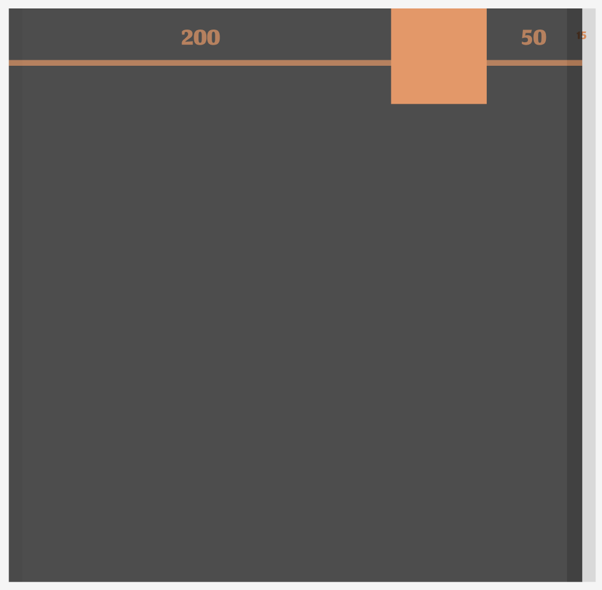
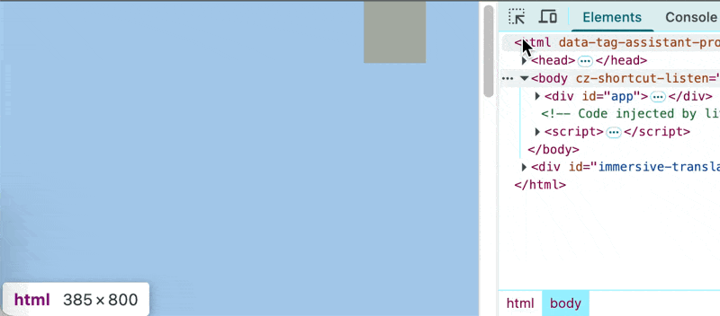
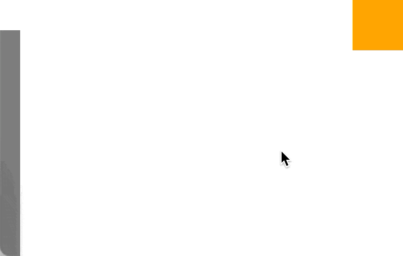
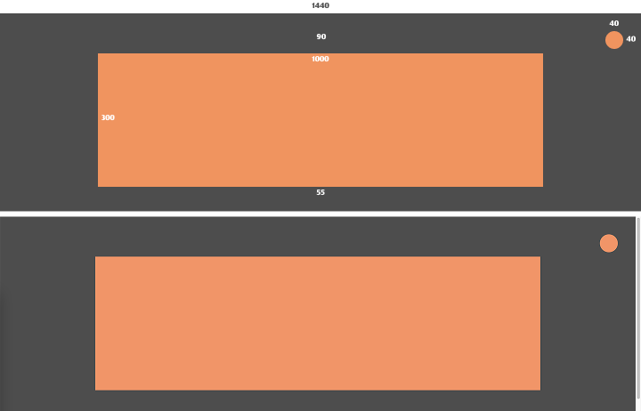
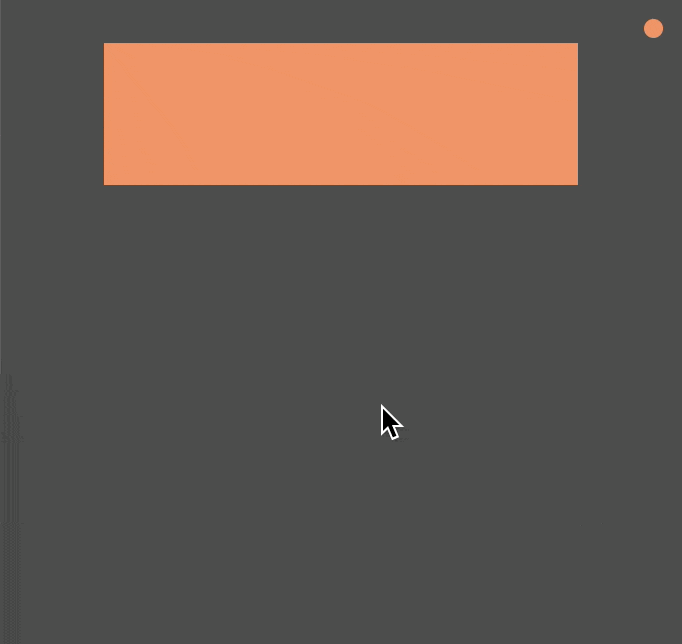
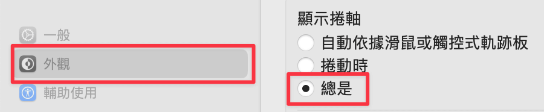
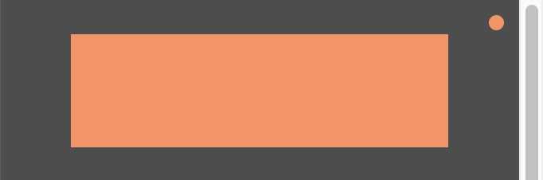
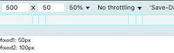

# 魔法的副作用：vw 與滾動條的恩怨情仇

在「煉金術師的精密測繪」中，我們知道了瀏覽器對於 **vw 的計算包含佔位滾動條寬度**，當使用 `100vw` 為寬度時，y 軸滾動條佔位會造成 x 軸滾動條的出現。

```html
<style>
  * {
    margin: 0;
    padding: 0;
    border: 0;
    box-sizing: border-box;
  }

  body {
    height: 200vh;
  }

  div {
    width: 100vw;
    background-color: orange;
  }
</style>
<div></div>
<script>
  const div = document.querySelector('div')

  const updateInfo = () => {
    div.innerHTML = `
      html: ${document.documentElement.clientWidth}<br/>
      body: ${document.body.clientWidth}<br/>
      div: ${div.clientWidth}
    `
  }

  window.addEventListener('resize', updateInfo)

  updateInfo()
</script>
```



因為 y 軸滾動條佔位，導致設置 `100vw` 的 `div` 比 `body` 跟 `html` 都大了 `15px`，進而出現 x 軸滾動條。

因此會產生一個問題：



原本設計稿中橘色盒子距離設計稿右邊有 50px，但是因為網站可能會出現 15px 的滾動條，所以最終實現時只有 35px，此時該怎麼辦？

## 暴力置中

直接將整個網站內容置中，讓滾動條寬度的影響平均分攤到設計稿的兩邊，這實際上是我最常用的，因為簡單暴力又好用。

**設計稿展示**



**程式碼實現**

```html
<meta name="viewport" content="width=device-width, initial-scale=1.0">
<style>
  * {
    margin: 0;
    padding: 0;
    border: 0;
    box-sizing: border-box;
  }

  body {
    overflow-x: hidden;
  }

  #app {
    position: relative;
    left: 50%;
    transform: translateX(-50%);

    width: 100vw;
    height: 200vh;
  }

  .box {
    width: 50px;
    height: 50px;
    background-color: orange;
    margin: 0 50px 0 auto;
  }
</style>
<body>
  <div id="app">
    <div class="box"></div>
  </div>
</body>
```

- 將應用層的最外層設置為 `100vw`，並且置中。
- `100vw` 會造成 x 軸滾動條出現，因此需在 `html` 或 `body` 設置 `overflow-x: hidden` 來避免。

**結果**



- 整個 app 是 100vw，此時內容比可排版空間多了一個滾動條的寬度，利用置中將多出來的寬度平均分配到左右兩側。
- 即使 app 為 100vw，由於 body 的 `overflow-x: hidden`，所以沒有出現 x 軸滾動條。

總之就是讓切版空間還是保持與設計稿相同，並且將 y 軸滾動條造成設計稿內容無法顯示的部分平均分散到設計稿兩邊來「緩解」，這個方法雖然簡單，但它使用的 `transform` 會對內部 `position: fixed` 的元素產生重大影響，文末的「補充說明」會介紹這個坑。

## 自製滾動條

既然佔位滾動條會壓縮設計稿的顯示空間，那有沒有可能讓滾動條不佔位呢？

css 中有個滾動條選擇器：`::-webkit-scrollbar {...}`，將他 `display: none` 就行了，另外還有一些兼容用的，例如 `scrollbar-width: none;` 跟 `-ms-overflow-style: none;`。

我們將滾動條隱藏後，可能還是需要滾動條讓使用者知道可以滾動，此時就需要自己實現滾動條：

1. 計算頁面有多少可以滾動。
2. 計算滾動條有多少可以滾動。
3. 計算當前頁面滾動了多少比例。
4. 讓滾動條保持與頁面相同的移動比例。
   - 將頁面滾動比例乘以滾動條可滾動距離。

**index.html**

```html
<style>
  * {
    margin: 0;
    padding: 0;
    border: 0;
    box-sizing: border-box;
  }

  /* 隱藏滾動條 */
  html, body {
    scrollbar-width: none;
    -ms-overflow-style: none;
  }

  html::-webkit-scrollbar,
  body::-webkit-scrollbar {
    width: 0 !important;
    height: 0 !important;
    display: none !important;
    background: transparent !important;
  }

  /* 此時 width: 100vw 就不會產生 x scrollbar */
  #app {
    width: 100vw;
    height: 200vh;
  }

  .box {
    width: 50px;
    height: 50px;
    background-color: orange;
    margin-left: auto;
  }

  /* 自製滾動條 */
  .scrollbar {
    position: fixed;
    z-index: 100;
    top: 0;
    left: 0;
    height: 100%;
    background-color: black;
    width: 20px;
    opacity: .5;
  }

  .scrollbar-thumb {
    position: absolute;
    top: 0;
    left: 0;
    width: 100%;
    height: 30px;
    background-color: white;
  }
</style>
<div id="app">
  <div class="box"></div>
</div>
<div class="scrollbar">
  <div class="scrollbar-thumb"></div>
</div>
<script>
  const scrollbar = document.querySelector('.scrollbar')
  const thumb = document.querySelector('.scrollbar-thumb')

  function updateScrollbar() {
    const documentHeight = document.documentElement.scrollHeight
    const viewportHeight = window.innerHeight
    const scrollTop = window.pageYOffset
    const thumbHeight = thumb.clientHeight
    const scrollbarHeight = scrollbar.clientHeight

    const maxThumbTop = scrollbarHeight - thumbHeight // 滾動條有多少可以滾
    const maxScroll = documentHeight - viewportHeight // 頁面有多少可以滾
    const scrollPercentage = scrollTop / maxScroll    // 當前頁面滾了多少比例
    const thumbTop = scrollPercentage * maxThumbTop   // 滾動條就需要移動多少比例

    thumb.style.top = thumbTop + 'px'
  }

  window.addEventListener('scroll', updateScrollbar)
  window.addEventListener('resize', updateScrollbar)

  updateScrollbar()
</script>
```

**結果**



- 我刻意將自製滾動條放左邊，證明原生滾動條真的被隱藏了。
- 當然這不是全部功能，例如點擊滾動條要 scrollTo、拖拽、無障礙等，這東西太麻煩而且很容易踩坑，建議直接去找個很多人在用的滾動條函式庫來用就好。

總之，這個方案的原理是讓佔位滾動條隱藏，就不會有人來跟你搶 viewport 的排版空間了。

## 不解決

你沒看錯，我認為不解決也是一個選擇。

我一直都是用 mac，而我實踐 vw 切版應該有四年，這期間遇到的 pm、設計、甲方等可能有一百多人，但其實我是今年初才注意到原來 window 系統預設滾動條會佔位，如果我沒特別注意，其實也不會有人真的在意頁面與設計稿有一點點不同，這也證實了我在「用等比縮放達到我心中的 pixel perfect」說的：**沒有人真的會去比對你的網頁到底差了幾 pixel，而是付你錢的人所看到的設計稿跟你交付的頁面「感覺」是一樣的，那就夠了！**



- 上面是設計稿、下面是網站實現。
- 真的有人會在意中間內容一點點偏左嗎？還是有人會在意裝飾球靠近中間內容一點點？如果真的遇到，真的建議趕快逃 😃。

## 小結

以上就是滾動條造成的問題以及我的解決方案～希望大家都能順利解決（或順利不解決？！）

## 補充說明

### 預設佔位滾動條

如上面所說，mac 預設的滾動條是 fixed 在畫面上而不佔位的。



如果你也想讓 mac 滾動條佔位，可以在 Mac 的**系統設定 > 外觀 > 顯示卷軸 > 總是**



這樣預設他就會跟 window 一樣佔位了



### transform 與 position: fixed 的交互作用

MDN 對於 `fixed` 的說明：

>  The element is positioned relative to its initial containing block, which is the viewport in the case of visual media.

看起來就是相對於 viewport 沒錯吧？但 mdn 還寫了一段話：

> If the position property is absolute or fixed, the containing block may also be formed by the edge of the padding box of the nearest ancestor element that has any of the following:
> - A filter, backdrop-filter, transform, or perspective value other than none.
> - A contain value of layout, paint, strict or content (e.g., contain: paint;).
> - A container-type value other than normal.
> - A will-change value containing a property for which a non-initial value would form a containing block (e.g., filter or transform).
> - A content-visibility value of auto.

也就是說，如果設置 `fixed` 元素的某層祖先元素符合以上其中一個條件，則 `fixed` 就會以該祖先元素的數值來計算。

**程式碼**

```html
<!DOCTYPE html>
<html lang="en">
<head>
  <meta charset="UTF-8">
  <meta name="viewport" content="width=device-width, initial-scale=1.0">
</head>
<body>
  <style>
    * {
      margin: 0;
      padding: 0;
    }

    .parent {
      height: 200dvh;
      transform: translate3d(0,0,0);
    }

    .fixed {
      position: fixed;
      inset: 0;
    }

    .info {
      position: fixed;
      top: 0;
      left: 0;
    }
  </style>
  <div class="fixed fixed1"></div>
  <div class="parent">
    <div class="fixed fixed2"></div>
  </div>
  <div class="info"></div>
  <script>
    const fixed1 = document.querySelector('.fixed1')
    const fixed2 = document.querySelector('.fixed2')
    const info = document.querySelector('.info')

    const updateInfo = () => {
      const fixed1Style = getComputedStyle(fixed1)
      const fixed2Style = getComputedStyle(fixed2)

      info.innerHTML = `
        <p>fixed1: ${fixed1Style.height}</p>
        <p>fixed2: ${fixed2Style.height}</p>
      `
    }

    window.addEventListener('resize', updateInfo)
    updateInfo()
  </script>
</body>
</html>
```

總共有兩個設置滿版的 fixed box：

  - `.fixed1` 在最外層。
  - `.fixed2` 在設置了 `transform` 的盒子內，該盒子的高度為 `200dvh`。

**結果**



從結果可以發現：`.fixed2` 滿版高度為 100px（視窗高度的兩倍，200dvh），證明 `.fixed2` 滿版是以 `.parent` 的數值去計算的。

我們在「暴力置中」解法中，對 `#app` 使用了 `transform` 來置中，因此要特別注意裡面的 `fixed` 行為跟你想像的可能不一樣歐～解決辦法就是不要把 `fixed` 元素放在 `#app` 裡面即可。

## 參考連結

- [mdn - fixed](https://developer.mozilla.org/en-US/docs/Web/CSS/position#fixed)
- [mdn - 改變 fixed 的祖先元素](https://developer.mozilla.org/en-US/docs/Web/CSS/CSS_display/Containing_block#identifying_the_containing_block)
- [煉金術師的精密測繪：vw 家族的尺寸之謎](../../7-vw進階知識/1/index.md)
- [用等比縮放達到我心中的 pixel perfect](../../../0-first/index.md)
