# 咒文的悖論：為何 vw 在桌面縮放時紋風不動？

`vw` 有個難解的問題：在**桌機**瀏覽器縮放時，`vw` 在視覺上完全不會跟著縮放。

```html
<meta name="viewport" content="width=device-width, initial-scale=1.0, maximum-scale=1" />
<style>
  * {
    margin: 0;
    padding: 0;
  }

  .vw {
    width: 10vw;
    height: 10vw;
    background-color: cadetblue;
  }

  .px {
    width: 10px;
    height: 10px;
    background-color: chocolate;
  }
</style>
<div class="vw"></div>
<div class="px"></div>
```

**桌機結果**

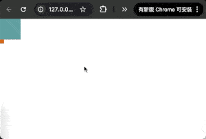

**手機結果**

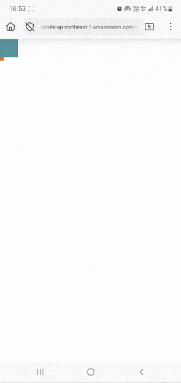

- 桌機瀏覽器進行縮放時，視覺上只有 `px` 有變動，`vw` 沒有任何變動。
- 手機瀏覽器進行縮放時，不管是 `px` 還是 `vw` 都有所變動。

要說這個題目前，我們需要理解基礎的畫面渲染尺寸知識：

## 畫面渲染尺寸知識

### pixel

pixel 主要分成 **「Device Pixel」** 與 **「Logical Pixel」**：

#### Device Pixel（設備像素）

我們在「實戰番外篇」有提過，螢幕就是一顆顆矩形的燈組成，這些燈就稱為設備像素，在螢幕出廠時就固定的硬體規格。

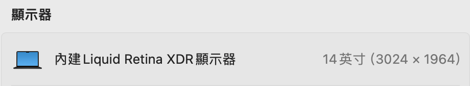

整個螢幕的像素數量稱為 **Physical Resolution（實體解析度）** 或 **Native Resolution（原生解析度）**，設備像素越密集，畫面越能呈現的更清晰、細膩，而像素密度會用 `PPI(Pixels Per Inch，每英寸像素數)` 來衡量：`實體解析度對角線 / 螢幕尺寸`，以我的電腦為例，PPI 差不多為 `Math.sqrt(3024 ** 2 + 1964 ** 2) / 14 = 257 PPI`。

#### Logical Pixel（邏輯像素）

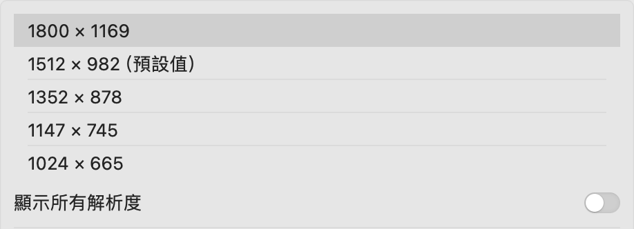

設備像素是無法改變的，但在作業系統設定中卻可以設定解析度，這個設定改變了什麼？

這是作業系統繪製畫面的解析度，更正確的說法為 **Logical Resolution（邏輯解析度）**，也就是作業系統告訴所有應用程式（包含瀏覽器）：『我現在提供一張 N 像素的畫布，請在這個畫布上繪製你的內容。』

此時會出現一個疑問，要怎麼在每個螢幕燈只能亮一種顏色的情況下，渲染非 1:1 的尺寸畫面？

這題的底層邏輯相當複雜，我只能簡單說一下過程：在決定畫面尺寸後，系統就會交給 GPU 去處理繪製，而 GPU 會為此做幾件事：

- `Sampling`：
  將系統想要渲染的圖片尺寸縮放至與設備相同，放大叫做 `Upsampling`，縮小叫做 `Downsampling`。
- `Interpolation`：
  圖片尺寸可能無法完美對應設備像素，也就是每個燈的範圍可能涵蓋多個顏色，此時 GPU 會使用 `Interpolation` 算法來決定最終每個燈應該渲染什麼顏色，簡單說就是參考該像素附近的像素顏色做加權平均。

在處理過後，就能明確決定每個像素燈所需顯示的顏色來顯示畫面。

也就是說**使用者可以選擇邏輯解析度來決定一個邏輯像素的大小**。

#### DPR（Device Pixel Ratio）

現代的螢幕 PPI 是以前的好幾倍：

- 如果畫面維持 1:1 的映射，內容會變得超小。
- 如果邏輯解析度調小，那 `Sampling` 時就會把圖片拉大，此時畫面就容易糊掉。

因此作業系統會為不同邏輯解析度設定一個畫面縮放比，該縮放比就是 DPR，也就是設定了邏輯解析度後，最終系統決定要繪製的畫面尺寸還會乘上這個 DPR 的值，以我的電腦為例：

- 邏輯解析度設定為 1800x1169 以下的 DPR 都是 2（HiDPI），也就是最終要渲染的畫布尺寸會是這個比例再乘上 2。
- 因為我的螢幕實體解析度為 3024x1964，所以系統建議的解析度是 1512x982，這個尺寸乘上 2 就會與實體解析度相同，不用作任何縮放處理，性能與效果是最好的。
- 超過 1800x1169 的 DPR 都是 1（LoDPI），因為乘 2 後會超出硬體性能設定的閾值，為了維持系統流暢性與穩定性而降低 DPR。

另外，window 系統顯示縮放百分比也會直接加權在 DPR 的數值上。

#### Css Pixel

`Css Pixel` 跟 `Logical Pixel` 是指相同的東西，只是層級不同，`Css Pixel` 指的是在瀏覽器中的 pixel，而 `Logical Pixel` 是一個通用的概念。

在瀏覽器中可以使用：

- `window.screen.width` 與 `window.screen.height` 來獲取當前使用者設置的邏輯解析度（chrome 與 safari）。
- `window.devicePixelRatio` 來獲取當前瀏覽器的 DPR。

### viewport（視口）

前面不停地提到 `viewport` ，實際上 `viewport` 又可細分為 **「Layout Viewport」** 與 **「Visual Viewport」**：

#### Layout Viewport

桌機時代只有 `viewport` 的概念，在電腦進行縮放時（`Ctrl/Cmd +` 或 `Ctrl/Cmd -`），縮放的原理是直接改變 `Css Pixel` 大小的定義，以我的 `Chrome` 為例：

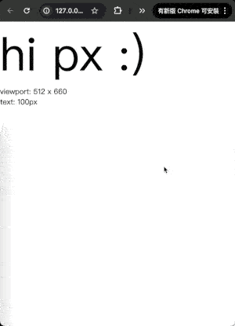

- 縮放的原理是改變 `Css Pixel` 大小的定義，而瀏覽器尺寸不變，所以 `viewport` 可容納的 pixel 數量就會有所變動。
  - 放大畫面：`viewport` 能裝的 css pixel 變少了。
  - 縮小畫面：`viewport` 能裝的 css pixel 變多了。
- text 的 pixel 數值是不變的，只是因為 pixel 大小定義縮放了，所以 pixel 單位的屬性尺寸也跟著縮放了。
- **這種縮放被稱為 page zoom**。
- 每次的縮放都會導致頁面需要重排、重繪。
  - `:)` 在放到最大的那次，塞不下而掉下來了。

`viewport` 在手機時代出現變化：`viewport` 後來被拆成「Layout Viewport」與「Visual Viewport」，而 **「Layout Viewport」就是指原本的 `viewport`**。

#### Visual Viewport

在手機版瀏覽器剛出現的年代，大部分網站都只針對電腦瀏覽器做處理，而手機瀏覽器會直接將畫面縮放到手機中，導致畫面超級小，進而導致使用者經常去縮放內容，造成排版亂掉而難以閱讀。

因此瀏覽器廠商將排版與顯示分離而出現了「Layout Viewport」與「Visual Viewport」兩個概念：你拿一張超大張的紙放在眼前，中間挖一個洞，此時你只能通過這個洞去看畫面：

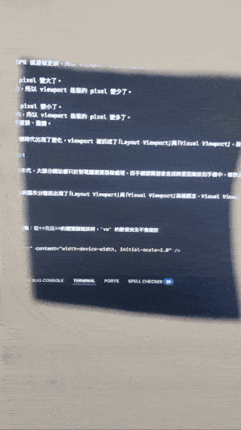

- 畫面就是 `Layout Viewport`。
- 紙就是 `Visual Viewport`，就是一個取景框。

所以手機縮放不會造成排版有任何的變動，而是**控制取景框（紙）和畫面的遠近關係**：

1. 取景框擷取畫面的一小部分。
2. GPU 進行影像放大：
   - 將擷取畫面拉伸到與實體解析度相同。
   - 使用 `Interpolation` 算法填補像素間的空隙，減少馬賽克產生。
3. 繪製顯示。

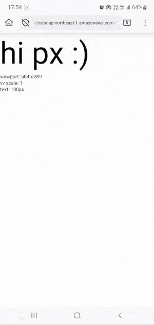

- 這種縮放稱為 **Pinch Zoom**，它不會改變 `Layout Viewport`，所以縮放讓畫面塞不下也不會造成排版有任何改變。
- w3c 為 `Visual Viewport` 開了一個專用的 API 叫 `visualViewport`，包括 `visualViewport.width`、`visualViewport.height`、`visualViewport.scale` 等當前 `Visual Viewport` 相關資訊。

## page zoom 無法縮放 vw 的問題

我們已經知道 page zoom 是直接改變 Css 像素大小的定義，而視窗實際大小沒有改變，所以 viewport 的像素值會隨之改變，假設視窗在 100% 縮放比的情況下是 1000px 寬，而我設置了 20vw 的數值，也就是 200px（`1000 / 100 * 20`）：

- 當畫面放大到 200% 時，viewport 寬剩 500px，20vw 剩 100px（`500 / 100 * 20`）。
- 但每個 CSS 像素在螢幕上佔據的面積也變大一倍，所以這 100px 在視覺上，剛好等於縮放前 200px 的寬度，視覺尺寸在增減後保持不變。

這就是為什麼使用 page zoom 後，vw 視覺上完全沒變動。

但是 Pinch Zoom 就不一樣了，他改變的是 `Visual Viewport` 的遠近，與 `Layout Viewport` 無關，所以 vw 在手機瀏覽器縮放時，視覺上是有效果的。

## 瀏覽器的坑

### 數值歧異

safari 與非 safari 在幾個數值的計算有著完全不同的理解而造成結果歧異：

#### DPR 是否包含瀏覽器縮放

在 W3C 規範中：

- DPR 的定義：`the result of dividing CSS pixel size by device pixel size.`
- CSS pixel size 的定義：`Let CSS pixel size be the size of a CSS pixel at the current page zoom and using a scale factor of 1.0.`。

這裡的爭執點在於 `current page zoom` 是否包含瀏覽器縮放，從結果來看，大部分瀏覽器廠商都認為包含而將縮放比例加權於 DPR 中，但是 `safari` 認為 `devicePixelRatio` 的「device」應該只反映設備本身的縮放，所以 safari 在 `page zoom` 時，DPR 會保持不變。

**chrome**

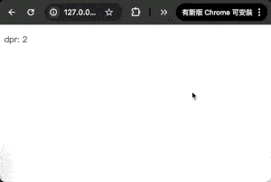

**safari**

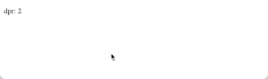

page zoom 縮放時：

- chrome 的 dpr 會改變。
- safari 的 dpr 不會改變。

其實我覺得 safari 是對的，`devicePixelRatio` 應該保持 `device` 的縮放比，但是應該要另外提供**穩定可用**的 page zoom 縮放比例給開發者使用，我實在沒找到 QQ，導致其他瀏覽器至少還能感知使用者「當下」 page zoom 的縮放比例，但 safari 完全無法得知。

#### Pinch Zoom 是否改變 viewport

W3C 對於 `innerWidth` 與 `innerHeight` 的規範為「包含滾動條寬度的 viewport 大小」：

- The innerWidth attribute must return the viewport width including the size of a rendered scroll bar (if any), or zero if there is no viewport.
- The innerHeight attribute must return the viewport height including the size of a rendered scroll bar (if any), or zero if there is no viewport.

但這個規範在早期 Viewport 的年代就有了，而 Viewport 拆分成「Layout Viewport」與「Visual Viewport」後，規範中的 viewport 無法確定是指哪個 viewport 而造成兩種不同的實踐。

```html
<!DOCTYPE html>
<html lang="en">
<head>
  <meta charset="UTF-8">
  <meta name="viewport" content="width=device-width, initial-scale=1.0">
</head>
<body>
  <style>
    * {
      margin: 0;
      padding: 0;
    }
    html {
      overflow-x: hidden;
    }
    body {
      height: 200vh;
    }
    .full-screen {
      position: absolute;
      width: 100vw;
      height: 100dvh;
    }
  </style>
  <div class="full-screen"></div>
  <div id="info"></div>
  <script>
    const domInfo = document.querySelector('#info')
    const domWScreen = document.querySelector('.full-screen')

    const updateInfo = () => {
      domInfo.innerHTML = `
        <p>viewport: ${window.innerWidth} x ${window.innerHeight}</p>
        <p>vw/vh: ${getComputedStyle(domWScreen).width} x ${getComputedStyle(domWScreen).height}</p>
        <p>vv scale: ${visualViewport?.scale || undefined}</p>
        <p>vv size: ${visualViewport?.width || undefined} x ${visualViewport?.height || undefined}</p>
        <p>html: ${document.documentElement.clientWidth} x ${document.documentElement.clientHeight}</p>
      `
    }

    const repeat = () => {
      updateInfo()
      requestAnimationFrame(repeat)
    }

    repeat()
  </script>
</body>
</html>
```

**chrome 選擇 `Layout Viewport`**

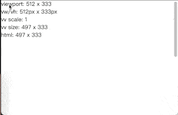

**safari 選擇 `Visual Viewport`**

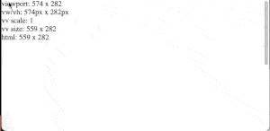

在 pinch zoom 時：

- chrome 的 viewport 數值不會改變。
- safari 的 viewport 數值會改變。
  - vw / vh 的計算沒有變，證實 Layout Viewport 沒有任何影響。

早期 chrome 的 `innerWidth/innerHeight` 也是採用 `Visual Viewport`，後來有了 `visualViewport` 後，就改成 `Layout Viewport` 了。

### safari vw 文字縮放有問題

在「用等比縮放達到我心中的 pixel perfect」中有一句「如果不一樣，那一定是 safari 的錯 😆」，指的就是這個問題：page zoom 時，理論上所有 vw 單位的數值都應該隨著 `viewport` 的數值變化而變化，但是 safari 的 `font-size` 不會改變！

```html
<!DOCTYPE html>
<html lang="en">
<head>
  <meta charset="UTF-8">
  <meta name="viewport" content="width=device-width, initial-scale=1.0">
</head>
<body>
  <style>
    * {
      margin: 0;
      padding: 0;
    }

    .vw {
      width: 50vw;
      font-size: 5vw;
      background-color: chocolate;
    }
  </style>
  <div class="vw">vw</div>
  <div id="info"></div>
  <script>
    const domInfo = document.querySelector('#info')
    const domVw = document.querySelector('.vw')

    const updateInfo = () => {
      const styleInfo = getComputedStyle(domVw)
      domInfo.innerHTML = `
        <p>viewport: ${window.innerWidth} x ${window.innerHeight}</p>
        <p>text: ${styleInfo.fontSize}</p>
        <p>vw: ${styleInfo.width} x ${styleInfo.height}</p>
      `
    }

    const repeat = () => {
      updateInfo()
      requestAnimationFrame(repeat)
    }

    repeat()
  </script>
</body>
</html>
```

**chrome**

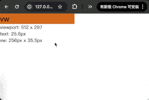

**safari**

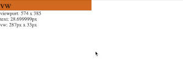

- chrome 的數值一切正常，當 viewport 因為 page zoom 放大兩倍而導致其 pixel 數值縮小兩倍時，`width`、`height`、`font-size` 都跟著 viewport pixel 數值變少而縮小了兩倍。
- safari 的 `width` 跟 `height` 也隨著 viewport 減少兩倍。
- 但是 **safari 的 `font-size` 數值不會隨著 viewport 因為縮放變動而變動**，此時的計算結果就是錯的：
  - page zoom 一倍時，font-size 應該為 `574 / 100 * 5 = 28.7px`，數值計算正確。
  - page zoom 兩倍時，font-size 應該為 `287 / 100 * 5 = 14.35px`，他還是維持 `28.7px`。

我不確定是不是只有 `font-size`，但 safari 就是有這種情境出現，真是傷腦筋。

## page zoom 無法縮放 vw 的解決方案

`page zoom` 無法縮放會遇到的問題就是無法通過**無障礙 1.4.4** 的規範：

> Except for captions and images of text, text can be resized without assistive technology up to 200 percent without loss of content or functionality.

瀏覽器達到最大 page zoom 時，字體要能至少放大兩倍，對於縮放不影響視覺大小的 vw 來說，完全是個無法解決的硬傷。

以下提出幾個解決方案，但我必須誠實的說，以「目前」瀏覽器縮放對於 page zoom 所暴露的資訊，此問題暫時真的難以完美解決。

### 乘上縮放比

我想得到的最完美解法就是乘上縮放比，但是當前瀏覽器沒有穩定的 page zoom 數據可用，導致此方案目前難以完美實行，我只能先提供一個示範的解決思路：

1. 獲取使用者當前 page zoom 縮放比：現階段只能拿 `devicePixelRatio` 的值去計算。
2. 為每個 vw 數值都乘上一個 css 變數，該變數用來存 page zoom 縮放比。
3. 當 `devicePixelRatio` 變動時，就更新這個縮放比。

```html
<!DOCTYPE html>
<html lang="en">
<head>
  <meta charset="UTF-8">
  <meta name="viewport" content="width=device-width, initial-scale=1.0">
</head>
<body>
  <style>
    * {
      margin: 0;
      padding: 0;
      box-sizing: border-box;
    }

    :root {
      --page-zoom: 1;
    }

    .box {
      width: calc(50vw * var(--page-zoom)); /** 每個 vw 值都乘上一個縮放比 */
      font-size: calc(5vw * var(--page-zoom));
      background-color: chocolate;
    }
  </style>
  <div class="box">vw</div>
  <script>
    // 當 devicePixelRatio 數值變動時，就去更新該縮放比
    const deviceDPR = 2
    const update = () => {

      document.documentElement.style.setProperty(
        '--page-zoom',
        window.devicePixelRatio / deviceDPR
      )
      update.remove?.()
      const media = matchMedia(`(resolution: ${window.devicePixelRatio}dppx)`)
      media.addEventListener('change', update)
      update.remove = () => media.removeEventListener('change', update)
    }

    update()
  </script>
</body>
</html>
```

**chrome**

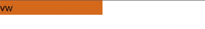

**safari**

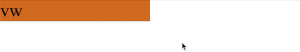

因為瀏覽器沒有穩定可用的 page zoom 縮放比，而產生兩個問題：

1. 非 safari 系列的瀏覽器將系統跟瀏覽器的縮放比都塞到 DPR 中，所以目前只能「猜測」使用者系統縮放比來瀏覽器 page zoom 縮放比。

   - 以獲取無障礙認證的角度來說，其實不是什麼困難的問題，page zoom 會導致 DPR 更新，所以縮放一定會有效果。
   - 但是以服務使用者的角度來說，這是一個天大的難題，所以我才認為 safari 不將 DPR 混用才是正確的。

2. safari 的 DPR 是靜態的，不會變動。

   - 這個問題原本是個難解的問題，但是因為 safari 有 font-size vw 文字會縮放的 bug，所以其實 safari 不用特別解決就能通過 1.4.4 了，算是誤打誤撞的 bug。

未來如果瀏覽器廠商們願意提供穩定可用的 page zoom 縮放比，並且 safari 也修掉這個奇怪的 font-size bug，這個解決方案就真的能完美處理無法縮放的情境了，現在只能成功獲取認證，不算是真的解決 😃

### px 與 vw 混用

因為 px 是可以正常縮放的，所以使用 `calc(xxvw + oopx)` 就能解決無法縮放的問題。

以官方人員在 wcag21 issue 舉的測試用例為例：

> With Reflow (1.4.10) in place the text-resize now fills in niche-cases where text doesn't scale with the zoom.
>
> So the combined test for reflow, text-resize and text-spacing can be:
>
> . Set the browser window to 1280px wide.
> . Zoom in to 400%.
> . Check content & functionality is available, and no horizontal scrolling (in LTR languages).
> . Check text is at least 200% bigger.
> . Turn on text-sizing (e.g. with a bookmarklet).
> . Un-zoom through each media query, looking for overlaps / missing content.

我們只關心文字縮放的部分：他希望將 1280px 寬的 viewport 放大四倍時，字體至少能放大兩倍，假設我的 `font-size` 為 60px，原本的數值應該是 `calc(60 / 1280 * 100vw)`，此時改為混用的計算過程為：

```text
. x 為 vw 要算出來的 px 值
. y 為 px 值

x + y = 60      # 兩個 px 值加起來要剛好等於 60。
x + 4y = 60 * 2 # 放大四倍時，數值要至少兩倍大。

-> (x + y) - (x + 4y) = 60 - 120
-> -3y = -60
-> y = 20
-> x = 40
```

所以最終的值為 `calc(calc(40 / 1280 * 100vw) + 20px)`。

**程式碼**

```html
<style>
  * {
    margin: 0;
    padding: 0;
  }

  body {
    font-size: calc(calc(40 / 1280 * 100vw) + 20px); /** <- */
  }

  .target {
    width: max-content;
    background-color: chocolate;
  }

  .rule1 {
    background-color: red;
  }

  .rule2 {
    background-color: blue;
  }
</style>
<div class="target">hi</div>
<div class="rule1"></div>
<div class="rule2"></div>
<div id="info"></div>
<script>
  const domInfo = document.querySelector('#info')
  const domRule1 = document.querySelector('.rule1')
  const domRule2 = document.querySelector('.rule2')
  const domTarget = document.querySelector('.target')

  const init = () => {
    const targetStyle = getComputedStyle(domTarget)
    const targetWidth = Number.parseFloat(targetStyle.width)
    const targetHeight = Number.parseFloat(targetStyle.height)

    domRule1.style.width = `calc(${targetWidth} / 1280 * 100vw)`
    domRule1.style.height = `calc(${targetHeight} / 1280 * 100vw)`
    domRule2.style.width = `calc(${targetWidth * 2} / 1280 * 100vw)`
    domRule2.style.height = `calc(${targetHeight * 2} / 1280 * 100vw)`
  }

  init()
</script>
```

**結果**

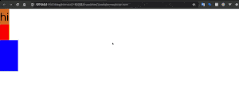

- 利用 vw 在縮放時視覺上不會有變動的特性來當比例尺，準備了用來測量 `.target` 大小的一倍尺與兩倍尺。
- 在 page zoom 放大到四倍時，`.target` 大小剛好等於兩倍。

以這種方式解決有幾個問題：

- 因為使用了 pixel，導致沒辦法完美的等比縮放，一樣會有 pixel 切版塞不下內容的問題。
- 你要能猜中認證檢測用的瀏覽器最大可以放大多少倍、用多大寬的 viewport，並且要為該尺寸切一個版。
  - 最大倍率比你猜的小，或者 viewport 尺寸比你猜的大，都可能不會通過檢測。

### 客製網站或是不解決

在瀏覽器沒有提供足夠的開發環境讓我們完美解決 page zoom 縮放之前，我不覺得應該為了非主要客群的需求而降低主要客群的使用體驗，加上目前大部分使用網站都是以手機為大宗的市場現況下，會需要 page zoom 的比例應該不高，大部分縮放都是觸發 pinch zoom，所以不解決所影響的使用範圍真的非常小眾。

如果真的要解決，目前最佳的處理方式應該是為需要用 page zoom 的客群客製一份 pixel 為主體的新網站，如果覺得成本太高，並且乘上縮放比也無法滿足他們的需求，那也只能放棄這個市場需求了。

## 補充說明

### DPI (Dots Per Inch)

所謂 DPI 指的是每英吋墨點數，衡量「印表機」每英吋可以在紙上噴多少個**墨點**，跟 PPI 的概念很像，但是 PPI 是用於衡量螢幕的像素。

但是後來這兩個單位經常被混用。

### meta viewport 設置影響

`<meta>` 標籤中有個 viewport 專門用來設置 `Layout Viewport` 與 `Visual Viewport` 的設定。

#### width

早期手機剛出的年代，為了將網頁內容放到手機中，手機瀏覽器將 `Layout Viewport` 設定為 980px 寬的畫面，然後縮放至頁面中。

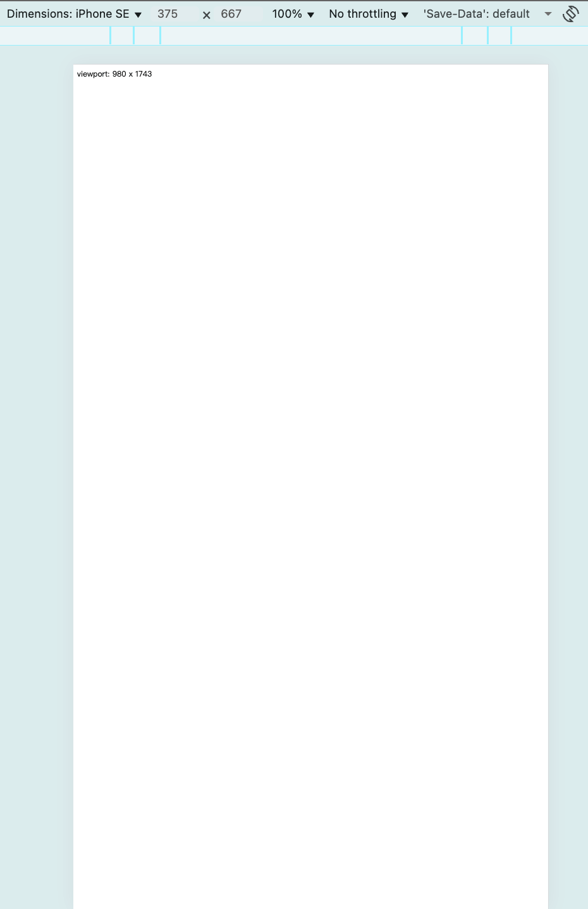

- 明明是 375 x 667，但是獲取到的 viewport 為 980 x 1743。
- 高度是隨著視窗寬度等比例決定（`980 / 375 * 667 = 1743`）。

後來 `<meta name="viewport"/>` 出現，讓你可以設置 `Layout Viewport` 應該是多少寬：

```html
<meta name="viewport" content="width=device-width">
```

99% 的情境下都會寫 `device-width`：設備多寬就多寬。

#### visualViewport.scale 相關

- `initial-scale`：
  - 畫面開啟時，最初的 `visualViewport.scale` 倍數。
  - 0.1 ~ 10.0。
- `minimum-scale`：
  - `visualViewport.scale` 最小可縮放倍數。
  - 0.1 ~ 10.0。
- `maximum-scale`：
  - `visualViewport.scale` 最大可縮放倍數。
  - 0.1 ~ 10.0。
- `user-scalable`：
  - 是否允許 pinch zoom。
  - `yes` 或 `no`。

#### viewport-fit

手機瀏覽器的 viewport 有時候會與一些功能鍵或是硬體設備重疊，例如動態島、home 鍵等，此時 viewport 的範圍是否應該包含這些部分就有歧異，這個設定讓你決定如何處理：

- `auto`：
  - 瀏覽器廠商自己決定，通常是 `contain`。
- `contain`：
  - 不要包含那些區域。
- `cover`：
  - 包含那些區域。
  - 多出來的值會設置在 `safe-area-inset-*` 中，讓你開發時想避開的話可以使用。

**程式碼**

```html
<meta name="viewport" content="width=device-width, initial-scale=1.0, viewport-fit=cover">
<!-- <meta name="viewport" content="width=device-width, initial-scale=1.0, viewport-fit=contain"> -->
<!-- <meta name="viewport" content="width=device-width, initial-scale=1.0, viewport-fit=auto"> -->
<style>
  * {
    margin: 0;
    padding: 0;
  }
  .target {
    position: fixed;
    top: env(safe-area-inset-top);
    left: env(safe-area-inset-left);
    right: env(safe-area-inset-right);
    bottom: env(safe-area-inset-bottom);
    background-color: skyblue;
    display: flex;
    flex-direction: column;
    align-items: center;
    justify-content: center;
  }
  h3 {
    text-align: center;
  }
</style>
<div class="target">
  <div class="info"></div>
</div>
<script>
  const domTarget = document.querySelector('.target')
  const domInfo = document.querySelector('.info')
  const updateInfo = () => {
    const divStyle = getComputedStyle(domTarget)
    domInfo.innerHTML =
      '<h3>cover</h3>' +
      // '<h3>contain</h3>' +
      // '<h3>auto</h3>' +
    `
      top: ${divStyle.top}<br/>
      bottom: ${divStyle.bottom}<br/>
      left: ${divStyle.left}<br/>
      right: ${divStyle.right}<br/>
      w x h: ${divStyle.width} x ${divStyle.height}<br/>
      viewport: ${window.innerWidth} x ${window.innerHeight}
    `
  }

  const repeat = () => {
    updateInfo()
    requestAnimationFrame(repeat)
  }

  repeat()
</script>
```

**結果**

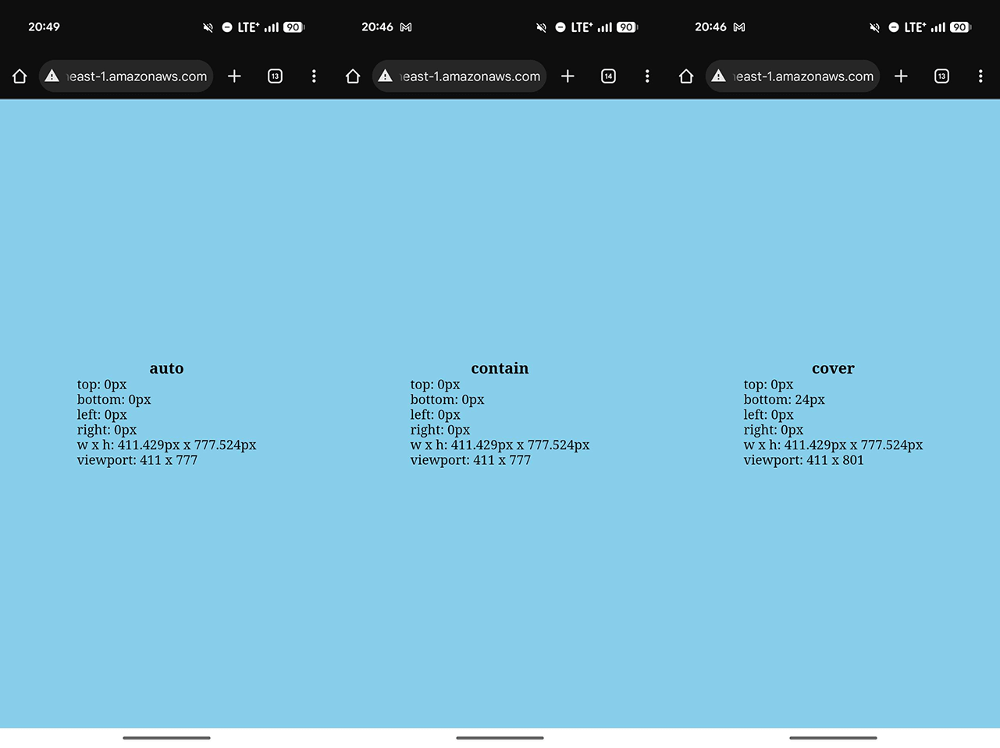

因為這支手機最下面點到會觸發其他功能，造成不同 `viewport-fit` 的結果不同：

- `contain` 的結果比 `cover` 小，因為他的 viewport 不包含手機會觸發其他功能的部分。
- `cover` 是包含的，所以他的 `viewport` 比較大，並且 `bottom: env(safe-area-inset-bottom)` 也有獲取到帶功能部分的大小，所以 `.target` 有避開該部分。
- `auto` 跟 `contain` 的結果相同，所以這個手機瀏覽器預設為 `contain`。

#### interactive-widget

在「煉金術師的精密測繪」中我們有提到，虛擬鍵盤會根據 `<meta name="viewport">` 標籤的 `interactive-widget` 設定來決定是否影響 `vh` 家族的數值。

- `resizes-visual`：
  - 修改 `visual-viewport` 的值。
  - 也就是在取景框的下面遮上一張紙，並不會影響排版本身，所以 `vh` 家族的值不會改變。
    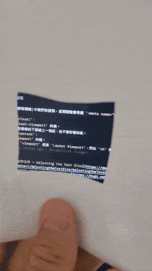
- `resizes-content`：
  - 修改 `viewport` 的值。
  - 這裡指的 `viewport` 就是 `Layout Viewport`，所以 `vh` 家族的值會被影響。
- `overlays-content`：
  - 直接將虛擬鍵盤放在 `visual-viewport` 的上面一層，既不影響排版，也不影響取景框。
  - 這個設定的用途在於讓你利用 `VirtualKeyboard API` 來自己操作虛擬鍵盤的相關排版影響。

## 參考連結

- [煉金術師的精密測繪：vw 家族的尺寸之謎](../../7-vw進階知識/1/index.md)
- [實戰番外篇：無垢領域 - reset.css](../../../1-基礎篇/1-vw/6/index.md)
- [VirtualKeyboard API](https://developer.mozilla.org/en-US/docs/Web/API/VirtualKeyboard_API)
- [W3C - devicePixelRatio](https://drafts.csswg.org/cssom-view/#dom-window-devicepixelratio)
- [MDN - devicePixelRatio](https://developer.mozilla.org/en-US/docs/Web/API/Window/devicePixelRatio)
- [device pixel](https://developer.mozilla.org/en-US/docs/Glossary/Device_pixel)
- [Update window.devicePixelRatio on browser zoom](https://issues.chromium.org/issues/40964337)
- [Expose a way to detect page zoom](https://bugs.webkit.org/show_bug.cgi?id=124862)
- [Pinch-zoom state no longer exposed to JavaScript, eg. via window.innerWidth/height](https://issues.chromium.org/issues/41229657)
- [Failure of Success Criterion 1.4.4 due to incorrect use of viewport units to resize text](https://www.w3.org/WAI/WCAG21/Techniques/failures/F94)
- [Resize Text (Level AA)](https://www.w3.org/WAI/WCAG21/Understanding/resize-text.html)
- [1.4.4 Resize Text - Misunderstandings Update - Interpretation](https://github.com/w3c/wcag21/issues/883#issuecomment-384800487)
