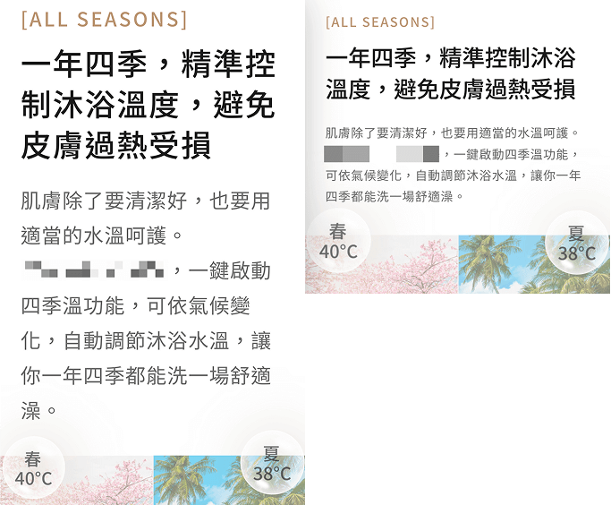

# 失控的咒文：當文字大小不再聽你使喚

有些手機瀏覽器會覺得你字體太小，然後「自動」將字體變大，這個行為被稱為 **「文字膨脹（Text Inflation）」**，我第一次遇到的時候（safari）真的慌得不行，因為隔天就要上線了，當時害我差點上不了線。



- 左邊是當時的慘況。
- 右邊是修正後的模樣。

文字膨脹有個特點，它會判斷哪些是主要文字區塊，然後對該區塊的文字「整個」放大到他覺得合適閱讀的程度，但是非主要文字的部分不會有影響：

- 泡泡裡都是純文字，他們沒有被放大。
- 其他部分不管會不會太小，都被一起放大了。

這個行為不僅讓你的切版結果與預期不符外，更大的問題是難以預測：字體多小才算太小？哪些區域會被算是主要文字區塊？文字最終會被放多大？基本上整個行為就是一個讓人崩潰的黑盒子。

這不是等比縮放切版才會發生的事，但是等比縮放的字體相對容易不小心縮到觸發那些瀏覽器的敏感神經。

## text-size-adjust

解決辦法就是使用 `text-size-adjust` 屬性來限制瀏覽器縮放文字即可，我們先看早期 mac 文件對於這個屬性的描述：

> The first time a webpage is rendered, Safari on iOS gets the width of the block and determines an appropriate text scale so that the text is legible.

文件中很直白的說 safari 會自動幫你調整文字比例，讓使用者更容易閱讀，真是謝囉？另外有一點要說的是，這個屬性、算法等行為就是 safari 發明的，它其實是想優化手機版網站不普及的年代，使用者需要經常用 pinch zoom 放大畫面來看內容的使用體驗，所以這個行為只會發生在手機瀏覽器，而**這個屬性現在也只有手機瀏覽器支持**。

`text-size-adjust` 可以接收三種數值：

- `auto`：瀏覽器自行決定。
- `none`：禁止瀏覽器文字膨脹。
- 百分比：直接指定字體膨脹百分比。
  - `100%` 與 `none` 效果是一樣的，都是不縮放文字。
  - 常見的 `reset.css` 都是寫 `100%` 而不是 `none`，原因可能是「以前」 `none` 有個 bug：
    - 以前 `none` 會導致 safari 在做 page zoom 縮放時（`Cmd +/-`），文字不會縮放。
      - 這個屬性以前在桌機瀏覽器是支持的，後來各大瀏覽器廠商才相繼移除支持。
    - 這個 bug 早就沒了，所以現在寫 `none` 或 `100%` 沒什麼實質區別，頂多差在語意上：
      - `none` 是禁止的意思。
      - `100%` 是維持一倍的字體大小。

```css
:root {
  -webkit-text-size-adjust: 100%;
  -ms-text-size-adjust: 100%;
  -moz-text-size-adjust: 100%;
  -o-text-size-adjust: 100%;
  text-size-adjust: 100%;
}
```

- 這個屬性到現在還是實驗性質的，很多瀏覽器只支持帶瀏覽器前綴的，所以我習慣在 `reset.css` 把這個屬性所有前綴都寫一遍來重置。
  - 至少 `webkit` 跟 `moz` 的前綴要留著，其他可以不用沒關係。
- 這個屬性是一個繼承屬性，直接設置在最上層即可。

## firefox mobile 的計算錯誤

我手機瀏覽器習慣用 firefox，曾經有一段時間我在看我的網站時，發現內容跟 safari 一樣被放大了，但是沒有大的那麼誇張，而且我寫了 `-moz-text-size-adjust: 100%;` 也沒用，我到現在還是毫無頭緒。

而我後來是怎麼處理的？我就檢查一下 chrome 跟 safari，發現一切正常之後，我就當作沒這件事情了😃 對！我根本沒去處理，因為：

1. 我也無從處理起，該加的屬性我都加了，沒用就是沒用。
2. firefox 手機版市佔不高，看得到我的作品的人也不多，使用 firefox 還會逛到我的作品的機會肯定超級低。
3. firefox 文字膨脹的比例在一個勉強還能接受的範圍，沒有導致嚴重跑版，就是沒那麼完美而已。

接著過了好長一段時間我再回去看就發現，疑？他自己好了誒，沒錯！我什麼都沒做，時間修復了這一切 😃。

順帶一提，我在寫這篇的時候，我把差點上不了線的案子的 `text-size-adjust` 移除，然後再拿 safari 測試一遍，發現也沒事了，時間真的能修復一切。

## 參考連結

- [safari 封存文件 - Adjusting the Text Size](https://developer.apple.com/library/archive/documentation/AppleApplications/Reference/SafariWebContent/AdjustingtheTextSize/AdjustingtheTextSize.html)
- [-webkit-text-size-adjust: none bug](https://bugs.webkit.org/show_bug.cgi?id=56543)
- [咒文的悖論有完整解釋 pinch zoom 是什麼](../2/index.md)
