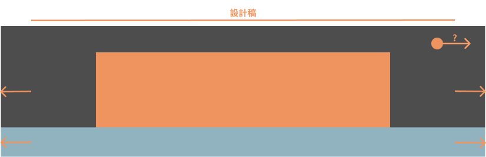
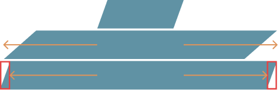
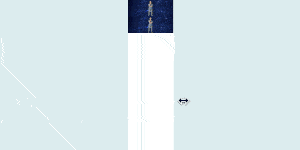
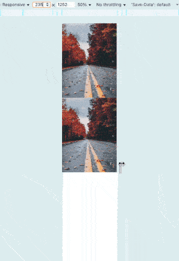
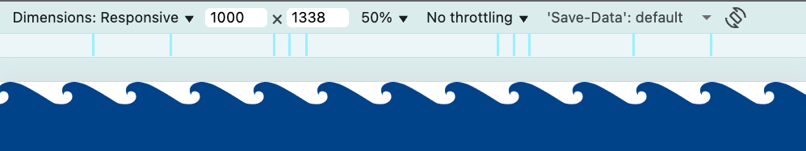
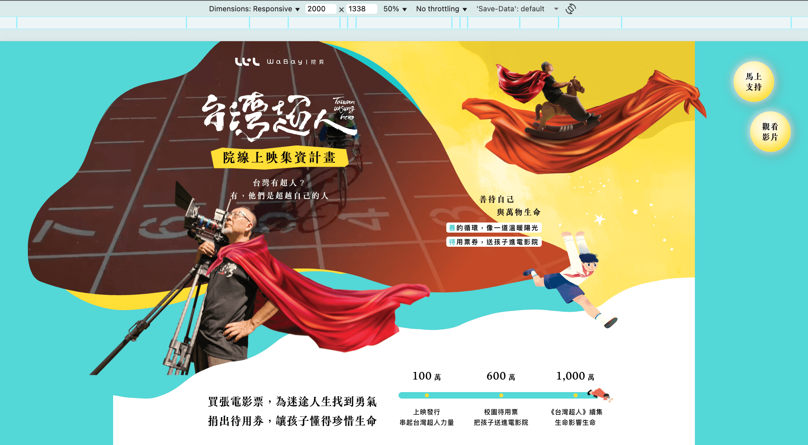

# 煉金術師的溝通手冊：與設計師的協作心法

我們已經學會整套等比縮放設計稿工作流的作法，並瞭解可能遇到的問題，如果你決定採用這種方式寫網站，建議先與設計溝通畫面呈現上可能會遇到的常見問題：

- 視窗超出設計稿的呈現。
- 滾動條的空間。
- 字體可能會縮的太小。

## 視窗超出設計稿的呈現

**當視窗超出設計稿時，設計稿沒畫的部分該怎麼處理？** 這邊提供幾個我常用的作法：

- 鎖畫面。
  - 延伸背景。
  - 賦予網站邊界感。
- 持續等比放大。
- 多張設計稿。

### 鎖畫面

鎖畫面是指 `css-gum` 的 `vwc`，讓畫面不會無限制的放大，這種做法會在視窗超出設計稿時，內容停止放大，此時就需與設計討論如何處理超出的部分，這裡提供兩個想法：「延伸背景」或「賦予網站邊界感」。

#### 延伸背景

將視窗超出設計稿的部分填充背景色或背景圖。



由於鎖畫面會使畫面的**高度不會改變，而視窗寬度無限變大**，所以處理上有些需要注意的部分：

##### 非矩形色塊背景

- 可以直接拉伸看看，觀察變形後會不會很奇怪，通常問題會出在斜率改變而造成背景色無法充分覆蓋內容。
- 如果有背景色無法覆蓋內容的情形，解決辦法就是保護斜率，例如平行四邊形拆成兩個直角三角形跟一個矩形。
  

##### 圖片背景

- 不要將圖拉壞，善用 `object-fit: cover;` 之類的設定。
- 不是每種背景圖都適合延伸，尤其是圖片中有產品或人物等需要儘量完整露出的物件，這種情形只能採用別的方案或是請設計將不能被截到的物件與背景圖拆分。
  ```html
  <!DOCTYPE html>
  <html lang="en">
  <head>
    <meta charset="UTF-8">
    <meta name="viewport" content="width=device-width, initial-scale=1.0">
  </head>
  <body>
    <style>
      * {
        margin: 0;
        padding: 0;
      }

      div {
        position: relative;
        height: min(calc(200 / 549 * 100vw), 200px);
      }

      .bg {
        width: 100%;
        height: 100%;
        object-fit: cover;
      }

      .man {
        position: absolute;
        width: auto;
        height: 100%;
        top: 0;
        left: 50%;
        transform: translateX(-50%);
      }
    </style>
    <div>
      
    </div>
    <div>
      
      
    </div>
  </body>
  </html>
  ```
  
  - 將原本的背景圖拆分成星空與人。
  - 將人單獨定位。

##### 手機版背景圖尺寸

在「鎖畫面 + 延伸背景」的方案下：

- 電腦版背景圖不管出多大都不夠。
- 手機版背景圖延伸則是有極限的：最多到切換電腦版設計稿之前的斷點寬度。

如果手機版想做滿版背景圖，**可以建議設計將該圖片尺寸出到你切換電腦版之前的斷點寬度**：假設設計稿寬度是 375px，你切換電腦版的斷點是 768px，那就麻煩設計出 767px 的背景圖而不是 375px，如此在視窗超出設計稿時，就不會拉大背景顯示。

```html
<!DOCTYPE html>
<html lang="en">
<head>
  <meta charset="UTF-8">
  <meta name="viewport" content="width=device-width, initial-scale=1.0">
</head>
<body>
  <style>
    * {
      margin: 0;
      padding: 0;
    }

    .box {
      height: min(calc(511 / 375 * 100vw), 511px);
    }

    .box1 {
      background: center / cover url(./assets/375.png);
    }

    .box2 {
      background: center / cover url(./assets/767.png);
    }
  </style>
  <div class="box box1"></div>
  <div class="box box2"></div>
</body>
</html>
```


- 上面背景圖 375px，當視窗超出 375px 時，該圖就必須做拉伸處理。
- 下面背景圖 767px，當視窗超出 375px 時，該圖就只是把裁切的畫面顯示出來而已，效果明顯比較好。

##### 無邊界物件

有些物件是無邊界的，例如海浪，那就可以**麻煩設計出一張頭尾可銜接的圖**，利用 `background-repeat` 無限延伸。

**圖片**


**程式碼**

```html
<!DOCTYPE html>
<html lang="en">
<head>
  <meta charset="UTF-8">
  <meta name="viewport" content="width=device-width, initial-scale=1.0">
</head>
<body>
  <style>
    * {
      margin: 0;
      padding: 0;
    }
    div {
      height: 100px;
      background-image: url(./wave.png);
      background-repeat: repeat-x;
    }
  </style>
  <div></div>
</body>
</html>
```

**結果**



「鎖畫面 + 延伸背景」會遇到的問題情境太多了，我只能寫一些常見的，總之就是儘量讓延伸的畫面看起來合理就對了。

#### 賦予網站邊界感

既然延伸背景不好處理，但又不希望畫面無限生長，有一種簡單粗暴的做法：直接讓網站有邊界感。具體做法就真的很看設計的想法，例如給一個框，或者利用背景色淡化網站邊界等，總之就是**讓使用者明顯感受到網站內容只到這，但又沒有很突兀的斷點感**，選擇這種做法就交給設計煩惱就行了。



我喜歡這個顏色佈局所營造的邊界感～

#### 裝飾物件的位置

鎖畫面不論採用哪種方案，裝飾物件的位置都需要決定：

- 跟著視窗向外移動（`vwc`）。
- 固定在原地（`vwe`）。

詳情可以參考「實戰3」。

### 持續等比放大

這是最無腦的做法，也是我工作中最常用的，因為我目前工作的案件時程都超級短，在這種時程緊迫，網站寫的出來就偷笑的情況下，實在沒辦法去考慮超出設計稿的處理，所以持續放大就是我經常做的選擇。

缺點也很明顯，用高解析度的螢幕看持續等比放大的網站時：

- 畫面會超爆大。
- 非 svg 的圖片會越來越不清晰。

不過那也沒辦法，我還是需要睡覺的 😴。

這種作法其實沒什麼需要與設計討論的，就是寫完後等設計跟 pm 來找你抱怨畫面很大時，跟他們說這也是沒辦法，然後請他們喝飲料（~~所以應該要討論飲料要喝什麼？~~）。

### 多張設計稿

這個方案會增加設計與工程的工作量，所以我其實也沒真的在工作中提過，但如果遇到特殊情形，這也許是一個選項。

例如我現在都會麻煩設計給我 1440px + 375px 的設計稿，遇到很重要的案子時，也許可以討論多出一張 1920px。但視窗寬度超出 1920px 時，還是需要用其他方案處理。

我心中確實覺得一個案子三張設計稿是最合適的，但是省一張設計稿來增加睡覺時間才是更明智的 😴。

## 滾動條的空間

在「vw 與滾動條的恩怨情仇」有聊過，設計稿會有十幾 pixel 的空間被滾動條佔去，如果設計將設計稿弄得很滿，建議請他冷靜點，不要弄這麼滿。

## 字體可能會縮的太小

等比縮放有個問題是，你的字體可能在一些裝置上會縮得太小，尤其是手機版。

解決辦法就是**手機版設計稿儘量接近大眾常用的最低手機尺寸**，我是都請設計出 375px 的設計稿，這樣「縮」的太小就不會是你的問題，是設計本來就將字體設置的太小了。

如果公司的設計都只出電腦版設計稿，並且溝通後也無法改變，~~那我一率建議快跑~~。

## 參考連結

- [css-gum](https://github.com/jzovvo/css-gum)
- [實戰3：無痕的延伸固定之術](../../../1-基礎篇/3-extension/1/index.md)
- [魔法的副作用：vw 與滾動條的恩怨情仇](../../8-problem/1/index.md)
