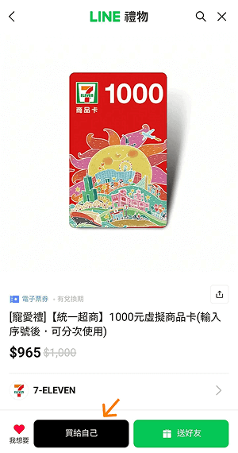
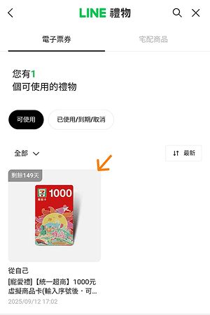
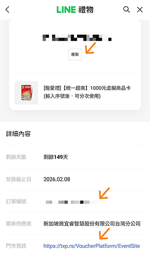
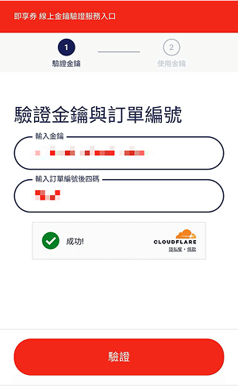
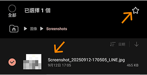
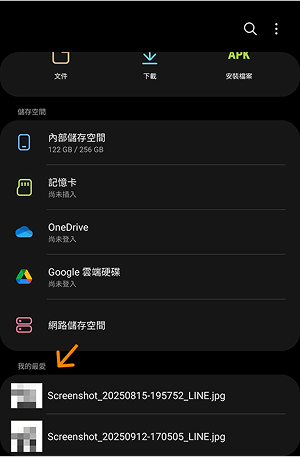

# 最後的秘術：在 7-11 至少省下 3.5%

終於走到系列文最終篇了！

回顧這趟旅程，我們從 vw 出發，帶出「等比縮放」、「有限縮放」與「延伸固定」三大核心公式，利用 `postcss` 將公式用函式呼叫替代，提供 `css-gum` 來幫你完成最後一哩路，最後補充可能的疑問與答案～

這套工作流是我這些年的經驗積累，一直沒找到有人提出相同作法，頂多就是用 `sass` 的 function 寫個 `pxToVw` 函式，**如果有幸能為這套工作流命名，期望它能叫「`Gum-Layout`」**：輕鬆的讓設計稿像口香糖一樣伸縮自如，嚼幾口就能開始伸展！

如果有幫助到看文章的你：

- 歡迎幫我爆肝寫出來的 **[`css-gum`](https://github.com/jzovvo/css-gum)** 按個星星 😴。
- 介紹更多人認識 **`Gum-Layout`**，跟你一起等比縮放設計稿！

希望大家都不再被甲方或高層質疑頁面與設計稿長得不一樣了～

我期望收尾文還能帶給看文章的你一點內容，在思考的過程中赫然看見「江湖在走，IT的省錢秘訣，省下的錢天天吃滷肉飯」系列，**我是靠即期品在維持生命的人誒**，省錢可是我的強項呢！所以最後我決定拿出最終壓箱寶秘技：兩個超商購物小技巧，我就喜歡如此荒謬的收尾 XD。

## 7-11 禮券

推薦大家多利用 LINE 禮物買 7-11 禮券，1000 元禮券只賣 965，現賺 35（蝦皮其實有更便宜的禮券），而且很多信用卡在 7-11 是不能用的，買禮券來付錢就可以了，還可能有信用卡回饋，是不是很划算！下面一步步教大家怎麼用：

1. 進入[購買頁面](https://liff.line.me/1429440178-lwY6XWYD/voucher/321825903)，按**買給自己**，接著會走付款流程。
   
2. 付款成功後，按**查看我的禮物**。
   
3. 點擊你剛買的禮券。
   
4. 複製序號
   
   - 你會看到一個很長的序號，按**複製**。
   - **記住訂單編號後四碼**。
   - 點擊**門市資訊的網址**。
5. 輸入剛剛記的內容。
   
6. 按**開啟票券**會出現條碼畫面，拿這個給店員刷就能付款了，所以**建議將條碼畫面截圖到相簿中**，方便未來使用。
   
   
7. 如果你是 android 手機，可以進到我的檔案，長按剛剛截圖的照片，按一下右上角的星星，截圖會存到我的最愛，方便快速打開給店員掃！
   
   

這是建構在你經常在 7-11 消費的前提，像我每天吃愛珍食就很適合，如果沒經常買的話，把一千塊拿去投入大盤比較賺～

## 全家找零轉儲

如果你經常去全家，建議都用現金付款，這樣買東西會經常獲得零錢，接著請店員將零錢存到 Fami 錢包中，這個儲值的動作是有發票的。

假設你消費 7 次，每次都剛好剩 5 塊，下次拿這 35 塊買一瓶飲料：

- **找零轉儲**：可獲得原本購物的 7 張發票，加 7 次轉儲的發票，共 14 張。
- **零錢放口袋或悠遊卡付款**：只會獲得原本購物的 7 張發票，加下次買飲料的發票，共 8 張。

沒轉儲就會少 6 次中發票的機會，超虧的吧 😃

好啦～整個系列真的結束啦，我要去買愛珍食了～我絕對不會跟大家說 **ptt 省錢版有壽星優惠整理文章**呢，掰噗～

## 參考連結

- [css-gum](https://github.com/jzovvo/css-gum)
- [江湖在走，IT的省錢秘訣，省下的錢天天吃滷肉飯](https://ithelp.ithome.com.tw/users/20163416/ironman/8356)
- [711 禮券](https://liff.line.me/1429440178-lwY6XWYD/voucher/321825903)
- [找零轉儲](https://nevent.family.com.tw/famiwallet/)
- [2025年當月壽星優惠整理](https://www.ptt.cc/bbs/Lifeismoney/M.1753976015.A.84C.html)

## 系列文章

- 宣告目標：
  - [用等比縮放達到我心中的 pixel perfect](../../0-first/index.md)
- 構建等比縮放設計稿的核心三公式：
  - [等比縮放的主角登場：解鎖 vw 的縮放魔法](../../1-基礎篇/1-vw/1/index.md)
  - [等比縮放的詠唱咒語：設計稿上的值 / 設計稿寬度 * 100vw](../../1-基礎篇/1-vw/2/index.md)
  - [將咒語刻印在網頁上：CSS calc()](../../1-基礎篇/1-vw/3/index.md)
  - [魔法訓練場：vw 咒文的初次施放](../../1-基礎篇/1-vw/4/index.md)
  - [實戰1：設計稿華麗轉生為等比縮放網站](../../1-基礎篇/1-vw/5/index.md)
  - [實戰番外篇：無垢領域 - reset.css](../../1-基礎篇/1-vw/6/index.md)
  - [封印無限擴張的道具：css 比較函式](../../1-基礎篇/2-minmax/1/index.md)
  - [為縮放魔法設置疆界：有限的等比縮放](../../1-基礎篇/2-minmax/2/index.md)
  - [實戰2：為轉生後的設計稿施加封印](../../1-基礎篇/2-minmax/3/index.md)
  - [實戰3：無痕的延伸固定之術](../../1-基礎篇/3-extension/1/index.md)
- postcss 的基本教學：
  - [煉金工房的核心設施：認識魔法熔爐 PostCSS](../../2-進階篇/1-postcss/1/index.md)
  - [讓 webpack 老大哥，學會使用 postcss 魔法熔爐](../../2-進階篇/1-postcss/2/index.md)
  - [無需學習的天賦，Vite 與生俱來的 PostCSS 魔法](../../2-進階篇/1-postcss/3/index.md)
  - [煉金術的兩種配方：PostCSS 插件的配置模式](../../2-進階篇/1-postcss/4/index.md)
- 利用 postcss 將三公式替換成函式呼叫的作法：
  - [點石成金的秘術：正規表示式替換大法](../../2-進階篇/2-postcss-replace/1/index.md)
  - [煉金術的精密儀器： postcss-value-parser](../../2-進階篇/3-postcss-value-parser/1/index.md)
  - [現成的魔法奇物：postcss-functions](../../2-進階篇/4-postcss-functions/1/index.md)
  - [實戰4：揮舞魔法奇物，重鑄 CSS 咒文](../../2-進階篇/4-postcss-functions/2/index.md)
- Vscode Snippet 的基本教學，幫助我們更方便的寫函式呼叫：
  - [手工刻印的快捷符文：VSCode Snippet](../../2-進階篇/5-snippets/1/index.md)
- css-gum 的詳細說明，幫助我們完成工作流的最後一哩路：
  - [終極煉金術：揭曉秘密武器 css-gum](../../2-進階篇/6-css-gum/1/index.md)
  - [煉金術師的入門套組：css-gum 的 Core 模組](../../2-進階篇/6-css-gum/2/index.md)
  - [魔法的底層迴路：css-gum 的 Util 模組](../../2-進階篇/6-css-gum/3/index.md)
  - [咒文書的自動化工廠：css-gum 的 Gen 模組](../../2-進階篇/6-css-gum/4/index.md)
  - [快捷符文生成器：css-gum 的 Snippet 模組](../../2-進階篇/6-css-gum/5/index.md)
  - [實戰5：煉金交響曲的華彩樂章](../../2-進階篇/6-css-gum/6/index.md)
  - [實戰6：Tailwind 與 css-gum 的協奏曲](../../2-進階篇/6-css-gum/7/index.md)
- vw 相關的其他單位介紹：
  - [煉金術師的精密測繪：vw 家族的尺寸之謎](../../2-進階篇/7-vw進階知識/1/index.md)
- 工作流可能會踩到的坑：
  - [魔法的副作用：vw 與滾動條的恩怨情仇](../../2-進階篇/8-problem/1/index.md)
  - [咒文的悖論：為何 vw 在桌面縮放時紋風不動？](../../2-進階篇/8-problem/2/index.md)
  - [失控的咒文：當文字大小不再聽你使喚](../../2-進階篇/8-problem/3/index.md)
- 工作流可能需要與設計溝通的問題：
  - [煉金術師的溝通手冊：與設計師的魔法契約](../../2-進階篇/9-communicate-with-designers/1/index.md)
